# 软件测试面试题

[TOC]


## 软件测试理论部分

### 1，cookies 和 session 的区别

**cookies**:是针对每一个网站的信息，每一个网站只对应一个cookies，其他网站不能访问。cookies文件保存在客户端，当每次访问相应的网站的时候，浏览器就会查找这个网站的cookies，如果有就会将这个cookies文件发送出去。cookies文件内容大致包含这些信息：用户名、密码、设置等等。

**session**: 是针对每一个用户的，只有当客户机访问的时候，程序就会为这个客户新增一个session。session主要保存的是用户的登录信息，操作信息等，这个session在**用户访问结束**后或**超时**后会自动消失。

- 数据存放位置不同：
  - cookie 数据存放在客户的浏览器上，session 数据放在服务器上。
- 安全程度不同：
  - cookie 不是很安全，别人可以分析存放在本地的 COOKIE 并进行 COOKIE 欺骗,考虑到安全应当使用 session。
- 性能使用程度不同：
  - session 会在一定时间内保存在服务器上。当访问增多，会比较占用你服务器的性能,考虑到减轻服务器性能方面，应当使用 cookie。
- 数据存储大小不同：
  - 单个 cookie 保存的数据不能超过 4K，很多浏览器都限制一个站点最多保存 20 个 cookie，而 session 则存储与服务端，浏览器对其没有限制。


### 2，HTTP的get请求和post请求的区别
1，在客户端，get请求方式通过url提交数据，数据在url中可以看到；post请求方式，数据放在body内提交。
2，get请求方式提交的数据最多只能有1024字节，而post没有限制。
3，安全性问题，在使用get请求的时候，参数会显示在url地址栏上，而post不会。所以，如果用户请求数据是中文数据而且是非敏感的数据，那么使用get请求；如果用户请求数据不是中文字符并且包含敏感数据，那么使用post为好。
4，安全的和幂等的，所谓安全的意味着该操作用于获取数据而非修改数据，即，安全的方法不会修改资源状态，尽管多次调用的返回值可能不一样(被其他非安全方法修改过)；幂等的意味着对统一url的多个请求应该返回同样的结果。

### 3，软件测试分为哪些种类
#### 3.1 按照阶段划分
单元测试、集成测试、系统测试、验收测试

#### 3.2 按是否运行程序划分
静态测试、动态测试
#### 3.3 按是否查看源代码划分
白盒测试、黑盒测试

黑盒测试：功能测试、性能测试

功能测试：逻辑功能测试、界面测试、易用性测试、安装测试、兼容性测试

性能测试：一般性能测试、稳定性测试、负载测试、压力测试

#### 3.4 其他
回归测试、冒烟测试、随机测试等

### 4，工作中使用哪些bug管理工具，说一下优缺点
#### 4.1 禅道
优点：

1）开源免费，从下载到使用不需要任何费用。开源的软件更能根据企业的需求在源码的基础上进行修改，让国内外众多企业节省项目管理成本。

2）禅道的功能非常完备，可扩展性，且代码开放，可作二次开发

3）价格实惠，售后服务方式选择多且有官方技术服务的保障。

缺点：

1）禅道的界面设计稍稍逊色，不够简洁，颜色使用单一，不够丰富。

2）禅道虽然有新人入门操作演示，但是对于新人上手还是会存在一些问题。

#### 4.2 JIRA
缺点：

1）JIRA使用上不太符合中国人的使用习惯。

2）JIRA虽然有中文版本，但是中文版本在使用的过程中还是会有很多英文，不能做到全中文界面。

3）JIRA对于国内用户提供的售后服务稍显弱些，存在时间和沟通上的障碍。

### 5，工作中遇到哪些经典的Bug
1，兼容性的问题。在火狐浏览器，提交订单按钮可以点击，但是到了谷歌就不能了。

2，查询订单页面，根据条件筛选的结果不是想要的结果，还有某些字段值没有显示出来，或者显示错误，因为开发数据库表中取值有误。

3，付款成功后，k订单状态一直不变更为交易成功。因为代码没有正确获取数据库表中付款成功记录得状态码。

4，修改支付密码，新密码和原密码一致，也通过了，系统没有做新旧密码的校验。

5，付款的时候手机验证码，可以一直使用，没有成功做到有效期的控制。

6，手机app断开网络后，再去点击，没有友好的错误页面提示网络已断开，只有undefined返回。

### 6，功能测试Bug级别怎么划分？
bug严重程度：一般提L4和L3，L2很少提，除非影响流程。L1这个是非常致命的bug，只有跟严重的情况才能提。

### 7，如何保证测试用例覆盖率达到100%？

- 用例的覆盖率不可能达到100%，但是我们可以尽量提高用例的覆盖率
- 提高方式：首先要理解需求，挖掘并覆盖显性需求和隐形需求
- 利用思维导图的方式进行测试点的设计，并让团队进行测试点的评审
- 根据已经设计的测试点用有效的测试方法进行测试用例的设计编写，并让团队进行用例的评审
- 针对以发现的问题，进行有效的解决，针对未发现的缺陷，进行记录跟踪，并归纳用例库当中，以便于后续解决

### 8，公司测试所用的环境

对于测试人员来说，分为：

- 测试环境
- 灰度环境
  - 类环境
  - 预发布环境
  - 预生产环境
- 生产环境/线上环境

### 9，给定场景说说你的测试用例设计思路

- 功能角度
- 用户体验角度
- 兼容性角度
- 性能角度
- 安全性角度

注意：任何一个产品，连最基本的功能都无法实现的话，那么就不用在谈什么性能、兼容、用户体验、安全等等。

例子：假如现在有个 "微信发红包"的功能，请你设计一下测试用例

答：首先我会从功能角度来分析，正确模拟微信发红包的功能，从点击某个人，打开右下角加号，然后选中发红包，跳转发红包页面，输入金额，点击发送，跳回聊天窗口。

在基本的功能实现之后，然后再将整个功能流程模块拆分为一个个的小的设计点。从小的设计点，利用等价类划分或者边界值分析等等，进行测试用例的设计。例如发金额数量，不输入金额是否能够发出去，输入金额超过最大限制是否能够发出去等等。

其次，从用户体验角度来说，是否满足用户的日常使用习惯，输入金额是否有提示确认，对方收到红包之后是否有反馈等等。

再者，从兼容性角度来说，针对不同的pc端和应用端是否兼容，不同的pc操作系统例如windows、mac一手机操作系统ios、Android、鸿蒙等等，分别来测试最基本的功能，检测兼容性问题。

第四，从性能角度来说，检测一定的用户量来同时进行发红包的功能，看看是否会出现卡顿、锁死、运行时间扩大，针对平均运行时间、最大运行时间、每秒的请求数、平均响应时间啊等等来检测其性能问题。

最后，从安全性角度来说，是否出现客户端安全、网络安全、用户认证安全、应用程序安全(sql注入)、数据库安全等等，测试是否别人用你的账户是否也能把红包发出去等等，在现实情况下这是不合理的。

### 10，测试的基本6大法则：

功能性、可靠性、效率性、可移植性、可维护性、易用性

### 11，OSI七层协议

七层：应用层-表示层-会话层-传输层-网络层-数据链路层-物理层

五层：

（1）应用层：客户端发送HTTP请求报文。

（2）传输层：（加入源端口、目的端口）建立连接。实际发送数据之前，三次握手客户端和服务器建立起一个TCP连接。

（3）网络层：（加入IP头）路由寻址。

（4）数据链路层：（加入frame头）传输数据。

（5）物理层：物理传输bit。

其中，HTTP协议处于应用层，TCP协议处于传输层


延伸：TCP/IP 五层模型 与 OSI 参考模型对照如下：


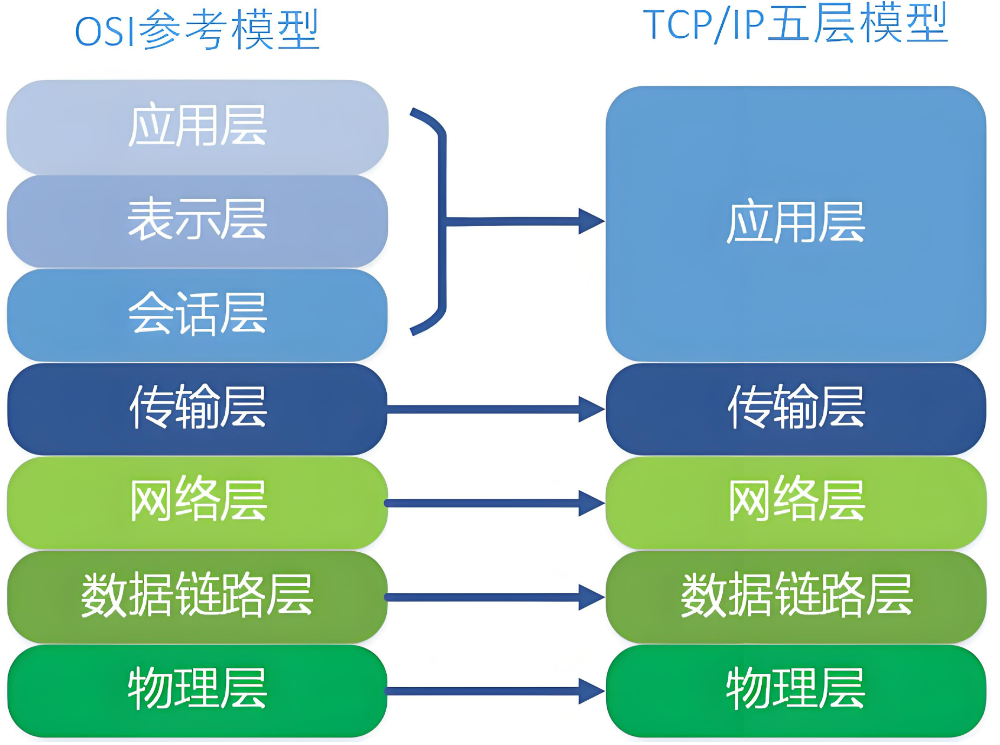


### 12，TCP与UDP的差别

TCP：面向连接的可靠的服务，它是面向字节流的，适用于可靠传输应用，例如：文件传输  

每一条TCP连接只能是点到点的

UDP：是无连接的不可靠的服务，它是面向报文的，适用于实时应用（IP电话、视频会议、直播等）

UDP支持一对一，一对多，多对一和多对多的交互通信

### 13，三次握手

**三次握手确保通信双方都具有收发数据的能力。**

**TCP是全双工通信，3次握手完成两个重要的功能，既要双方都能够通信，**也要允许双方就初始序列号进行协商，这个序列号在握手过程中被发送和确认。**如果只是两次握手，只能确定单向是可以通信的，**这样**当客户端发起请求，服务端响应，服务端创建新的套接字开始与客户端通信，但是如果这是一个无效的连接请求，如网络滞留的一个请求，这样会造成服务器的资源浪费。**


第一次握手：建立连接时，客户端发送 syn 包（syn=j）到服务器，并进入 SYN_SENT状态，等待服务器确认

第二次握手：服务器收到 syn 包，必须确认客户的 SYN（ack=j+1），同时自己也发送一个 SYN 包（syn=k），即 SYN+ACK 包，此时服务器进入 SYN_RECV 状态

第三次握手：客户端收到服务器的 SYN+ACK 包，向服务器发送确认包 ACK(ack=k+1），此包发送完毕，客户端和服务器进入 ESTABLISHED（TCP 连接成功）状态，完成三次握手。


### 14，http状态码

状态码，100~199表示请求已收到继续处理，200~299表示成功，300~399表示资源重定向，400~499表示客户端请求出错，500~599表示服务器端出错

200：响应成功

302：跳转，重定向

307（重定向，服务器要求客户端重新请求一个新的 URL）

400：客户端有语法错误

401（Unauthorized/未授权，需要身份认证）

403：服务器拒绝提供服务

404：请求资源不存在

405（Method Not Allowed/方法未允许）

415 不支持的媒体类型

500：服务器内部错误

502（Bad Gateway/错误的网关）

503（Service Unavailable/服务无法获得）

504（Gateway Timeout/网关超时

### 15，端口号

oracle端口号：1521

redis端口号：6379

mysql端口号：3306

ssh文件传输协议端口号：22

### 16，如何制定测试计划

测试计划包括测试目标、测试范围、测试环境的说明、测试类型的说明（功能，安全，性能，稳定性）、测试工具、模块的划分、测试负责人、测试执行轮次的时间安排、相关文档在文档管理库中的位置、测试的风险 。其中模块划分需要根据测试人员对于业务的熟悉程度及个人能力进行分配，工作量的估算需要根据以往测试时的经验，结合本次需求的修改，可以大致估算出测试量

### 17，在项目中怎样保证软件的质量？

项目质量不仅仅是某个人或某个团队来保障的，而是整个团队一起努力的结果，在公司级别需要有一个规范的项目流程：

- 产品：保证整个迭代周期中的产品逻辑，对于可能的兼容，升级做出预判，并给出方案
- 设计：满足产品表达的同时，保证设计的延续性
- 开发：产品细节的保证，技术方案选择要严谨，考虑兼容，性能，开发完成后要充分自测，严格遵循开发规范操作
- 测试：验证产品逻辑，站在用户角度对交互设计进行系统验证，尽可能多的使用技术手段保证测试质量
- 运维：制定严谨的上线流程和权限管控，做好生产环境监控报警，出现事故后有应急预案

### 18，功能测试用例的8大基本要素，或者说测试用例包含哪些内容？

用例编号、用例标题、功能模块、优先级、前置条件、测试数据、执行步骤、预期结果

### 19，编写测试用例的方法主要有哪些？

- **等价类划分方法**：等价类划分法将程序所有可能的输入数据（有效的和无效的）划分成若干个等价类。
- **边界值方法**：边界值分析法就是对输入或输出的边界值进行测试的一种黑盒测试方法。
- **错误推测方法**：在测试程序时，人们可以根据经验或直觉推测程序中可能存在的各种错误，从而有针对性地编写检查这些错误的测试用例的方法。
- **因果图方法**：因果图法是一种适合于描述对于多种输入条件组合的测试方法，根据输入条件的组合、约束关系和输出条件的因果关系，分析输入条件的各种组合情况，从而设计测试用例的方法，它适合于检查程序输入条件涉及的各种组合情况。
- **判定表驱动分析方法**：判定表是黑盒测试的方法之一，判定表是把作为条件的所有输入的各种组合值以及对应输出值都罗列出来而形成的表格。
- **正交分解法**：是研究多因素多水平的一种设计方法，它是根据正交性，由试验因素的全部水平组合中挑选出部分有代表性的点进行试验，通过对这部分试验结果的分析了解全面试验的情况，找出最优的水平组合。
- **场景分析法**：分析软件应用的场景，从用户的角度出发，从场景的角度来设计测试用例，是一种面向用户的测试用例设计方法。关心用户做什么，而不是关心产品做什么。
- **全局探索式测试方法**：测试人员根据应用程序所提供的信息自由发挥，不受限制，不受任何约束的探索程序的各种功能。

### 20，APP 测试和 web 测试有什么区别

Web 端测试和移动端测试类型基本相似，都需要进行功能测试、性能测试、安全性测试，他们主要区分 web 端一般都是 b/s 架构，基于浏览器的，app 是 c/s 架构，是有客户端的。

(1) 从**系统架构**来看的话：web 测试只要更新了服务器端，客户端就会同步更新；而如果是app 端下修改了服务端，意味着客户端用户所有使用的核心版本都需要进行回归测试一遍。

(2) **客户端性能**方面：Web 端可能只会关注响应时间；App 则还要关心流量、电量、cpu等；

(3) **兼容方面**：Web 是基于浏览器的，所以更倾向于浏览器（IE、Chrome、firefox）和电脑硬件，电脑系统方向的兼容；App 测试则必须依赖于手机或者 pad，不仅要看分辨率、频目尺寸、重要看设备系统。

### 21，遇到偶现性bug该怎么办？

偶现性bug也是bug，但是并不是可以完美复现的，有可能测试时候没问题，上线就有问题了，复现起来难度也很大。出现的原因有很多，可能开发代码判断逻辑有问题，可能前端组件版本升级不支持该方法而导致。

我在工作中遇到的经典问题：

- 后端：crm系统，对一个工单进行评价逻辑，后端忘记在循环之后 i --; 造成代码判断人员跳跃问题，也就是说，本来有10个人评价，可能因此造成9个人，或者8个人不固定，在测试环境中，测试人员过少，没有大量数据测试，因此测试不出来人员跳跃问题，线上人员一多，问题就出来了，时好时坏。这也是后端没有代码自测，测试没有大量数造成的经典问题。
- 前端：在线竞赛练习系统，竞赛详情处有参赛人员数据统计折线图，本来系统好好的，后来折线图折叠了，导致系统统计不准确，后来前端查询相关api文档，发现Echarts更新版本，这个方法不再维护，默认为最新的版本，因此才导致如此，将版本升级，前端方法进行了更改，就完美解决了

因此，遇到概率性bug首先是要确定该bug复现的难易度，尽可能的去复现，实在复现不了，再考虑开发代码方面以及第三方库版本方面问题，方法过时问题。测试要做好记录，如果不影响正常功能使用，可以稍作缓缓，放在下一个迭代当中优化，如过该bug影响主流程，那么要今早处理问题，及时解决，并上线。

### 22，Bug的优先级和严重程度

Priority(优先级)和 Severity(严重程度)是提交 bug 的两个重要属性。通常，测试 人员在提交 Bug 时，只定义 Bug 的 Severity, 即该 Bug 的严重程度，而将 Priority交给 Project Leader 或 Team Leader 来定义，由他们来决定该 Bug 被修复的优先等级。某种意义上来说，Priority 的定义要依赖于 Severity，在大多数情况下，Severity 越严重，那这个Bug 的 Priority 就越高。

Severity（严重程度）如下：

Blocker（有妨碍的）: 即系统无法执行、崩溃或严重资源不足、应用模块无法启动或异常退出、无法测试、造成系统不稳定

Critical（紧要的）：即影响系统功能或操作，主要功能存在严重缺陷，但不会影响到系统稳定性

Major（严重的）：即界面、性能缺陷、兼容性。

Minor/Trivial（次要的/不严重的）:即易用性及建议性问题。

Priority（优先级）：Immediate（立刻）、Urgent（紧要、优先）、High（高度重视）、Normal（正常）、Low（稍缓）

### 23，bug的生命周期

New：发现 bug，未经评审决定是否指派给开发人员进行修改。

Open：确认 bug，并且认为需要进行修改，指派给相应的开发人员。

Fixed：开发人员进行修改后标识成修改状态，有待测试人员的回归测试验证。

Rejected：如果认为不是 Bug，则拒绝修改。

Delay：如果认为暂时不需要修改或暂时不能修改，则延后修改。

Closed：修改状态的 Bug 经测试人员的回归测斌验证通过，则关闭 Bug。

Reopen：如果经验证 Bug 仍然存在，则需要重新打开 Bug，开发人员重新修改。

### 24，如何定位前后端bug

1. 测试遇到 bug，首先 Fiddler 开启抓包后看是否能抓到接口，如果不能抓到接口，说明是前端 BUG
2. 如果抓到接口，但是接口请求参数或者参数值错误，说明是前端 BUG
3. 如果是接口应答信息错误，说明是后端 BUG

### 25，你最近这家公司测试机有多少？

参考答案：

（1）小公司一般十几台，例如：苹果 5~6 台，安卓 10+台

（2）大公司测试机很多，兼容性测试更深一点，例如：苹果 30+台，安卓 100+台

### 26，bug 如何提交记录

1. 提交到 bug 管理工具，例如：禅道/jira/公司自研用例管理平台
2. 包括 bug 标题以及 bug 描述（前提条件，操作步骤，预期结果，实际结果），所属模块，所属版本，bug 严重程度，提交所对应的开发）。

### 27，你们的测试流程是什么?

- 产品经理整理好需求之后，会邀请会议，参加需求评审会议，确定此次需求功能点
- 测试根据需求文档，制定相对应的测试计划，以及书写测试用例
- 测试邀请会议进行测试用例的评审
- 开发开发完毕会首先给产品demo，产品确认是按照需求开发的之后，再指派给测试
- 测试按照需求以及设计图进行测试
- 测试有问题的指派给对应开发
- 开发修改完毕之后，重新指派给测试，测试进行复测
- 测试测试通过之后，指派给产品进行最后的验收
- 产品验收通过，单个任务单关闭，任务结束
- 测试上线前最后进行模块整个覆盖测试，确认无误，开始上线，测试结束

### 28，http 和 https的区别

HTTP:超文本传输协议，是一个客户端和服务器端的请求和应答的标准。

HTTPS:是以安全为目标的 HTTP 通道，HTTP 的安全版本，HTTP 下加入 SSL 层，HTTPS的安全基础是 SSL,因此加密的详细内容就需要 SSL.

他们的区别如下：

1. HTTP 信息是明文传输的，而 HTTPS 是安全的 具有安全性的 ssl 加密传输

2. HTTP 标准端口是 80 ，而 HTTPS 的标准端口是 443
3. HTTP 无需证书，而 HTTPS 需要认证证书.需要到 CA 申请证书，一般免费证书较少，

因而需要一定费用

### 29，进程和线程的区别

进程与线程的区别

- 进程是资源分配最小单位，线程是程序执行的最小单位；
- 进程有自己独立的地址空间，每启动一个进程，系统都会为其分配地址空间，建立数据表来维护代码段、堆栈段和数据段，线程没有独立的地址空间，它使用相同的地址空间共享数据；
- CPU 切换一个线程比切换进程花费小；
- 创建一个线程比进程开销小；
- 线程占用的资源要⽐进程少很多。
- 线程之间通信更方便，同一个进程下，线程共享全局变量，静态变量等数据，进程之间的通信需要以通信的方式（IPC）进行；（但多线程程序处理好同步与互斥是个难点）
- 多进程程序更安全，生命力更强，一个进程死掉不会对另一个进程造成影响（源于有独立的地址空间），多线程程序更不易维护，一个线程死掉，整个进程就死掉了（因为共享地址空间）
- 进程对资源保护要求高，开销大，效率相对较低，线程资源保护要求不高，但开销小，效率高，可频繁切换；

### 30，在浏览器中输入了一个 url 后，请求流程是什么样的

1、DNS 域名解析

2、与服务器建立 TCP 连接

3、发起 HTTP 请求，发送数据

4、服务器响应 HTTP 请求，返回数据

5、浏览器解析数据、渲染

6、关闭连接

### 31，说几个常见的 HTTP 请求头字段吧

| 字段名         | 解释                                         |
| -------------- | -------------------------------------------- |
| Host           | 目标域名或者ip地址                           |
| Content-Length | 请求数据长度                                 |
| Accept         | 客户端希望接收的数据类型，* / * 代表所有类型 |
| User-Agent     | 客户端使用什么工具去访问浏览器               |
| Content-Type   | 请求体中数据的类型                           |
| Cookie         | 请求体中携带的cookie信息                     |

### 32，当开发人员说不是 BUG 时，你如何应付？

开发人员说不是bug，有2种情况： 

一是需求没有确定，所以这个时候可以找来产品经理进行确认，需不需要改动，商量确定好后再看要不 要改。 

二是这种情况不可能发生，所以不需要修改，这个时候可以先尽可能的说出是BUG的依据是什么？如果 被用户发现或出了问题，会有什么不良结果？ 如果还是不行，那可以给这个问题提出来,跟开发经理和测试经理进行确认。如果最终bug被确定不改， 那么就要在测试报告里面记录一下，以便以后查阅。

### 33，如何提交一份高质量的缺陷跟踪单

首先要明确，缺陷跟踪单不仅仅是给自己看的，所以高质量的缺陷单，最主要的一条判断标准是，别人 一看就懂，标题简洁明了，步骤条理清晰。还需考虑缺陷的完备性，比如缺陷等级、所属功能模块、版 本、复现步骤、预期结果、实际结果、产生原因、日志截图等

### 34，给你一个项目，如何开展测试

1.查找需求说明、项目设计等相关文档，分析需求。 

2.制定测试计划，确定测试范围和测试策略。    

3.设计测试用例，包括功能、兼容、性能、安全等方面    

4.开展测试执行    

5.回归测试以及发送测试报告

### 35，黑盒测试和白盒测试的区别

黑盒测试就是把系统当成一个黑盒子一样，不需要了解系统内部的细节，只关注输入和输出，通过手动 输入不同的数据，来验证输出是否符合预期； 

白盒测试需要了解系统内部实现细节，通常是针对函数进行测试，需要写测试代码来调用对应的函数， 通过传入不同的参数，来测试函数返回值是否符合预期。

### 36，测试报告里都包含哪些内容

测试范围，测试时间、参与人员、测试策略、BUG数量、上线风险、遗留问题、测试是否通过

### 37，如何提高用例的覆盖率，减少漏测

1、要根据需求文档来编写用例，确保每条需求都被对应的用例覆盖 

2、要充分理解业务，挖掘隐形需求，并编写对应的用例 

3、除了正常的业务场景，多考虑一些异常的场景和数据 

4、要从多个维度对软件进行测试，功能、性能、安全、兼容、用户体验性等各方面来考虑 

5、多站在用户的角度去思考问题，模拟用户的使用场景

6、组织用例评审

### 38，当发现一个bug时，如何确定是不是一个bug

1、看需求文档，是否有明确的要求 

2、看下这个问题是否违反了正常人的行为习惯，或者行业的通用规范 

3、可以找产品经理或者开发人员沟通确定是否为bug 

4、对于无法打成一致的问题，可以组织相关人员开会，共同来决定是否为bug

### 39，没有需求文档，如何开展测试

没有需求文档不代表没有需求。 可以找相关人员进行沟通，获取需求，比如产品经理、开发人员 可以参考同行业竞品，总结梳理需求 可以根据用户的使用习惯和一些行业的规范，来总结一些功能需求


## 移动端

### 1，常用的adb命令有哪些

| 命令                              | 含义                                                         |
| --------------------------------- | ------------------------------------------------------------ |
| adb devices                       | 展示当前电脑连接的设备，如果电脑上有个多手机，需要adb -s 指定对应设备 |
| adb install xxx.apk               | 直接安装xxx.apk到手机中，注意：必须打开手机设置里的USB安 装  |
| adb install -r xxx.apk            | 替代存在的应用，不会删除应用数据，用于更新应用               |
| adb shell am monitor              | 获取当前活动状态的app包名，需要先启动app，再执行命令         |
| adb uninstall com.xxx.application | 直接删除应用和所有数据                                       |
| adb shell pm list packages        | 列出设备所有安装的包名                                       |
| adb shell pm list packages -s     | 列出设备本身自带的安装包                                     |
| adb shell pm list packages -3     | 列出第三方设备的软件安装包(就是你在外部安装的apk，而不是在模拟器搜索安装的) |
| adb shell pm clear 包名           | 清除app的缓存                                                |
| adb pull 远程文件 本地路径        | 从 Android 设备下载某文件到本地电脑中                        |
| adb push 本地文件 远程路 径       | 从本地电脑上传文件到Android设备的某目录中                    |
| adb logcat > log.txt              | 指定操作app进行操作日志记录，书写此命令，一直在等待闪烁，此时操作模拟器上的app，需要停止按ctrl+c |
| adb get-state                     | 获取设备的状态（设备的状态有三种：device，设备连接正常；offline，连接出现异常，设备无响应；unknown，设备未连接） |
| adb kill-server                   | 启动 adb 服务                                                |
| adb start-server                  | 启动adb服务                                                  |
| adb reboot                        | 重启设备                                                     |
| adb connect                       | 远程连接设备                                                 |
| adb disconnect                    | 断开设备连接                                                 |
| adb shell dumpsys meminfo 包名    | 查看app内存占用情况                                          |
| adb shell top -m 10 -s cpu        | 查看cpu的使用情况  -m 显示最大数量 -s 按指定行排序           |
| adb shell am start -W 包名/界面名 | 测试app的启动速度                                            |


#### 延伸：ADB 的概念 

**ADB**，全名**Android Debug Bridge**，是Android提供的一个通用的调试工具，是一个**C/S**架构的命令行工具，通过这个工具，使得我们的PC能够和Android设备来进行通信。

#####  ADB的工作原理

adb包含三个部分：

- Client端：运行在开发机器中，用来发送adb命令，比如电脑


- Daemon [ˈdiːmən]守护进程：运行在调试设备，比如手机、模拟器中，用来接收并执行adb命令


- Server端：运行在开发机器中，用来管理Client端和手机端Daemon之间的通信。


当在电脑命令行窗口中输入adb 命令时，会先执行adb客户端，客户端拿到命令之后，会发送给adb服务端，server再将命令传给Daemon，最后在手机上执行。假如在手机上安装一个应用，会有一个返回信息，会将信息传递给adb服务器，adb 在给客户端，最后显示在命令行。

总结：

- client端将命令发送给server端


- b.server端会将命令发送给daemon端


- daemon端进行执行


- 将执行结果，返回给server端


- server端将结果再返回给client端


##### 获取包名和界面名

- 包名：app包名，通过app的包名开区分不同的app，app包名是唯一的
- 界面名(启动名)：相当于web页面当中的链接地址，在app中，每个界面都有一个名字

原因：自动化过程当中，需要通过app的包名和界面名来启动app 

前置条件：打开雷电模拟器，打开一个app，这里打开设置

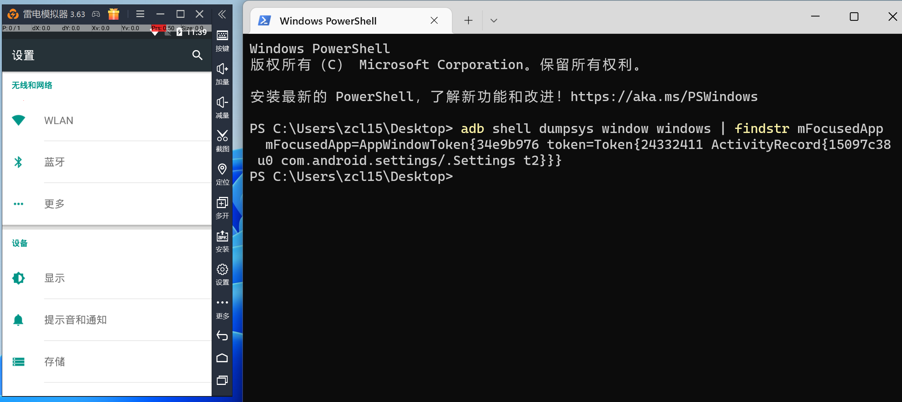

命令：windows命令：

​					adb shell dumpsys window windows | findstr mFocusedApp  或者	

​                    adb shell dumpsys window windows | findstr mCurrentFocus

​			        adb shell dumpsys window windows | findstr "usedApp"

简单一点的命令：adb shell dumpsys window | findstr "usedApp"

解释：

com.android.settings/.Settings 			com.android.settings：包名  	.Settings ：界面名

**注意：此上述需要模拟器打开软件获取**


##### 使用 aapt 获取

<font color=red>**使用aapt不需要打开模拟器打开软件获取**</font>

使用aapt获取包名和路径名：aapt dump badging "D:\DEV\Resource\apk\xuechebu.apk"

解释： aapt dump badging + 软件安装路径地址

package 表示包名

package: name='com.bjcsxq.chat.carfriend'

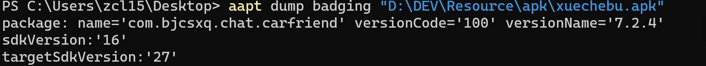

launchable-activity 表示界面名

launchable-activity: name='com.bjcsxq.chat.carfriend.module_main.activity.SplashActivity'

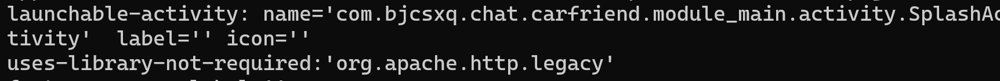


### 2，用过monkey吗？用monkey来做什么？发现过什么问题

monkey   集成在adb工具当中，主要用来做稳定性测试，monkey是通过java语言编写的一种稳定性测试工具，主要用来测试app会不会出现crash(崩溃)的情况

之前用monkey测APP的稳定性时，发现过一些crash的情况，当时通过查看monkey日志，找到了一些 空指针异常（NullPointException）报错，将报错发给了开发，后来开发判断是因为兼容性问题，修复 后就没问题了。


#### 相关知识点延伸

##### monkey 的一些命令

- -p   对指定的app进行随机操作
  - adb shell monkey -p 包名 次数(随机操作次数)
- -v  记录信息的级别
  - level 0 : adb shell monkey -p 包名 -v 次数(随机操作次数)                            [默认级别]
  - **level 1: adb shell monkey -p 包名 -v -v 次数(随机操作次数)**                        [打印出来的信息多，只打印与本程序有关的信息，**推荐**]
  - level 3: adb shell monkey -p 包名 -v -v -v 次数(随机操作次数)                    [打印出来的信息更多，本程序和其他程序有关信息都会被打印出来]
- -s 指定伪随机数。如果两次的伪随机数相同，那么两次的操作流程、步骤会一模一样，作用，**复现上次出现的错误**
  - adb shell monkey -p 包名 -v -v -s  伪随机数字 次数(随机操作次数)  
- --throttle 用于指定随机事件的间隔时间，单位是毫秒
  - **adb shell monkey -p 包名 -v -v --throttle 时间 -s 伪随机数字 次数(随机操作次数)**                     **重要**

组合使用：

- adb shell monkey -p 包名 --throttle 间隔操作时间 --pct-touch 占据整个随机事件的百分比数字 --pct-motion 占据整个随机事件的百分比数字 -v -v -s  伪随机数字 次数(随机操作次数)
  - --pct-touch   10       触摸(整个随机事件操作次数的百分占比)
  - --pct-motion 50   滑屏(整个随机事件操作次数的百分占比)

adb shell monkey -p com.baidu.homework --throttle 200 --pct-touch 10 --pct-motion 50 -v -v -s 10 100

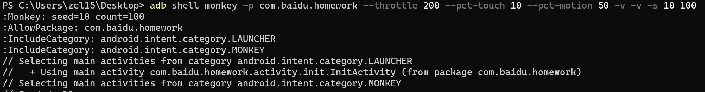

adb shell monkey -p com.baidu.homework --throttle 200 --pct-touch 10 --pct-motion 50 -v -v -s 10 100 > log.log

将运行结果打印到日志文件当中，在桌面上

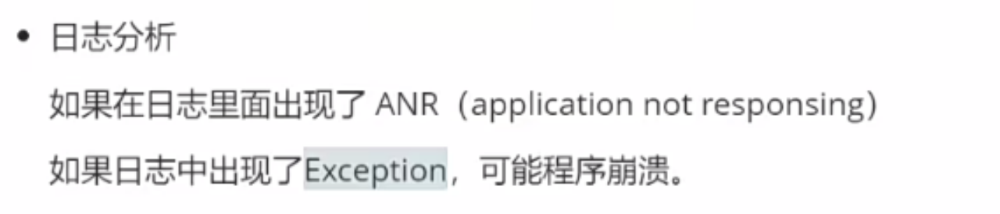


### 3，APP崩溃/闪退，一般都是什么原因造成的

根据之前我遇到的几次崩溃/闪退来看，都是因为代码问题，APP的代码内部报空指针错误 （NullPointException）。 另外还可能是网络问题

### 4，iOS系统和Android系统的区别

1. iOS 稳定性比较高，Android相对差一些，就看厂商的优化了 
2. Android 因为开源而导致碎片化严重，每个厂商都定制了自己的 ROM  
3. Android更容易出现信息泄露，权限问题，安全性漏洞等问题 
4. iOS 的开发语言是 Swift 和 Objective-C，运行效率高，Android 的开发语言为 java ，运行效率低 
5. 做兼容性测试时，Android 要做的设备比较多，iOS 相对少一些

### 5，怎么测试APP的兼容性

主要看客户这边对兼容性的要求高不高 如果要求不高的话，部门内有一些主流的安卓和iOS机型，大概七八部手机吧，平时主要用这些测试下就行； 如果要求高的话，一般会购买一些第三方测试服务，像是WeTest、Testin之类的，他们的机型更多，而且最终会提供一个测试报告 

### 6，安卓最新的版本是多少，iOS最新的版本是多少

截至2024年11月，Android系统的最新版本是**Android 14**，iOS的最新版本是‌**iOS 18.2 Beta测试版**‌（版本号：22C5125e）

### 7，手机APP更新测试，说下测试点

移动端版本更新升级是一个比较重要的功能点，主要分为强制更新和非强制更新。 

强制更新需要测试的点有： 

1. 强制升级是否可以升级成功，功能是否正常
2. 升级后的数据是否正常 
3. 强制升级的弹窗是否可以关闭  
4. 强制更新的提示，包括未更新和已更新 
5. 版本号对比等等 

非强制更新的测试点有：

1. 提示弹框的显示，是否可以选择暂不更新和立即更新；是否可以关闭弹框不显示
2. 选择暂不更新后，老版本是否可以正常使用
3. 选择立即更新后，更新能否成功，新版本号是否是最新版本；功能是否是最新的 
4. 非强制更新弹框的提示频率，是每天一次还是每周一次，根据需求来测 
5. APP设置里的版本更新，是否也能触发非强制更新 
6. 用户选择继续使用老版本后，使用某些新版本才有的功能时，是否还有更新提示  
7. 版本号对比等

### 8，如何模拟弱网测试

很多抓包工具都可以做到模拟网络情况，比如fiddler可以在“自定义规则”中设置发送/接受1KB数据需要的时间来控制网络传输速率。 

如果是网站还可以采用chrome开发者工具模拟弱网； 如果是手机app则可以在手机自身的网络设置里设置为2G/3G/4G/飞行模式。

### 9，做兼容性测试时，如何选择机型

公司内部有一些客户端统计数据，可以看到APP用户里，哪些机型占比最高，主要选择一些主流机型就 行，比如iPhone13/14/15/16、华为p40、小米15、OPPO、vivo这些。 另外每年也会购买一些新出的机型。

### 10，在做APP测试时，如何去获取APP的安装包

公司内部有一个移动端包管理平台，开发写完代码后，会打包发布到包管理平台中。无论安卓还是iOS， 都可以通过手机浏览器访问包管理平台，然后点击不同系统、不同版本的安装包进行下载，在手机上点 击安装就行。

### 11，测过APP的push推送吗？都要考虑哪些测试点

主要测试这几点： 

1. 什么场景下会触发push 
2. push消息内容的准确性 
3. push推送的用户是否准确（全部推送/部分推送/指定用户推送） 
4. push推送消息的点击跳转是否正常 
5. app在前台运行和后台运行，用户是否都能收到push消息 
6. 用户未登录，是否能接受到push消息
7. 用户长时间未登录，后续第一次登录时，是否会收到历史推送消息

### 12，APP冷启动和热启动的区别

冷启动：指 app 被后台杀死后，在这个状态打开 app，这种启动方式叫做冷启动 

热启动：指 app 没有被后台杀死，仍然在后台运行（如按home键），通常我们再次去打开这个 app， 这种启动方式叫热启动。 热启动比冷启动速度更快。

### 13，APP某个功能失效了，如何排查是客户端还是服务端 的问题

1.  检查客户端网络是否有问题，可以查看其他APP能否正常使用 
2. 检查是否为版本问题，可以换个操作系统（安卓、ios），或者换个其他软件版本试试 
3. 检查是否为兼容性问题，可以换个手机试试 
4. 抓包分析，如果APP没有向服务器发送请求，或者请求参数不对，就是APP的问题；如果服务端响 应数据不对，就是服务端的问题

### 14，工作中都用到了抓包工具的什么功能，分别是在什么 场景下使用的

**分析前后端bug** 

发现bug后，对bug做基本的定位，判断是客户端还是服务端的问题 

**请求断点** 

拦截客户端发送的请求，修改某些参数，测试服务端接受到异常参数后的处理逻辑 

**响应断点** 

拦截服务端返回的响应，修改某些数据（如状态码），测试客户端接受到异常响应后的处理逻辑； 

拦截服务端返回的响应，修改某些数据（响应json），构造出一些特殊场景（如返回大量数据，测试分 页情况）

**弱网** 

为了测试APP在弱网情况下，核心功能是否可用，如果不可用，是否有友好提示；是否会出现闪退、崩 溃的情况 

**Mock** 

当服务端没开发完成，使用Fiddler模拟服务端来返回有效的响应内容，可以先测试APP端是否功能正常

### 15，针对 App 的安装功能，写出测试点？

1. 正常安装测试，检查是否安装成功。

2. APP版本覆盖测试。例如：先安装一个1.0版本的APP,再安装一个高版本(1.1版本)的APP，检查是否被覆盖。

3. 回退版本测试。例如：先装一个 2.0 版本的 APP,再安装一个 1.0 版本的 APP,正常情况下版本是可以回退的。

4. 安装时内存不足，弹出提示。

5. 根据安装手册操作，是否正确安装。

6. 安装过程中的意外情况（强行断电、断网、来电话了、查看信息）等等，检查会发生的情况。

7. 通过‘同步软件’，检查安装时是否同步安装了一些文件。

8. 在不同型号、系统、屏幕大小、分辨率上的手机进行安装。

9. 安装时是否识别有 SD 卡，并默认安装到 sd 卡中。

10. 安装完成后，能否正常启动应用程序。

11. 安装完成后，重启手机能否正常启动应用程序。

12. 安装完成后，是否对其他应用程序造成影响。

13. 安装完成后，能否添加快捷方式。

14. 安装完成后，杀毒软件是否会对其当做病毒处理。

15. 多进程进行安装，是否安装成功。

16. 在安装过程中，所有的提示信息必须是英文或者中文，提示信息中不能出现代码、符号、

乱码等。

17. 安装之后，是否自动启动程序。
18. 是否支持第三方安装。
19. 在安装中点击取消。

### 16，app的专项测试

（1）APP冷/热启动测试

（2）APP 权限测试（设备权限、app 权限设置）

（3）APP 安装/卸载/（弱、强）升级

（4）APP 消息推送（APP、短信、微信、QQ）

（5）APP 前端性能（耗电量、顺滑度、耗流量）

（6）APP 弱网

（7）APP 稳定性测试

29，ios 系统和 android 系统的区别

1）iOS 稳定性与安全性高，iOS 可能没有系统性问题，只是可能有屏幕分辨率兼容性问题。

2）Android 因为开源而导致碎片化严重，每个厂商都定制了自己的 ROM

3）Android 容易信息泄露，各手机厂商都会对 Android 进行修改，有权限等安全性问题。

4）流畅度上，Android 采用虚拟机运行机制，这种机制导致运行一段时间后就容易出现卡顿；ios 几乎不会出现卡顿现象。

5）性价比上，iso 系统拥有自研专利，并且目前为止禁止其他生产厂商使用；Android 系统是 Google 公司提供的免费、开源系统，Android 比 IOS 开放更多的应用接口 API，Android 的性价比要远高于 IOS。

### 17，你们公司是怎么做 app 兼容性测试的？公司的测试机少怎么办？

（1）主要还是通过手工去测试已有的机器。

（2）有时可能会有测试机不够的情况，用自己的新手机或者跟公司的同事借一下，以及交叉测试。

（3）个别用户会反馈在哪些机型上出现一些崩溃，有时哪些机型确实要去测试一下。

（4）录制自动化脚本，夜间执行自动化测试用例

（5）部分机型通过云测平台（testIn、weTest）的云真机测试，付费居多。

（6）使用模拟器测试可能会出问题，经常出现模拟器没有问题而真机有问题，所以尽可能拿真机覆盖。

## 数据库部分

### 1，数据库引擎的类型

#### 1.1 **InnoDB引擎**

这是**MySQL 5.5或更高版本的默认存储引擎**。它提供了事务安全(ACID兼容)表，支持外键引用完整性约束。它支持**提交、回滚和紧急恢复**功能来保护数据。它还支持**行级锁定**。当在多用户环境中使用时，它的“一致非锁定读取”提高了性能。它将数据存储在集群索引中，从而减少了基于主键的查询的I/O。

支持外键，保持数据的一致性和完整性

innoDB拥有自己独立的缓冲池，常用的数据和索引都在缓存中

#### 1.2 **InnoDB 索引和 MyISAM 索引的区别，索引的优缺点**

1）存储结构（主索引／辅助索引）

InnoDB 的数据文件本身就是主索引文件。而 MyISAM 的主索引和数据是分开的。

InnoDB 的辅助索引 data 域存储相应记录主键的值而不是地址。而 MyISAM 的辅助索引和主索引没有多大区别。

innoDB 是聚簇索引，数据挂在逐渐索引之下。

2）锁: MyISAM 使用的是表锁；InnoDB 使用行锁

3）事务: MyISAM 没有事务支持和 MVCC；InnoDB 支持事务和 MVCC

4）全文索引: MyISAM 支持 FULLTEXT 类型的全文索引;InnoDB 不支持 FULLTEXT 类型的全文索引，但是 InnoDB 可以使用 sphinx 插件支持全文索引，并且效果更好

5）主键: MyISAM 允许没有任何索引和主键的表存在，索引都是保存行的地址; InnoDB如果没有设定主键或非空唯一索引，就会自动生成一个 6 字节的主键，数据是主索引的一部分，附加索引保存的是主索引的值

6）外键: MyISAM 不支持；InnoDB 支持

### 2，MySQL 4 种隔离级别

- 未提交读READ UNCOMMITTED：一个事务在提交之前，对其他事务是可见的，即事务可以读取未提交的数据。存在“脏读”（读到了脏数据）问题；
- 提交读READ COMMITTED：事务在提交之前，对其它事务是不可见的。存在“不可重复读”（两次查询的得到的结果可能不同，即可能在查询的间隙，有事务提交了修改）问题。解决了“脏读”问题。
- 可重复读REPEATABLE READ：在同一事务中多次读取的数据是一致的。解决了脏读和不可重复读问题，存在“幻读”（在事务两次查询间隙，有其他事务又插入或删除了新的记录）。--- MySQL默认隔离级别。
- 可串行化SERIALIZABLE：强制事务串行化执行。即一个事物一个事物挨个来执行，可以解决上述所有问题。

### 3，什么是事务

事务：是数据库操作的最小工作单元，是作为单个逻辑工作单元执行的一系列操作；这些操作作为一个整体一起向系统提交，要么都执行、要么都不执行；事务是一组不可再分割的操作集合（工作逻辑单元）；

1、原子性(Atomicity)：事务中的全部操作在数据库中是不可分割的，要么全部完成，要么均不执行。

2、一致性(Consistency)：几个并行执行的事务，其执行结果必须与按某一顺序串行执行的结果相一致。

3、隔离性(Isolation)：事务的执行不受其他事务的干扰，事务执行的中间结果对其他事务必须是透明的。

4、持久性(Durability)：对于任意已提交事务，系统必须保证该事务对数据库的改变不被丢失

### 4，SQL 中常用的聚合函数都有哪些？

max()：最大值

min()：最小值

avg()：平均值

sum()：求和

count()：统计总数

### 5，主键、外键和索引的区别

1）定义

主键：唯一标识一条记录，不能有重复的，不允许为空

外键：表的外键是另一表的主键, 外键可以有重复的, 可以是空值

索引：该字段没有重复值，但可以有一个空值

2）作用

主键：用来保证数据完整性

外键：用来和其他表建立联系用的

索引：提高查询排序的速度

3）个数

主键：只能有一个

外键：一个表可以有多个外键

索引：一个表可以有多个索引

### 6，**列举几种表连接的方式,有什么区别?** 

左连接: 左边为主表表数据全部显示, 匹配表的不匹配部分不显示

右连接: 右边为主表表数据全部显示, 匹配表的不匹配部分不显示

内连接: 只有两个元素表相匹配的才能在结果集中显示

全外连接: 连接中的不匹配的数据全部会显示出来

交叉连接: 笛卡尔乘积, 显示的结果是连接表数的乘积

### 7，悲观锁和乐观锁的区别？

**为什么需要锁？**

在多用户环境中，在同一时间可能会有多个用户更新相同的记录，这会产生冲突。这就是著名的并发性问题。

**并发控制机制**

悲观锁：假定会发生并发冲突，屏蔽一切可能违反数据完整性的操作

乐观锁：假设不会发生并发冲突，只在提交操作时检查是否违反数据完整性

**乐观锁原理**

使用数据版本（Version）记录机制实现，这是乐观锁最常用的一种实现方式。何谓数据版本？即为数据增加一个版本标识，一般是通过为数据库表增加一个数类

型的“version”字段来实现。当读取数据时，将 version 字段的值一同读出，数据每更新一次，对此 version值加一。当我们提交更新的时候，判断数据库表对应记

录的当前版本信息与第一次取出来的version 值进行比对，如果数据库表当前版本号与第一次取出来的 version 值相等，则予以更新，否则认为是过期数据。用下

面的一张图来说明：


**悲观锁原理**

需要使用数据库的锁机制，比如 MySQL：

1. 先关闭 auto commit 属性，改为手动提交事务

2. 在事务内通过 select...for update 语句锁定数据，如：select * from t_goods where id=1 for update

3. 此时在 t_goods 表中，id 为 1 的 那条数据就被我们锁定了，其它的事务必须等本

次事务提交之后才能执行。这样我们可以保证当前的数据不会被其它事务修改

### 8，在工作中什么时候会使用数据库？

（1）查询数据（查看数据的准确性）

比如新增用户，然后查询数据库看看是否新增成功

（2）造数据（方便测试）

比如需要大量用户去模拟登录接口，查看接口压力，进行数据的构造（可以使用sql的存储过程进行快速插入）

（3）初始化、备份还原数据

话术：

原来我们数据库用的比较多的，就是数据结果检查，测试一些数据准备，性能测试造大量数据。

测试执行到的结果，我们需要通过sql语句 select来查找数据库对应的表，看看数据库信息跟我们执行的结果是否一致，比如：生成申请借款后，我们会去数据库里面去检查下,数据库中数据是否 跟申请订单数据一致。

 我们在测试执行时需要做一些测试数据准备，我们就用 insert into输入数据或(者update set修 改数据)，我们需要到数据库查看有没有相关记录保存，保存的数据跟我们输入或者修改的记录是否 一致; 比如：原来我们一个初审功能里面有个分页功能，测试分页功能，需要100条数据，我们就通 过数据库操作添加100，可以用 insert into。也可以用脚本实现，或者存储过程

还有在做性能测试时，模拟用户场景时需要用到大量的数据，这时就需要我们到数据库中制造大量 的数据出来。比如说，测试充值，需要大量用户数据，充值表中大量数据，比如10W条数据，我们就用存储过程去造。

### 9，存储过程是怎样编写的（MySQL）？

在 MySQL 中，存储过程是一种预先编写并存储在数据库中的 SQL 脚本，可以通过调用来执行。它可以包含 SQL 语句的集合，用于实现特定的功能。以下是编写存储过程的基本步骤和语法：

#### 创建存储过程

```mysql
DELIMITER //

CREATE PROCEDURE 存储过程名(
    IN 输入参数 数据类型,
    OUT 输出参数 数据类型,
    INOUT 输入输出参数 数据类型
)
BEGIN
    -- SQL 语句
    DECLARE 变量名 数据类型; -- 声明变量
    SET 变量名 = 初始值;      -- 赋值

    -- 示例：查询某表中的记录数
    SELECT COUNT(*) INTO 输出参数 FROM 表名 WHERE 条件;

    -- 示例：插入数据
    INSERT INTO 表名 (列1, 列2) VALUES (值1, 值2);

    -- 示例：更新数据
    UPDATE 表名 SET 列1 = 新值 WHERE 条件;

    -- 示例：控制流（IF 或 LOOP）
    IF 变量名 > 10 THEN
        -- 逻辑
    END IF;
END //

DELIMITER ;

```

#### 调用存储过程

```mysql
CALL 存储过程名(参数1, 参数2, 参数3);
```

#### 示例 1：简单存储过程

**功能**：打印表中的记录数。

```mysql
DELIMITER //

CREATE PROCEDURE GetRecordCount(IN tableName VARCHAR(255), OUT recordCount INT)
BEGIN
    SET @query = CONCAT('SELECT COUNT(*) INTO @count FROM ', tableName);
    PREPARE stmt FROM @query;
    EXECUTE stmt;
    SET recordCount = @count;
    DEALLOCATE PREPARE stmt;
END //

DELIMITER ;
```

**调用**：

```mysql
CALL GetRecordCount('your_table_name', @outputCount);
SELECT @outputCount; -- 查看返回值
```

#### 示例 2：带输入输出参数的存储过程

**功能**：根据用户 ID 更新用户年龄，并返回更新后的年龄。

```mysql
DELIMITER //

CREATE PROCEDURE UpdateUserAge(
    IN userId INT,
    IN newAge INT,
    OUT updatedAge INT
)
BEGIN
    -- 更新用户年龄
    UPDATE users SET age = newAge WHERE id = userId;

    -- 查询更新后的年龄
    SELECT age INTO updatedAge FROM users WHERE id = userId;
END //

DELIMITER ;
```

**调用**：

```mysql
CALL UpdateUserAge(1, 30, @updatedAge);
SELECT @updatedAge; -- 查看返回值
```

#### 删除存储过程

如果不需要某个存储过程，可以使用以下语句删除：

```mysql
DROP PROCEDURE 存储过程名;
```


### 10，数据库中delete、truncate、drop的区别

- 首先drop、truncate是DDL数据定义语言，不支持事务的回滚操作，而delete是DML数据操作语言，支持事务的回滚操作。
- 其次，delete删除的是表中的部分以及全部数据，可以跟关键词where进行条件的限定，不可以删除表的结构、视图、索引、约束等等。而truncate和drop是全部删除表中的数据。但truncate与drop不同的是，truncate只删除表中的全部数据，保留表的结构、视图、索引、约束等。drop是全部干掉，包括表的数据；表的结构、视图、索引、约束。
- 对于删除速度来说，drop最快，truncate次之，delete最慢。
- 其中随着不断的进行DML操作，会不断提高表的高水位线，delete操作之后虽然表的数据删除，但是并没有降低表的高水位线，因此查询速度还是和delete操作前速度一样。而truncate操作会重置高水位线，数据库容量也会被重置，之后再进行DML操作的话也会有提升。

### 11，SQL语句的执行顺序

假如一条这样的SQL语句

```sql
select id, count(*)  
from user where age = 18 
group by id having count(*) > 5 
order by count(*) desc limit 2; 
```

执行顺序

```sql
from -> where -> group by -> having -> select -> order by -> limit
```

### 12, 你们用的什么数据库连接工具

Navicat，数据库版本 mysql 5.6，端口默认是3306

**延伸**：

连接数据库工具选择如下：

**简单查询和数据管理**：MySQL Workbench、phpMyAdmin、HeidiSQL。

**多数据库支持**：DBeaver、DataGrip、TablePlus。

**企业级管理**：Navicat、Toad for MySQL。

**轻量快速**：Sequel Pro（macOS）、HeidiSQL（Windows）。

### 13，根据以下数据库表，书写对应的mysql语句

题目来源于网上，具体讲解地址可以去观看：https://www.bilibili.com/video/BV1Vy4y1z7EX?spm_id_from=333.788.videopod.episodes&vd_source=041bc3fc775a34d6d411f01365cecd96&p=132

题目：

有3个表分别是 emp 员工表；dept 部门表，salgrade 是薪资表；根据这三个表，完成相关的数据库题目书写

建表语句：

**emp**

```mysql
/*
 Navicat Premium Data Transfer

 Source Server         : localhost_3306
 Source Server Type    : MySQL
 Source Server Version : 50740
 Source Host           : localhost:3306
 Source Schema         : test

 Target Server Type    : MySQL
 Target Server Version : 50740
 File Encoding         : 65001

 Date: 02/01/2023 17:39:20
*/

SET NAMES utf8mb4;
SET FOREIGN_KEY_CHECKS = 0;

-- ----------------------------
-- Table structure for emp
-- ----------------------------
DROP TABLE IF EXISTS `emp`;
CREATE TABLE `emp`  (
  `EMPNO` int(11) NOT NULL,
  `ENAME` varchar(255) CHARACTER SET latin1 COLLATE latin1_swedish_ci NOT NULL,
  `JOB` varchar(255) CHARACTER SET latin1 COLLATE latin1_swedish_ci NOT NULL,
  `MGR` int(255) NULL DEFAULT NULL,
  `HIREDATE` varchar(255) CHARACTER SET latin1 COLLATE latin1_swedish_ci NULL DEFAULT NULL,
  `SAL` int(255) NULL DEFAULT NULL,
  `COMM` int(255) NULL DEFAULT NULL,
  `DEPTNO` int(11) NOT NULL,
  PRIMARY KEY (`EMPNO`) USING BTREE
) ENGINE = InnoDB CHARACTER SET = latin1 COLLATE = latin1_swedish_ci ROW_FORMAT = Dynamic;

-- ----------------------------
-- Records of emp
-- ----------------------------
INSERT INTO `emp` VALUES (7369, 'SMITH', 'CLERK', 7902, '1980-12-17', 800, NULL, 20);
INSERT INTO `emp` VALUES (7499, 'ALLEN', 'SALESMAN', 7698, '1981-02-20', 1600, 300, 30);
INSERT INTO `emp` VALUES (7521, 'WARD', 'SALESMAN', 7698, '1981-02-22', 1250, 500, 30);
INSERT INTO `emp` VALUES (7566, 'JONES', 'MANAGER', 7839, '1981-04-02', 2975, NULL, 20);
INSERT INTO `emp` VALUES (7654, 'MARTIN', 'SALESMAN ', 7698, '1981-09-28', 1250, 1400, 30);
INSERT INTO `emp` VALUES (7698, 'BLAKE', 'MANAGER', 7839, '1981-05-01', 2850, NULL, 30);
INSERT INTO `emp` VALUES (7782, 'CLARK  ', 'MANAGER', 7839, '1981-06-09', 2450, NULL, 10);
INSERT INTO `emp` VALUES (7788, 'SCOTT ', 'ANALYST', 7566, '1987-04-19', 3000, NULL, 20);
INSERT INTO `emp` VALUES (7839, 'KING', 'PRESIDENT ', NULL, '1981-11-17', 5000, NULL, 10);
INSERT INTO `emp` VALUES (7844, 'TURNER', 'SALESMAN', 7698, '1981-09-08', 1500, 0, 30);
INSERT INTO `emp` VALUES (7876, 'ADAMS', 'CLERK', 7788, '1987-05-23', 1100, NULL, 20);
INSERT INTO `emp` VALUES (7900, 'JAMES ', 'CLERK ', 7698, '1981-12-03 ', 950, NULL, 30);
INSERT INTO `emp` VALUES (7902, 'FORD', 'ANALYST ', 7566, '1981-12-03', 3000, NULL, 20);
INSERT INTO `emp` VALUES (7934, 'MILLER ', 'CLERK', 7782, '1982-01-23', 1300, NULL, 10);

SET FOREIGN_KEY_CHECKS = 1;

```

**dept**

```mysql
/*
 Navicat Premium Data Transfer

 Source Server         : localhost_3306
 Source Server Type    : MySQL
 Source Server Version : 50740
 Source Host           : localhost:3306
 Source Schema         : test

 Target Server Type    : MySQL
 Target Server Version : 50740
 File Encoding         : 65001

 Date: 02/01/2023 17:39:13
*/

SET NAMES utf8mb4;
SET FOREIGN_KEY_CHECKS = 0;

-- ----------------------------
-- Table structure for dept
-- ----------------------------
DROP TABLE IF EXISTS `dept`;
CREATE TABLE `dept`  (
  `DEPTNO` int(11) NOT NULL,
  `DNAME` varchar(255) CHARACTER SET latin1 COLLATE latin1_swedish_ci NULL DEFAULT NULL,
  `LOC` varchar(255) CHARACTER SET utf8 COLLATE utf8_general_ci NULL DEFAULT NULL,
  PRIMARY KEY (`DEPTNO`) USING BTREE
) ENGINE = InnoDB CHARACTER SET = latin1 COLLATE = latin1_swedish_ci ROW_FORMAT = Dynamic;

-- ----------------------------
-- Records of dept
-- ----------------------------
INSERT INTO `dept` VALUES (10, 'ACCOUNTING', 'NEW YORK');
INSERT INTO `dept` VALUES (20, 'RESEARCH ', 'DALLAS ');
INSERT INTO `dept` VALUES (30, 'SALES', 'CHICAGO ');
INSERT INTO `dept` VALUES (40, 'OPERATIONS', 'BOSTON ');

SET FOREIGN_KEY_CHECKS = 1;

```

**salgrade**

```mysql
/*
 Navicat Premium Data Transfer

 Source Server         : localhost_3306
 Source Server Type    : MySQL
 Source Server Version : 50740
 Source Host           : localhost:3306
 Source Schema         : test

 Target Server Type    : MySQL
 Target Server Version : 50740
 File Encoding         : 65001

 Date: 02/01/2023 17:39:26
*/

SET NAMES utf8mb4;
SET FOREIGN_KEY_CHECKS = 0;

-- ----------------------------
-- Table structure for salgrade
-- ----------------------------
DROP TABLE IF EXISTS `salgrade`;
CREATE TABLE `salgrade`  (
  `GRADE` int(255) NULL DEFAULT NULL,
  `LOSAL` int(255) NULL DEFAULT NULL,
  `HISAL` int(255) NULL DEFAULT NULL
) ENGINE = InnoDB CHARACTER SET = latin1 COLLATE = latin1_swedish_ci ROW_FORMAT = Dynamic;

-- ----------------------------
-- Records of salgrade
-- ----------------------------
INSERT INTO `salgrade` VALUES (1, 700, 1200);
INSERT INTO `salgrade` VALUES (2, 1201, 1400);
INSERT INTO `salgrade` VALUES (3, 1401, 2000);
INSERT INTO `salgrade` VALUES (4, 2001, 3000);
INSERT INTO `salgrade` VALUES (5, 3001, 9999);

SET FOREIGN_KEY_CHECKS = 1;

```


三个表分别如下显示：

**emp** 员工表：

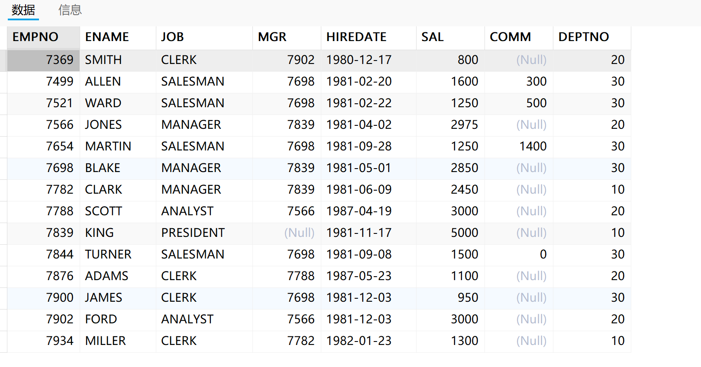


**dept** 部门表

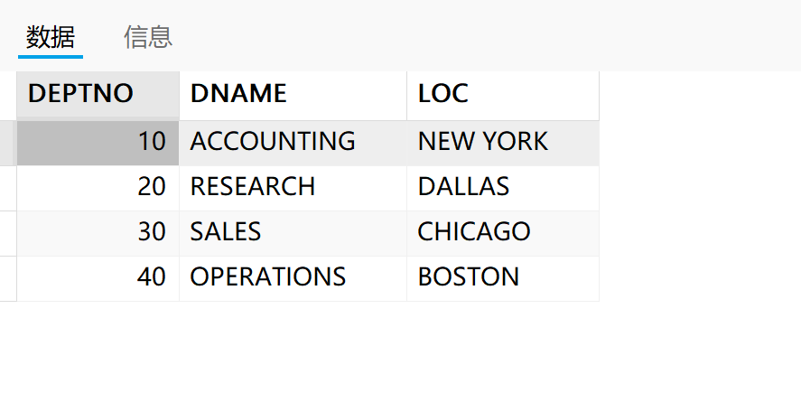


**salgrade** 薪资表：


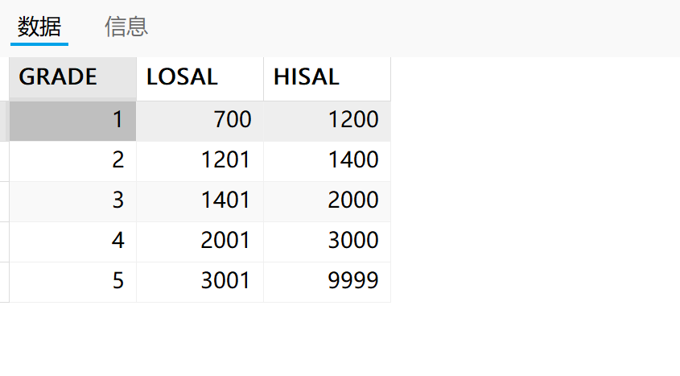


#### 1、取得每个部门最高薪水人员的名称

~~~~mysql
-- 第一题：取得每个部门最高薪水的人员名称
-- 第一步：取得每个部门的最高薪水
SELECT max(sal) maxsal,deptno FROM emp GROUP BY deptno;
-- 第二步：将上述表当做临时表t，做连接，连接条件：员工表的部门编号=临时表的部门编号 and 员工表的薪水=临时表的薪水

SELECT e.ename,t.*
FROM emp e
JOIN
(SELECT deptno,max(sal) maxsal FROM emp GROUP BY deptno) t
on 
e.deptno = t.deptno and e.sal = t.maxsal ORDER BY deptno asc
~~~~

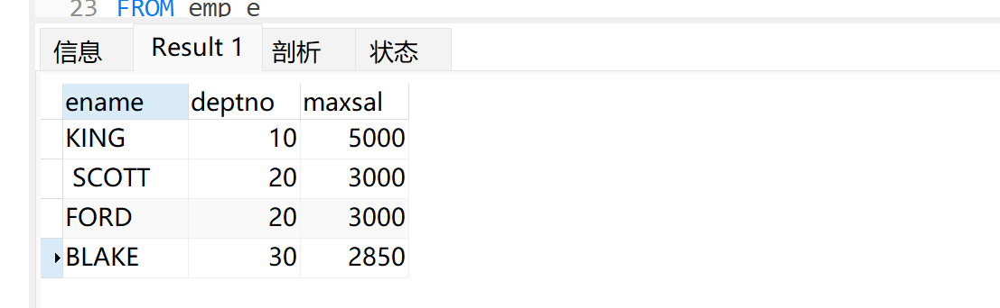

#### 2、哪些人的薪水在部门的平均薪水之上

~~~~sql
-- 第二题：哪些人的薪水在部门的平均薪水之上
-- 第一步：部门的平均薪水
SELECT deptno,AVG(sal) avgsal FROM emp GROUP BY deptno
-- 第二步：将上述表作为临时表连接，连接条件：员工的部门编号=临时表的部门编号 and 员工表的薪资 > 临时表的平均薪资

SELECT e.ename,e.sal,t.*
FROM emp e
JOIN 
(SELECT deptno,AVG(sal) avgsal FROM emp GROUP BY deptno) t
on
e.deptno = t.deptno and e.sal > t.avgsal
ORDER BY deptno asc

~~~~


#### 3、取得部门中的 平均薪资的等级

~~~~sql
-- 第三题：取得部门中的 平均薪资的等级
-- 第一步：部门中的平均薪资
SELECT deptno,avg(sal) avgsal FROM emp GROUP BY deptno
-- 第二步：将上述表作为临时表连接，连接条件：临时表的平均薪资 > = 等级表的最低薪资 and 临时表的平均薪资 < = 等级表的最高薪资
SELECT t.*,s.grade
from salgrade s
JOIN 
(SELECT deptno,avg(sal) avgsal FROM emp GROUP BY deptno) t
on
t.avgsal >= s.losal and t.avgsal <= hisal
~~~~

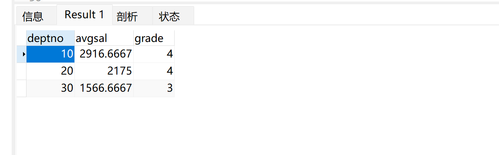

#### 4、取得部门中的 平均的薪资等级

~~~~sql
-- 第四题：取得部门中的平均的薪资等级

-- 法一：
SELECT e.deptno,avg(s.grade)
FROM emp e
JOIN
salgrade s
on
e.sal BETWEEN s.LOSAL and s.HISAL
GROUP BY  deptno

-- ------------------------------------------

-- 法二：

-- 第一步：部门中每个人的薪资等级

SELECT e.ename,e.deptno,s.grade
FROM emp e
JOIN
salgrade s
on
e.sal BETWEEN s.LOSAL and s.HISAL
ORDER BY  deptno

-- 第二步：将查询结果看成临时表，以部门进行分组，对等级进行平均计算

SELECT t.deptno,avg(t.grade)
FROM
(SELECT e.deptno,s.grade
FROM emp e
JOIN
salgrade s
on
e.sal BETWEEN s.LOSAL and s.HISAL
ORDER BY  deptno) t
GROUP BY DEPTNO
~~~~

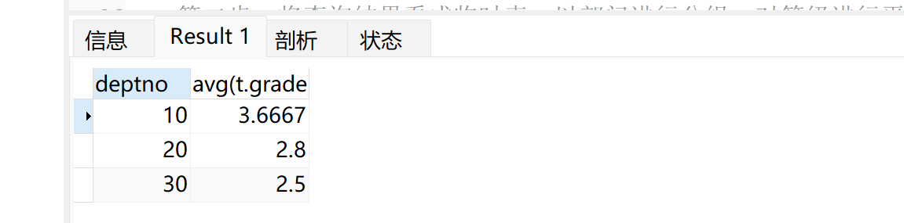


#### 5、不用组函数max，取得最高的薪水(两种方法)

~~~~sql
-- 5、不用组函数max，取得最高的薪水(两种方法)

-- 法一：直接按照sal进行降序排序取得第一个值
SELECT sal maxsal FROM emp ORDER BY sal desc LIMIT 1

-- 法二：与等级表进行连接，然后按照等级表进行排序，取得第一个中的sal

SELECT e.sal maxsal
FROM emp e
JOIN
salgrade s
on
e.sal BETWEEN s.LOSAL and s.HISAL 
ORDER BY s.grade desc
LIMIT 1

-- 但是本题没有说明找出薪资最大的人的信息，只是找出最大薪资为多少，所以，LIMIT 还是能够使用的


-- 法三：表的自连接
-- 第一步：取出emp表中的薪资
SELECT sal FROM emp

-- 第二步：将表做自连接,找出小于最大值的所有薪资，因为只有最大薪资没有小于其他的薪资的
-- DISTINCT 去除重复的字段，不去重也可以查询到

SELECT DISTINCT a.sal
FROM
emp a
JOIN
emp b
on
a.sal < b.sal

-- 第三步：

-- 查询薪资不在这里面的薪资，就是最大薪资

SELECT sal maxsal FROM emp WHERE sal not in (
SELECT DISTINCT a.sal
FROM
emp a
JOIN
emp b
on
a.sal < b.sal)

~~~~

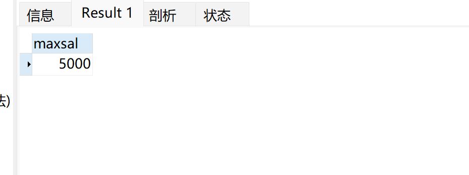

##### 5.1  找出薪资为最大薪资的人员信息(可能有多个人薪资都为最大，一模一样的薪资)

~~~~~sql
-- 改变题目：找出薪资为最大薪资的人员信息

-- ：以sal降序排序，找出最大值，然后取出emp表中等于最大值的人 
-- 原因：因为limit 只是取出第一个值，万一还有其他人的薪资也是5000，就取不出来，造成数据不准确
-- 最大值为：
SELECT sal maxsal FROM emp ORDER BY sal desc LIMIT 1

SELECT ename,sal maxsal,DEPTNO FROM emp WHERE sal = (SELECT sal maxsal FROM emp ORDER BY sal desc LIMIT 1)
~~~~~

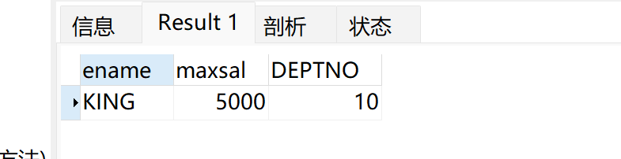

#### 6、取得平均薪水最高的部门的部门编号（两种方法）

~~~~sql
-- 取得平均薪水最高的部门的部门编号（两种方法）

-- 法一：
-- 第一步：以部门分组，取得平均薪水,取出第一个
SELECT deptno,avg(sal) avgsal FROM emp GROUP BY deptno ORDER BY avgsal desc LIMIT 1

-- 第二步：将上述查询结果当做临时表，取出部门编号
SELECT t.deptno 
FROM 
(SELECT deptno,avg(sal) avgsal FROM emp GROUP BY deptno ORDER BY avgsal desc LIMIT 1) t


-- 法二：麻烦，不建议

-- 新表
SELECT deptno,avg(sal) avgsal FROM emp GROUP BY deptno ORDER BY avgsal desc

-- 将新表做自连接，取出小于最大部门平均薪资的所有薪资，去重

SELECT DISTINCT a.deptno,a.avgsal
FROM 
(SELECT deptno,avg(sal) avgsal FROM emp GROUP BY deptno ORDER BY avgsal desc) a
JOIN
(SELECT deptno,avg(sal) avgsal FROM emp GROUP BY deptno ORDER BY avgsal desc) b
on
a.avgsal < b.avgsal


-- 将去重过后的表最为查询的条件，查询新表中不在去重过后的表中的薪资，即为最大部门薪资，然后取出部门编号即可

SELECT d.deptno
FROM 
(SELECT deptno,avg(sal) avgsal FROM emp GROUP BY deptno ORDER BY avgsal desc) d
WHERE d.avgsal not in 
(SELECT DISTINCT a.avgsal
FROM 
(SELECT deptno,avg(sal) avgsal FROM emp GROUP BY deptno ORDER BY avgsal desc) a
JOIN
(SELECT deptno,avg(sal) avgsal FROM emp GROUP BY deptno ORDER BY avgsal desc) b
on
a.avgsal < b.avgsal)

-- 法三：max
-- 第一步:以部门分组，取出每个部门的平均薪资

SELECT deptno,avg(sal) avgsal FROM emp GROUP BY deptno ORDER BY avgsal desc

-- 第二步：将上述结果当成临时表t，使用max函数，找出部门平均薪资最高的信息 
SELECT t.deptno,max(t.avgsal) maxsal
FROM 
(SELECT deptno,avg(sal) avgsal FROM emp GROUP BY deptno ORDER BY avgsal desc) t

-- 在mysql 5.7之后的版本会报错 原因不在支持，使用group by 以及聚合函数 必须是group by后面声明的列

-- 因此：在mysql 5.7 之后可以按照底下这样写

----------------------------------------------

-- 法三：max
-- 第一步:以部门分组，取出每个部门的平均薪资

-- SELECT deptno,avg(sal) avgsal FROM emp GROUP BY deptno ORDER BY avgsal desc,deptno

-- 第二步：将上述结果当成临时表t，使用max函数，找出部门平均薪资最高的信息 
-- SELECT t.deptno,max(t.avgsal) maxsal
-- FROM 
-- (SELECT deptno,avg(sal) avgsal FROM emp GROUP BY deptno ORDER BY avgsal desc,deptno) t

-- 第三步：将上述结果当成临时表a，取出部门编号
SELECT a.deptno
FROM
(SELECT t.deptno,max(t.avgsal) maxsal
FROM 
(SELECT deptno,avg(sal) avgsal FROM emp GROUP BY deptno ORDER BY avgsal desc) t) a

~~~~

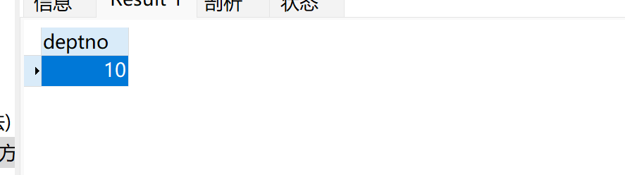

#### 7、取得平均薪水最高的部门的部门名称

~~~~sql
-- 7、取得平均薪水最高的部门的部门名称

-- 部门分组，查询出每个部门的平均薪水,取得最高

select DEPTNO, avg(sal) max_avgsal from emp GROUP BY DEPTNO ORDER BY max_avgsal desc LIMIT 1


-- 将上述表当做临时表，进行连接
-- 连接条件：临时表的部门编号 = 部门表的部门编号

SELECT d.dname,t.*
FROM 
(select DEPTNO, avg(sal) max_avgsal from emp GROUP BY DEPTNO ORDER BY max_avgsal desc LIMIT 1) t
JOIN
dept d
on
t.DEPTNO = d.DEPTNO

~~~~

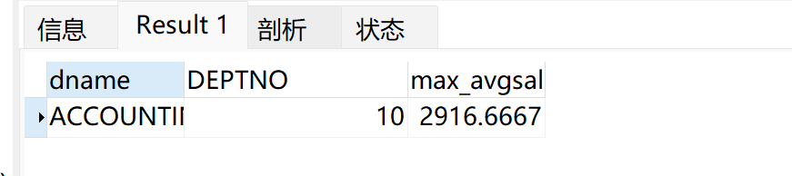


#### 8、求平均薪水的等级 最低的部门 的部门名称

~~~~sql
-- 8、求平均薪水的等级 最低的部门 的部门名称

-- 法一：

-- 以部门分组，求平均薪水最低的部门，平均薪水最低一定是等级最低，所以先找平均薪水最低的部门

SELECT deptno,avg(sal) avgsal FROM emp GROUP BY DEPTNO 
ORDER BY avgsal LIMIT 1

-- 表连接，查看平均薪水最低的等级，将上述表作为临时表t

SELECT t.*,s.grade
FROM
(SELECT deptno,avg(sal) avgsal FROM emp GROUP BY DEPTNO 
ORDER BY avgsal LIMIT 1) t
JOIN 
salgrade s
on
t.avgsal BETWEEN s.losal and s.hisal

-- 将上述表作为临时表，进行连接，取出部门名称
SELECT d.dname,m.*
FROM
(SELECT t.*,s.grade
FROM
(SELECT deptno,avg(sal) avgsal FROM emp GROUP BY DEPTNO 
ORDER BY avgsal LIMIT 1) t
JOIN 
salgrade s
on
t.avgsal BETWEEN s.losal and s.hisal) m
JOIN
dept d
on
m.DEPTNO = d.DEPTNO

~~~~


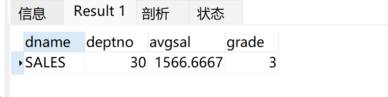

#### 9、取得 比普通员工（员工代码没有在mgr字段上出现的）最高薪水 还要高的领导人的姓名

~~~~sql
-- 9，取得 比普通员工（员工代码没有在mgr字段上出现的）最高薪水 还要高的领导人的姓名\

-- 第一步：找出领导人员编号

SELECT  DISTINCT MGR FROM emp WHERE mgr is not null

-- 第二步：找出不在领导人员编号里面的即为普通员工

SELECT ename FROM emp WHERE EMPNO not in (SELECT  DISTINCT MGR FROM emp WHERE mgr is not null)

-- 第三步：计算普通员工的最大薪水

SELECT max(sal) FROM emp  WHERE EMPNO not in (SELECT  DISTINCT MGR FROM emp WHERE mgr is not null)

-- 第四步：找出大于普通员工最大薪水的人员名称信息

SELECT ename,sal FROM emp WHERE sal > (SELECT max(sal) FROM emp  WHERE EMPNO not in (SELECT  DISTINCT MGR FROM emp WHERE mgr is not null))
 
~~~~

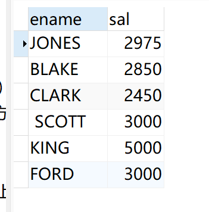

#### 10、取得薪水最高的前五名员工

~~~~sql
-- 10、取得薪水最高的前五名员工

SELECT ename,sal from emp ORDER BY sal desc LIMIT 5


-- ---------------------------------------------------

-- 变形

-- 10、取得薪水最高的前五名普通员工

-- 找出领导：
SELECT DISTINCT MGR FROM emp WHERE MGR is not null

-- 找出普通员工,以员工薪水降序排序，LIMIT 取前5名

SELECT ENAME,sal FROM emp WHERE EMPNO not in (SELECT DISTINCT MGR FROM emp WHERE MGR is not null) ORDER BY sal desc LIMIT 5

~~~~


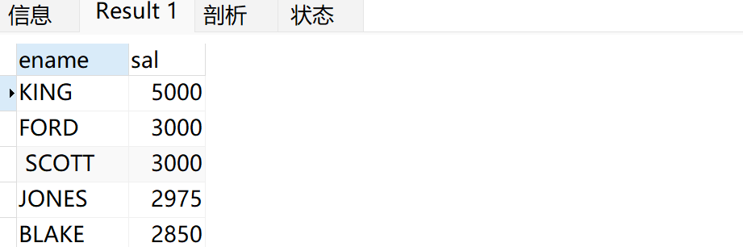

#### 11、取得薪水最高的第六到第十名员工

~~~~sql
-- 11、取得薪水最高的第六到第十名员工

SELECT ename,sal from emp ORDER BY sal desc LIMIT 5,5

-- -------------------------------------------------------

-- 变形

-- 11、取得薪水最高的第六到第十名普通员工

-- 找出领导编号

SELECT  DISTINCT  MGR FROM emp where mgr is not null 

-- 找出普通员工以名字、薪水

SELECT ENAME,sal FROM emp where EMPNO not in (SELECT  DISTINCT  MGR FROM emp where mgr is not null )

-- 以薪水降序排序，取得第六到第十的员工信息

SELECT ENAME,sal FROM emp where EMPNO not in (SELECT  DISTINCT  MGR FROM emp where mgr is not null ) ORDER BY sal desc LIMIT 5,5

~~~~

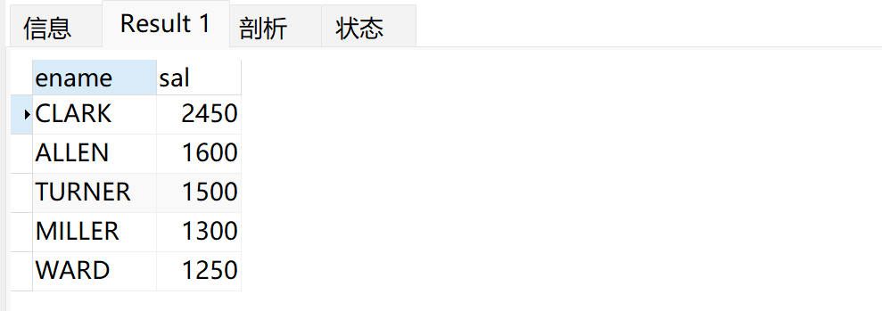

#### 12、取得最后入职的5名员工

~~~~sql
-- 12、取得最后入职的5名员工

SELECT ename,job,sal,HIREDATE from emp ORDER BY HIREDATE DESC LIMIT 5
~~~~

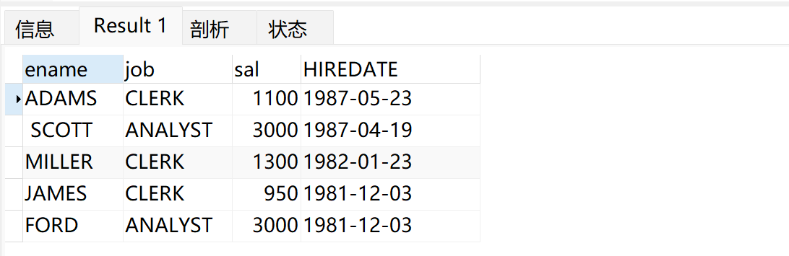


#### 13、取得每个薪水等级有多少名员工

~~~~sql
-- 13、取得每个薪水等级有多少名员工

-- 每个员工所在的薪水等级, 以部门等级进行分组，统计每个分组下的部门员工数量
SELECT s.grade,count(s.grade) emp_num
FROM 
emp e
JOIN
salgrade s
on
e.sal BETWEEN s.LOSAL and s.HISAL 
GROUP BY s.GRADE

-- -- 将上述表作为临时表，以等级进行分组，统计每个等级下的员工数量
-- 
-- SELECT t.GRADE,count(t.ENAME) emp_num
-- FROM
-- (SELECT e.ename,s.grade
-- FROM 
-- emp e
-- JOIN
-- salgrade s
-- on
-- e.sal BETWEEN s.LOSAL and s.HISAL ) t
-- GROUP BY t.GRADE
~~~~

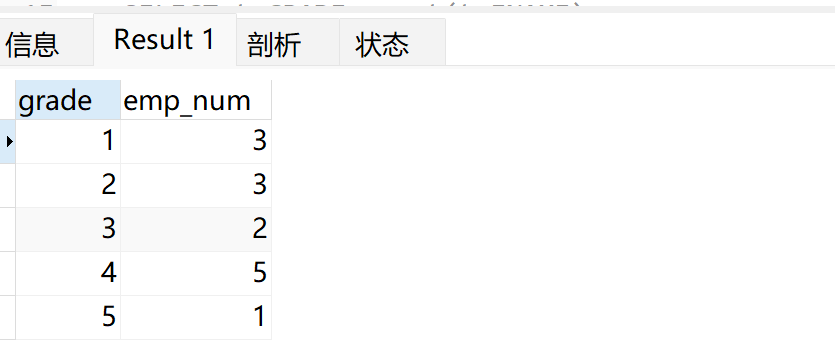


#### 14、列出所有员工和员工领导的名字

~~~~~sql
-- 14、列出所有员工和员工领导的名字


-- 表的自连接，连接条件：a表的领导员工编号 = b表的员工编号  a，b表都是emp表
SELECT a.ENAME,b.ename mgr_ename
FROM 
emp a
left JOIN
emp b
on
a.mgr = b.empno

~~~~~

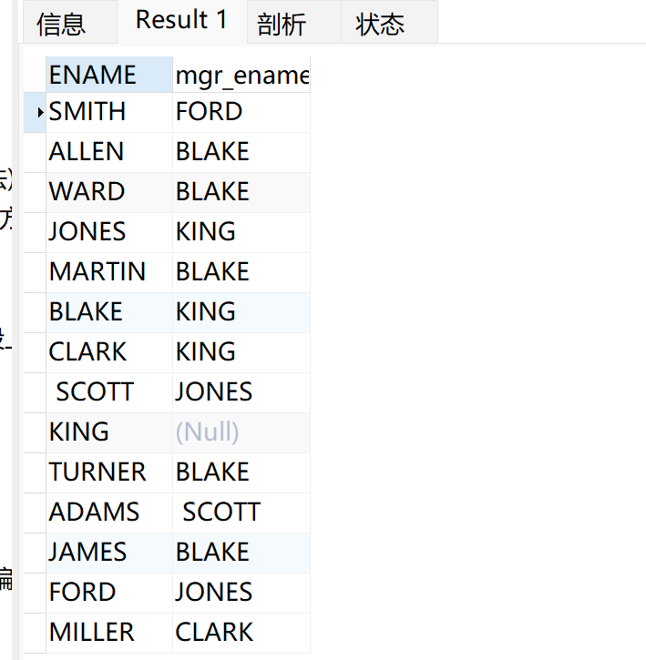

#### 15、列出受雇日期早于其直接上级的所有员工编号、姓名、部门名

~~~~sql
-- 15、列出受雇日期早于其直接上级的所有员工编号、姓名、部门名

-- 找出员工编号、姓名、部门号、入职日期以及直属上司的编号
SELECT EMPNO,ename,DEPTNO,mgr,HIREDATE FROM emp  WHERE mgr is not null


-- 将上述结果作为临时表，进行表的连接，连接条件：临时表的上级员工编号 = emp 表的员工编号 

SELECT t.EMPNO,t.ename,t.deptno,t.HIREDATE,e.ename mgr_ename,e.HIREDATE mgr_hiredate
FROM
(SELECT EMPNO,ename,DEPTNO,mgr,HIREDATE FROM emp  WHERE mgr is not null) t
JOIN
emp e
on
t.mgr = e.EMPNO

-- 将上述结果作为一张表，进行条件筛选，筛选条件：员工的受雇日期小于直属老板的受雇日期
SELECT t.EMPNO,t.ename,t.deptno,t.HIREDATE,e.ename mgr_ename,e.HIREDATE mgr_hiredate
FROM
(SELECT EMPNO,ename,DEPTNO,mgr,HIREDATE FROM emp  WHERE mgr is not null) t
JOIN
emp e
on
t.mgr = e.EMPNO
WHERE 
t.HIREDATE < e.HIREDATE

-- 上述结果显示更加清楚一些

-- ----------------------------


-- 题目中要求的结果显示


SELECT t.EMPNO,t.ename,t.deptno
FROM
(SELECT EMPNO,ename,DEPTNO,mgr,HIREDATE FROM emp  WHERE mgr is not null) t
JOIN
emp e
on
t.mgr = e.EMPNO
WHERE 
t.HIREDATE < e.HIREDATE
~~~~

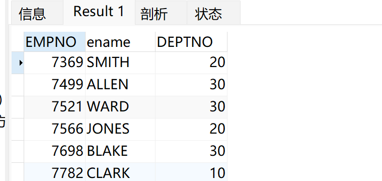


#### 16、列出部门名称和这些部门的员工信息，同时列出那些没有员工的部门

~~~~sql
-- 16、列出部门名称和这些部门的员工信息，同时列出那些没有员工的部门

SELECT d.dname,d.deptno,e.*
FROM
emp e
right JOIN
dept d
on
e.deptno = d.deptno
ORDER BY 
d.DEPTNO
~~~~

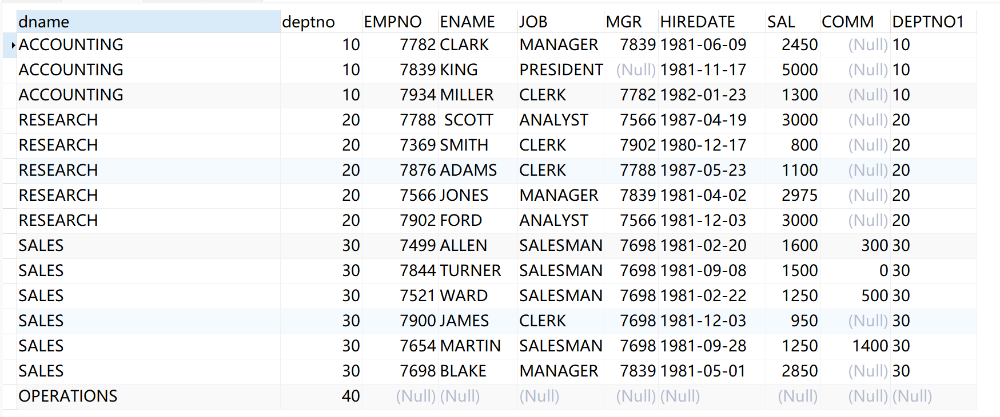


#### 17、列出至少有五个员工的所有部门

~~~~mysql
-- 17、列出至少有五个员工的所有部门

SELECT deptno,count(*) count
FROM emp
GROUP BY
deptno


-- 将上述结果当成临时表，过滤条件：数量大于等于5的所有都查询出来

SELECT t.*
FROM
(SELECT deptno,count(*) count
FROM emp
GROUP BY
deptno
) t
WHERE 
t.count > 4

~~~~

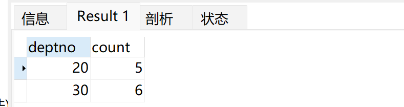

#### 18、列出薪资比“smith”高的所有员工信息

~~~~sql
-- 18、列出薪资比“smith”高的所有员工信息

-- 找出smith的薪资数

SELECT sal FROM emp WHERE ENAME = "smith"


-- 找出薪资比800大的所有员工

SELECT * FROM emp WHERE sal > (SELECT sal FROM emp WHERE ENAME = "smith")
~~~~

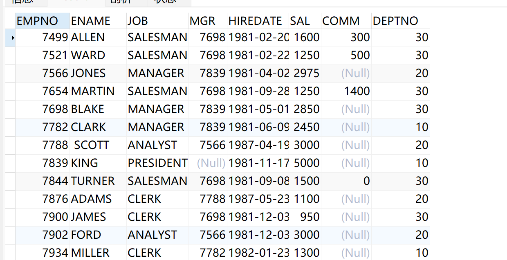

#### 19、列出所有“clerk”（办事员）的姓名及其部门名称和部门人数。

~~~~sql
-- 19、列出所有“clerk”（办事员）的姓名及其部门名称和部门人数。


-- 查询出所有job为 clerk 的员工信息
select ename,deptno from emp where job = 'clerk'; -- m表


-- 查询出部门名称

select t.*,d.dname
from 
(select ename,deptno from emp where job = 'clerk') t
join
dept d
on
t.deptno = d.deptno;  -- n表

-- 查询出部门人数
select deptno,count(deptno) count from emp group by deptno;

-- 多表联查 将上述查询结果作为两张临时表 查询条件：m表的员工编号 = n表的员工编号

select m.*,n.count
from
(select t.*,d.dname
from 
(select ename,deptno from emp where job = 'clerk') t
join
dept d
on
t.deptno = d.deptno) m
join
(select deptno,count(deptno) count from emp group by deptno) n
on
m.deptno = n.deptno;
~~~~

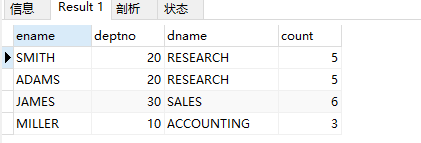

#### 20、列出最低薪资大于1500的各种工作 以及 从事该工作的全部雇员人数 

~~~~sql
-- 20、列出最低薪资大于1500的各种工作 以及 从事该工作的全部雇员人数 


-- 先列出所有的小于1500工作种类

SELECT DISTINCT job FROM emp WHERE sal <= 1500

-- 排出小于1500的工作种类，剩下的就是大于1500的工作种类

SELECT DISTINCT job FROM emp WHERE job not in (SELECT DISTINCT job FROM emp WHERE sal <= 1500)


-- 表连接，连接条件：临时表的工作 = emp表的工作，然后再以工作进行分组统计数量

SELECT t.*,count(t.job) count
FROM
emp e
JOIN
(SELECT DISTINCT job FROM emp WHERE job not in (SELECT DISTINCT job FROM emp WHERE sal <= 1500)
) t
on
e.job = t.job
GROUP BY t.job 

-- ------------------------------------------

-- 简单方法：having 过滤

SELECT job,count(*) FROM emp GROUP BY job HAVING min(sal) > 1500

~~~~

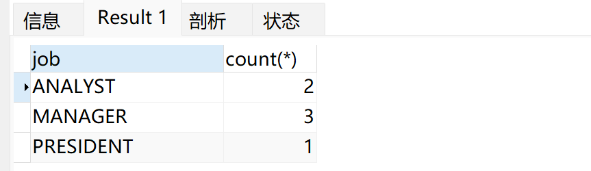

#### 21、列出在部门“SALES”（销售部）中工作的员工姓名，假定不知道部门编号

~~~~sql
-- 21、列出在部门“SALES”（销售部）中工作的员工姓名，假定不知道部门编号

SELECT e.ename
FROM
emp e
JOIN
dept d
on
e.deptno = d.deptno
WHERE d.dname = "sales"

~~~~

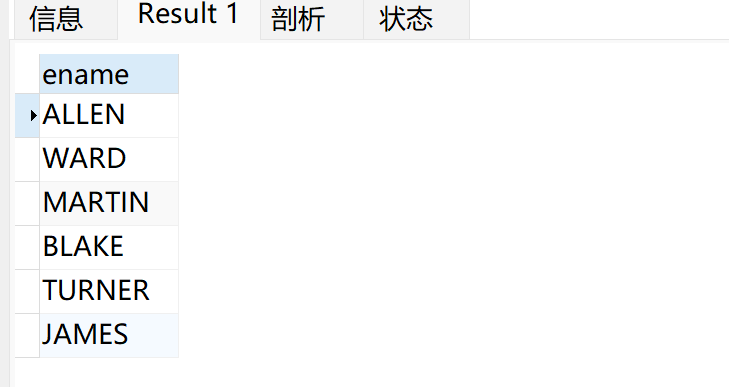


#### 22、列出薪资高于公司平均薪资的所有员工，员工所在的部门，员工的上级领导，员工的工资等级

~~~~sql
-- 22、列出薪资高于公司平均薪资的所有员工，员工所在的部门，员工的上级领导，员工的工资等级

-- 先求公司的平均薪资为多少

SELECT avg(sal) avgsal from emp 

-- 找出薪资大于平均薪资的员工

SELECT * FROM emp WHERE sal > (SELECT avg(sal) avgsal from emp )

-- 将上述查询结果做表的自连接，连接条件：表1的领导编号 = 表2的员工编号，这样就找出来员工的直属领导
-- 左连接，将king找出来

SELECT a.ename ,a.DEPTNO emp_deptno, b.ename mgr_name,a.sal emp_sal
FROM 
(SELECT * FROM emp WHERE sal > (SELECT avg(sal) avgsal from emp )) a
left join
(SELECT * FROM emp WHERE sal > (SELECT avg(sal) avgsal from emp )) b
on
a.mgr = b.empno

-- 将上述结果当成临时表t,与薪资等级表salgrade进行连接，左连接，将king查询出来

-- 连接条件 ：临时表的薪资置于薪资等级表的最低薪资与最高薪资之间

SELECT t.*,s.grade emp_grade
FROM 
(SELECT a.ename ,a.DEPTNO emp_deptno, b.ename mgr_name,a.sal emp_sal
FROM 
(SELECT * FROM emp WHERE sal > (SELECT avg(sal) avgsal from emp )) a
left join
(SELECT * FROM emp WHERE sal > (SELECT avg(sal) avgsal from emp )) b
on
a.mgr = b.empno) t
JOIN
salgrade s
on
t.emp_sal BETWEEN s.LOSAL and s.HISAL
~~~~


#### 23、列出与“scott”从事相同工作的所有员工及部门名称。

~~~sql
-- 23、列出与“scott”从事相同工作的所有员工及部门名称。


-- 找出scott从事的工作
SELECT job FROM emp WHERE ename = "scott";


-- 从员工表中找出与上述语句查询出来的工作一样的人，不包括scott

SELECT ename,DEPTNO FROM emp WHERE JOB = (SELECT job FROM emp WHERE ename = "scott") and ename !="scott";

~~~

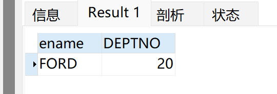

#### 24、列出薪资等于 部门30 员工的薪资 的其它员工的姓名和薪资。

~~~~sql
-- 24、列出薪资等于 部门30 员工的薪资 的其它员工的姓名和薪资。

-- 查询部门为30的员工的薪资

SELECT ename,sal,DEPTNO FROM emp WHERE deptno = 30 -- a表
 
-- 查询部门不为30的员工的薪资
SELECT ename,sal,DEPTNO FROM emp WHERE DEPTNO !=30  -- b表


SELECT  b.ename,b.sal
FROM
(SELECT ename,sal,DEPTNO FROM emp WHERE deptno = 30 ) b
JOIN
(SELECT ename,sal,DEPTNO FROM emp WHERE DEPTNO !=30) a
on
a.sal = b.sal

-- -------------------------------------------------------
-- 法二：

SELECT ename,sal,DEPTNO FROM emp WHERE deptno = 30 -- t表

-- 将上述结果看成临时表，与emp表做表连接，连接条件：临时表的薪资 = emp 表的薪资,并且emp表的部门编号 ！= 临时表的部门编号

SELECT e.ename,e.sal
FROM
emp e
JOIN
(SELECT ename,sal,DEPTNO FROM emp WHERE deptno = 30) t
on
e.DEPTNO !=t.deptno and e.sal = t.sal
~~~~

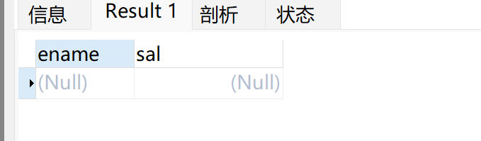

#### 25、列出薪资高于 部门30 的所有员工薪资的 员工姓名 和 薪资 以及部门名称

~~~~sql
-- 25、列出薪资高于 部门30 的所有员工薪资的 员工姓名 和 薪资 以及部门名称

-- 找出部门30的员工的最高薪资为多少

SELECT ename,max(sal) maxsal,DEPTNO FROM emp WHERE DEPTNO = 30

-- 将上述表作为临时表，与emp表进行表连接，连接条件：emp表的工资 > 临时表的maxsal and emp表的部门编号 != 临时表的部门编号 

SELECT DISTINCT e.ename,e.sal,e.deptno
FROM
emp e
join
(SELECT ename,max(sal) maxsal,DEPTNO FROM emp WHERE DEPTNO = 30) t
on
e.sal > t.maxsal and e.DEPTNO != t.DEPTNO 

~~~~

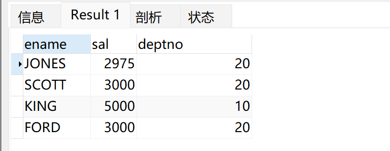

#### 26、列出在每个部门工作的员工数量、平均工资、平均服务期限

~~~~sql
-- 26、列出在每个部门工作的员工数量、平均工资、平均服务期限

SELECT d.deptno,count(e.DEPTNO) count_deptno,ifnull(avg(e.sal),0),ifnull(avg(TIMESTAMPDIFF(YEAR,HIREDATE,now())),0)avg_service_year
FROM
emp e
RIGHT JOIN
dept d
on
e.DEPTNO =d.DEPTNO
GROUP BY 
d.deptno

-- 间隔类型：
--  TIMESTAMPDIFF(YEAR,HIREDATE,now()) 
 
 
-- TimeStampDiff(间隔类型，前一个日期，后一个日期)
-- 示例：timestampdiff(YEAR,hiredate, now () )


-- ifnull(计算的字段,0) 表达的意思是：如果该字段计算出来为null,则以0来代替null显示出来

~~~~


#### 27、列出所有员工的姓名、部门名称和工资

~~~~sql
-- 27、列出所有员工的姓名、部门名称和工资

SELECT e.ename,d.dname,e.sal FROM 
emp e
JOIN
dept d
on
e.DEPTNO = d.DEPTNO

~~~~

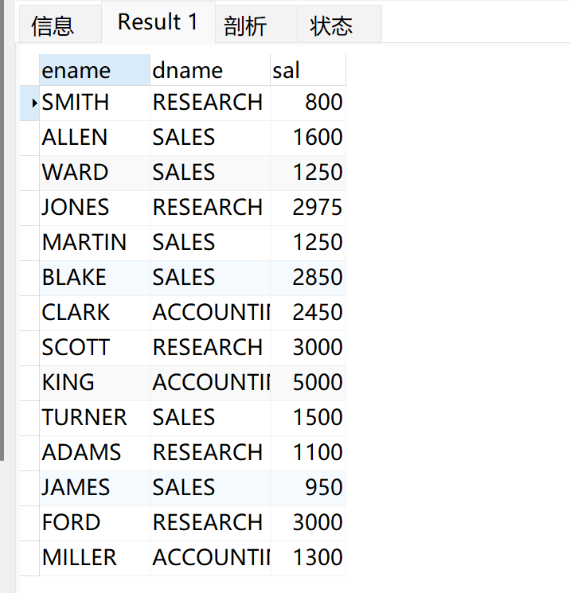

#### 28、列出所有部门的详细信息和人数

~~~~sql
-- 28、列出所有部门的详细信息和人数

-- 以部门分组，统计每个部门的人数
SELECT deptno,count(deptno) count FROM emp GROUP BY DEPTNO

-- 将上述结果作为临时表，与dept表进行表连接，连接条件：临时表的部门编号 = dept表的部门编号
SELECT d.*,ifnull(t.count,0) deptno_count
FROM
dept d
left JOIN
(SELECT deptno,count(deptno) count FROM emp GROUP BY DEPTNO) t
on
d.DEPTNO = t.DEPTNO
~~~~

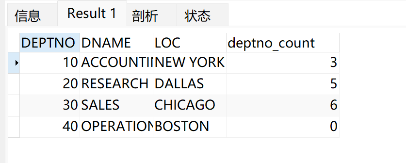

#### 29、列出各种工作的最低工资 以及 从事该工作的雇员姓名

~~~~sql
-- 29、列出各种工作的最低工资 以及 从事该工作的雇员姓名


-- 以工作进行分组，取出工作的最低工资
select job,min(sal) job_minsal FROM emp GROUP BY job

-- 将上述表作为临时表，与emp表进行表连接，连接条件：emp表的工资 = 临时表的工资 and emp表的工作 = 临时表的工作

SELECT e.ename,t.*
FROM
emp e
JOIN
(select job,min(sal) job_minsal FROM emp GROUP BY job) t
on
e.sal = t.job_minsal and e.job = t.job

~~~~

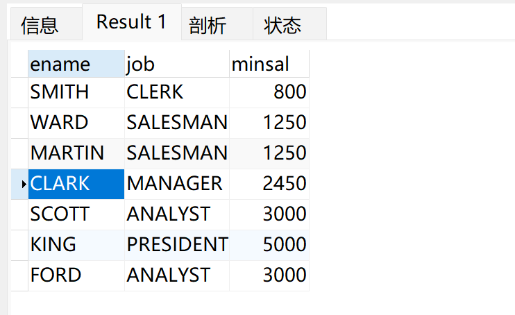


#### 30、列出各个部门 manager（领导）的最低薪资

~~~~sql
-- 30、列出各个部门 manager（领导）的最低薪资

-- 将emp表进行自连接，连接条件领导的编号=员工的编号，并且以部门进行分组，求出最小的领导薪资
SELECT b.DEPTNO mgr_deptno,min(b.sal) min_mgr_sal
FROM
emp a
JOIN
emp b
on
a.mgr = b.empno
GROUP BY mgr_deptno

-- 将上述结果作为临时表，与部门表进行连接，连接条件：临时表的部门编号 = 部门表的部门编号
SELECT d.DEPTNO,ifnull(t.min_mgr_sal,0)
FROM
dept d
left JOIN
(SELECT b.DEPTNO mgr_deptno,min(b.sal) min_mgr_sal
FROM
emp a
JOIN
emp b
on
a.mgr = b.empno
GROUP BY mgr_deptno) t
on
d.DEPTNO = t.mgr_deptno

~~~~

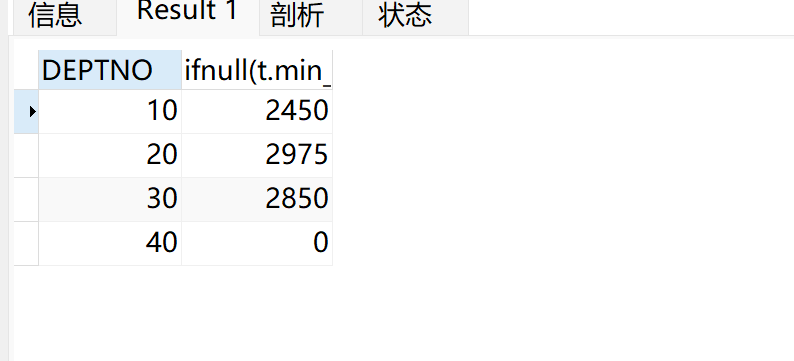


#### 31、列出所有员工的 年薪， 按年薪从低到高排序

~~~~sql
-- 31、列出所有员工的 年薪， 按年薪从低到高排序

SELECT ename,sal*12 year_sal FROM emp ORDER BY year_sal 


~~~~

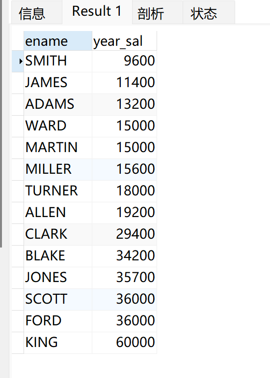

#### 32、求出员工领导的薪水超过3000的员工名称与领导名称

~~~~sql
-- 32、求出员工领导的薪水超过3000的员工名称与领导名称

SELECT a.ename,b.ename mgr_name
FROM
emp a
left JOIN
emp b
on
a.mgr = b.EMPNO
WHERE 
b.sal >3000

~~~~

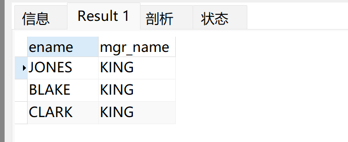

#### 33、求出部门名称中，带“S”字符的部门员工的工资合计和部门人数

~~~sql
-- 33、求出部门名称中，带“S”字符的部门员工的工资合计和部门人数

SELECT dname FROM dept WHERE dname like "%s%"


SELECT d.deptno,d.dname,count(e.ename) count,ifnull(sum(e.sal),0) sumsal
FROM
emp e
RIGHT JOIN
dept d
on
e.DEPTNO = d.DEPTNO
WHERE
d.dname like "%s%"
GROUP BY
d.dname
~~~


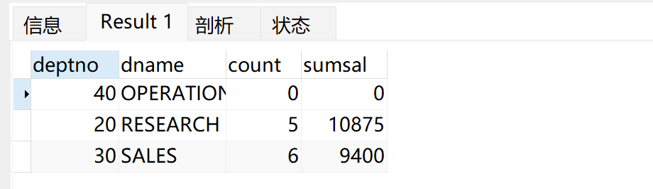

#### 34、给任职日期超过30年的员工加薪10%

~~~~sql
-- 34、给任职日期超过30年的员工加薪10%

UPDATE emp set sal=sal*1.1
WHERE
TIMESTAMPDIFF(YEAR,HIREDATE,now()) > 30

SELECT * FROM emp;
~~~~


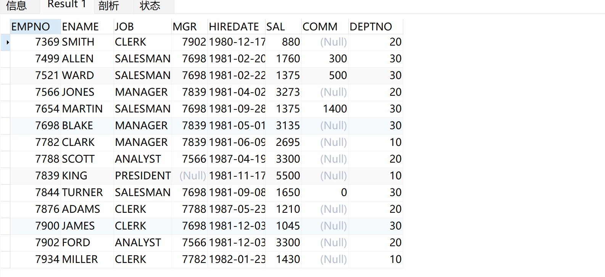


### 14，左连接与右连接有什么区别

左连接：以**左边的表为主**，显示左边表列的全部数据，如果右边表没有对应的数据， 则为NULL

右连接：以**右边的表为主**，显示右边表列的全部数据，如果左边表没有对应的数据， 则为NULL

## 抓包与网络协议

### 1，抓包工具怎么用 

我原来的公司对于抓包这块，在App的测试用得比较多。我们会使用fiddler抓取数据检查结果，定 位问题，测试安全，制造弱网环境; 如：抓取数据通过查看请求数据，请求行，请求报头，请求正文，信息是否正确去检查结果,

如果是以4开头的话就有可能是前端问题一般我会到前端排查，以5开头就有可能是后端问题，我就会到后端排查;如果是200的话，就需要检查请求行，请求报头，请求正文是否正确， 如果请求错误就是前端问题，如果请求没有问题，那就是后端问题，看后端问题服务器运行日志， 是否包含 exception，error或根据时间点去看日志。 测试安全，抓取数据查看用户的感敏信息有没有进行加密显示，还有就是把发送请求的数据篡改是否 成功。 

弱网环境，诵过 fiddler工具选择 Customize Ruels...(Ctr+R)调出定义脚本编辑器找到 “if (m_SimulateModem)”设置上行下行网速，然后把 Rules-> Performance-> Simulate Modem Speeds 选中生效 常用抓包工具有：浏览器中F12， fiddler， Charles(青花瓷)， wireshark

### 2，如何抓取https的包

1. 设置 Tools=> Option=>勾选 Decrypt Https traffic=>勾选 lgnore server certificate errors(unsafe) 
2. 打开https网页就可以成功抓取了 
3. 还可以 Fiddler添加过滤器(Filters)：只抓取指定iP的数据

### 3，如何抓取手机的包

开启 Fiddler的远程连接 Fiddler 主菜单Toos- Options-> Connections>勾选 Allow remote computers to 

重启 Fiddler，更新刚开启的远程配置 

然后手机和电脑需要在同一个局域网，抓取http手机设置代理就可以，要抓取https包，手机需 要安装一个fiddler证书 

1、fiddler 工具生成一个证书，发送手机上面安装 

2、通过手机浏览器打开安装证书界面192.168.3.197：8888 华测教育专属 ip 地址是用 fiddler工具的电脑的ip地址，fiddler工具端口号的8888 

3、点击下载证书，会提示，输入手机锁屏密码 

4、给证书命名，名字随意，其他默认就ok 

5、点击确定，安装成功，然后就可以抓取https的包了

### 4, 网络协议了解多少?

原来我们用得比较多的协议是http和https以及tcp协议 http 和https 都是超文本协议，浏览器发送数据请求基本用的都是他们，不同的是https在http的基础上增加了ssl加密协议,

http的默认端口是80，http：的默认端口是443， 

https 收费，http免费。 

tcp 协议的话，作用在传输层，在发送请求前会有三次握手，是面向连接的协议，传输过程比较可靠 udp 协议的话，作用在传输层，面向非连接协议，传输过程相对tcp不可靠，传输大量数据

### 5, 请求方式有哪些

常用：get、post 不常用：delete、put、head、option

### 6, 为什么要使用cookie和session：http是无状态协议

第一次登录，发送用户信息给到服务器，服务器把用户信息保存在session中服务器响应数据给客户端，响应数据中有包含session的先关用户信息 , 客户端接收到服务器session信息，把session中相关的用户信息保存在cookie中 

第二次登录，客户端发送请求，并携带cookie，服务端可以直接验证cookie值，如果用户已经登录过，可以免登录

### 7, post申请方式，用get会报什么错误

404 Not Found 

请求失败，请求所希望得到的资源未被在服务器上发现，没有信息能够告诉用户这个状况到底是暂时的还是永久的，假如服务器知道情况的话，应当使用410状态码来告知旧资源因为某些内部的配置机制问题，已经永久的不可用，而且没有任何可以跳转的地址，404这个状态码被广泛应用于当服务器 不想揭示到底为何请求被拒绝或者没有其他适合的响应可用的情况下，出现这个错误的最有可能的原 因是服务器端没有这个页面。

### 8, http协议提交请求头内容

Accept-Charset：浏览器能够显示的字符集 

Accept- Encoding：浏览器能够处理的压缩编码 

Accept-Language：浏览器当前设置的语言 

Connection：浏览器与服务器之间连接的类型 

Cookie：当前页面设置的任何 Cookie 

Host：发出请求的页面所在的域 

Referer：发出请求的页面的URL 

User-Agent：浏览器的用户代理字符串 

Content-Type：请求数据的格式或者是类型

### 9，什么是长连接，什么是短连接？

长连接和短连接是客户端和服务端之间的通信机制。

长连接：客户端和服务端建立连接后，后续无论进行多少次通信，所有的请求和响应数据都是在这个链接上进行，这就是长连接。

短连接：客户端每一次和服务端进行通信时，都重新创建一个链接，通信完成后关闭连接

### 10，什么是幂等性

简单的说，幂等测试就是验证数据一致性和事务完整性。

可能出现幂等问题的场景：

- 用户重复提交——非常容易发生，前端、后端均需要控制；
- 网络重发
- 消息重发
- 系统间重试

所以说保证接口的幂等性是非常重要的。

测试幂等的手段：前端幂等测试，注意按钮的多次快速点击；

后端接口的幂等测试，使用 postman 或 jmeter 多次发送同一参数的请求，查看服务端响应。

### 11，说一下DNS解析流程

1. 浏览器先检查自身缓存中有没有被解析过的这个域名对应的ip 地址，如果有，解析 结束。同时域名被缓存的时间也可通过TTL属性来设置。 
2.  如果浏览器缓存中没有（专业点叫还没命中），浏览器会检查操作系统缓存中有没有 对应的已解析过的结果。而操作系统也有一个域名解析的过程。在windows中可通过c 盘里一个叫hosts的文件来设置，如果你在这里指定了一个域名对应的ip地址，那浏览 器会首先使用这个ip地址。 
3. 如果至此还没有命中域名，才会真正的请求本地域名服务器（LDNS）来解析这个域 名，这台服务器一般在你的城市的某个角落，一般都会缓存域名解析结果，大约 80% 的域名解析到这里就完成了。 
4. 如果LDNS仍然没有命中，就直接跳到Root Server 域名服务器请求解析。 
5. 根域名服务器返回给LDNS一个所查询域的主域名服务器（gTLD Server，国际顶尖域 名服务器，如.com .cn .org 等）地址 
6. 此时LDNS再发送请求给上一步返回的gTLD  
7. 接受请求的gTLD查找并返回这个域名对应的Name Server的地址，这个Name Server 就是网站注册的域名服务器  8. 
8. Name Server 根据映射关系表找到目标ip，返回给LDNS  
9. LDNS 缓存这个域名和对应的ip 
10. LDNS 把解析的结果返回给用户，用户根据TTL值缓存到本地系统缓存中，域名解析 过程至此结束 

## 接口测试

### 1，接口测试怎么测试？

使用工具 Jmeter：

首先开发会给我们一个接口文档，我们根据开发给的接口文档，进行测试点的分析，主要是考虑正常 场景与异常场景，正常场景，条件的组合，参数的格式校验等价边界值;异常场景，多一个参数，少一个必填参数，参数为空;

接着编写测试用例，用的 Jmeter工具去运行，创建线程组，建立http请求，输入测试用例，请求参数，建立察看结果树，运行，看返回的结果，是否跟接口文档里面要求的返回 结果一致，其他用例，值需要修改里面的参数，请求地址这些信息。

比如说原来我们做一个申请借款的接口，对接口进行测试分析，考虑正常场景与异常场景，正常场景， 考虑不同参数组合，比如说，不同借款方式，还款期限，还款曰期，借款的利率等参数组合; 也要测试每个参数格式校验，异常场景，多一个参数，少一个必填参数，比如没有借款的利率，参数为空的，比如借款标题为空，编写测试用例 在 jmeter中执行，填写参数，更地址就ok，发送请求

### 2，两个接口有关联， jmeter具体怎么做

另外两种问法：上个接口的返回值是下个接口的请求参数，这种如何处理?动态关联有没有了解过? 

这个涉及到动态关联，首先要搞清楚后一个接口需要用到上一个接口的什么数据，例外要看数据是在哪里取的，是在head还是在body里，然后如果要取的数据是json格式我会在发请求用json提取器去取这个数据，如果是其他格式的就用边界值提取器或正则表达式去提取数据 

就拿我当时做的那个下单接口来说吧，因为下单接口需要先登录，需要用到登录接口的 cookies 来做鉴权，首先就是把登录接口调试通过，然后在登录接口的http请求中添加一个边界值提取器或者也可以用正则表示式提取器去提取登录接口的响应头中的 cookies值 

然后在下单接口中需要添加一个http cookies管理器，在http cookies管理器中引用登录接口提取出来的 cookies，这样就可以了 

如果是不同的线程组的话，那在登录接口中还得添加一个Beanshell取样器，在 Beanshell 取样器中，利用函数助手中的 SetProperty()函数把提取出来的 cookies设置为全局变量， 然后在下单接口的http cookies管理器中利用函数助手中的Property()函数引用登录接口中设置的 全局变量，这样就可以了。

### 3，接口测试主要目的是什么?有什么意义与价值？

主要就是验证后台服务端的业务逻有没有问题，提高测试的效率 

1. 越底层发现bug，它的修复成本是越低的 
2. 前端页面修改频繁情况下，接口测试不受页面元素改变而影响 
3. 检查系统的安全性，前端传参不可信，比如京东购物，前端价格不可能传入-1，但是 通过接口可以传入-1
4. 如今的系统复杂度不断上升，传统的测试方法成本急剧增加且测试效率大幅下降，接口自动化测试 可以提高测试效率
5. 接口测试相对容易实现自动化持续集成，且相对U自动化也比较稳定，可以减少人工，回归测试人 力成本与时间，缩短测试周期

### 4，接口测试的流程

1. 首先分析开发给到的接口文档 
2. 接口文档分析完成，编写测试用例  
3. 然后借助接口测试工具去测试执行测试用例 
4. 发现bug提交bug，并跟进bug修复

### 5，接口测试和平常的Ul测试有什么区别?

其实这两者测试的侧重点是不同的，接口因为没有界面，更多考虑后台服务器对请求的，处理逻辑问题，业务交互，检测的是后台“容错机制”是否完整；

 而ui更多会去关注页面展示，数据转换，界面排序这些功能，当然也会后台数据处理的问题，ui测试其实已经包含了接口测试。,系统功能的用例更全面，不仅有界面的，也有业务功能用例，还有其他 用户场景的用例功能入口用例，流程用例，而接口测试主要根据各种入参场景来设置用例。

### 6，给你一个新的接口，你怎么去设计用例?

首先要对于每个要测的接口都要先搞清楚这个接口的功能，它的作用是什么，熟悉这个业务功能需要用到什么协议，请求方式是什么，接口有哪些参数。

对于每个参数的作用都要搞清楚，像数的类型， 是否有约束限制，是否为必填的，长度，其他的限制等等，如果两个参数之间有关联我们还要考虑参 数的组合场景，对于参数不理解的，一般都会跟开发沟通下，然后考虑返回数据的类型，返回数据中的返回码和返回信息是什么。

通过以上几个点去提炼测试点，设计用例。 

参数约束——长度、必选项、格式、数据类型 业务场最——正确的业务场景;错误的业务场景；异常场景：服务器空间不足；组合场景——相互依赖：手机和验证码、用户名和验证码； 相互排斥：二选一当然还有边界值等价类等等 

Jmeter 测试流程，步骤如下： 

创建 jmeter线程组一添加HPPT请求-输入协议-域-端口-路径-编码-请求方式-请求参数-启动 

Jmeter 测试流程： 

先需求，再根据需求写测试点转换成测试用例，根据测试用例编写测试脚本；执行测试脚本； 提交BUG，跟踪BUG,

### 7，接口文档主要包含哪些内容? 

接口文档一般两种形式的，要不就是word版本的要不就是html的形式，具体内容：

1．URL(接口地址) 

2．接口功能 

3．请求方式：post 

4．请求参数，以及接口中每个参数的详细说明，类型，是否为必填，约束条件等等 

5．响应数据及格式，返回码，返回码解释等等 

### 8，你们什么时候测试接口

一般有需求就会做，后台的接口开发好，就可以开始测。例外，如果增加了新需求，也要做接口测试， 还有就是开发对后台的接口做了修改，交互逻辑发生变化，我们也要重新对接口进行测试。

### 9，你怎么去检查，分析接口

我们主要是根据入参情况，去看接口的返回值，对于返回值，我主要关注的几个点：状态码，提示信息，返回数据的具体内容。根据接口文档的说明去检查这个3个点是否满足接口需求文档， 

有些如果要检查数据库的，就连接数据库获取数据与返回的数据做对比。 

如果不满足就是有问题，如果满足则通过，如果有Bug我们会先大概分析下，是什么原因， 并进行复测，如果还是有问题，提交Bug给开发，让开发修复，之后再回归测试

### 10，什么是api接口测试

接口测试主要用于检测外部系统与系统之间以及内部各个子系统之间的交互点测试的重点， 是要检查数据的交换，传递和控制管理过程，以及系统间的相互逻辑依赖关系等

### 11，什么情况下开展接口测试?

1、项目处于开发阶段 

2、有接口需求文档，开发已完成联调，功能测试展开之前 

3、专项测试：参数约束测试，业务场景测试，测试接口请求响应时间（性能） 

4、版本上线前，进行整体回归测试，查看接口是否有异常(如404等)

### 12，依赖于第三方的接口如何测试

1，需要第三方接口的，接口文档 

2，发送请求到第三方接口，检查第三方接口返回的数据是否正确 

3，不正确的时候，要跟第三方接口联调，看是请求问题，还是第三方接口返回数据有误， 这个我们公司的第三方接口，我们都是打通的，比如电商，我们通过调用微信接口等等，都是打通的， 比如要测试下单第三支付，我们自己开店，收款设置我们自己的账号，然后通过商品设计1分钱，去测试的。 

如果不打通的话，基本也只能抓包，主要保证我们发送出去的数据符合需求文档就行，然后真正的上 线之前，我们会在预生产环境做一个联调测试，把各自系统连在一起，做一个联调测试没有问题了，我们就可以上线，基本就这么做的 

联调测试怎么做的： 其实联调测试就是数据拉通测试，两个子系统，连在一起，形成一个完整的系统，然后从上游下数据， 下游接到数据看传过来的数据是否符合下游的系统要求然后下游做了操作，把数据返回给上游，通知 上游说数据返回了，上游看返回的数据是否符合要求，如果没有问题，就这个数据就拉通成功这个都 是按照用例来执行，上游和下游一起出一份用例，两边都评审通过，然后按照测试用例执行，每条用 例测试通过那么联调测就完成了。

### 13，你们接口怎么鉴权的?

1. 通过用户和密码，auth鉴权 
2. 通过 cookie和 session
3. 通过 token 
4. 通过sign签名 现在app一般是通过 token鉴权，有些是通过把 token放在请求头里面，有些是通过 singn签名这 个字段放在body里面去鉴权的，一般的web是通过 session去鉴权的 

### 14，接口传输格式有哪些 

常见的媒体格式类型如下： 

text/html：HTML 格式 

text/plain：纯文本格式 

text/xml：XML 格式 

Image/gif：gif 图片格式 

Image/jpeg：jpg 图片格式 

Image/ng：png 图片格式 

以 application 开头的媒体格式类型 

application/xhtm + xml： XHTML 格式 

application/ml：XML 数据格式 

application/atom + xml： Atom XML 聚合格式 

application/json：JsoN 数据格式 

application/pdf：pdf 格式 

application/msword：Word 文档格式 

application/octet-stream：二进制流数据(如常见的文件下载) 

multipart/form-data：需要在表单中进行文件上传时，就需要使用该格式

### 15，cookie、session、token 的区别

它们都是用来做鉴权的，区别的话，大概是这样的 

1. 现在 cookie、session一般是配合使用的用户第一次登陆时，服务器会创建一个 session 生成一个 sessionID，sessionID保存在 cookie中，然后返回到客户端，保存在浏览器中。 客户端每次发请求都会把这个值带到服务器，做一个鉴权和会话的跟踪，或者时效的验证 
2. token 和 cookie、session 差不多，通过算法，每次验陆，会产生一串很长的随机字符串，一般 是在放在返回的body里面，或者返回的头里面，他们都是服务器产生，带过来是要做验证和时效的 验证的。一般在app中使用token比较多一点，Web端使用cookie、session的鉴权方式会多一点。

### 16，工作中常用的jmeter自带函数有哪些

1. random随机数函数 
2.  randomString随机字符串函数
3. time获取当前时间戳函数 
4. md5加密函数

### 17，工作中常用的JMeter参数化哪些

1. 函数，例如digest、intSum、longSum、counter、Random、RandomString、time  
2. csv 配置元件  
3. 测试计划、用户定义的变量  
4. beanshell 内置变量vars、props  
5. 关联：后置处理器、例如 正则提取、json提取

### 18，Jmeter中常用的断言方式

1. Json断言，可以通过Json路径表达式判断接口返回的Json字符串中某些字段是否符合预期 

2. 响应断言，可以判断响应头/响应体中是否包含预期的字符串 
3. 区别：Json断言只能判断Json格式的；响应断言只要是文本格式都可以判断，应用范围更广

### 19，如何使用 JMeter 测试HTTP/HTTPS接口？

1. 在 Jmeter 里添加线程组、Http 请求、头文件管理器、查看结果树、聚合报告。  
2. 在线程组里配置线程数和运行时间。  
3. 在 Http 请求里配置协议、IP、端口号、请求方式、URL、参数(化)、关联、断言。  
4. 在查看结果树里查看接口的请求数据、响应数据。  
5. 在聚合报告中查看接口响应时间。

### 20，有遇到过接口有错误的情况吗？

1. 业务错误  返回信息错误。  

   例1：备注字段值为边界值字符串情况下，接口返回异常Exception。  

   例2：没有走折扣情况下，订单金额和支付金额不一致情况下，仍能支付，接口返回 支付成功。  

2. 异常错误  接口传入异常参数。  

   例1：充钱填了负数，反而能充钱成功。  

   例2：手机号接口参数值传英文字母字符串没有处理，接口报null错。

### 21，Jmeter的八大原件

取样器、逻辑控制器、前置处理器、后置处理器、断言、定时器、配置元件、监听器

## python部分

### 1，列表和元组的区别？

•列表是可变的并且可以重新设定长度  

•元组是不可变的,并且长度也是一旦创建就无法改变

  •元组与列表的声明不同  

•元组比列表的访问和处理速度更快 

 •元组可以在映射中当做“键”使用，而列表不行

备注：

列表可以看成是动态数组,它们是可变的并且可以重新增加、修改元素   

元组可以看成是静态的数组,它们是不可变的,并且长度也是一旦创建就无法改变 

### 2，列表和字典有什么区别？

•获取元素的方式不同。列表通过索引值获取，字典通过键获取。 

•[数据结构](https://so.csdn.net/so/search?q=数据结构&spm=1001.2101.3001.7020)和算法不同。字典是 hash 算法，查询的速度特别快。  

•占用的内存不同。

### 3，is和==的区别

is用来判断两个变量的内存地址是否相同，==用来判断引用变量的值是否相等

### 4，冒泡排序

依次比较相邻的两个数的大小，如果前一个数比后一个数大，交换位置，如果前一个数比后一个数小，不叫换，然后在比较第二个第三个数，然后第三个第四个数

时间复杂度：O(n^2)

### 5，面向对象的三个特征

封装、继承、多态

#### 知识延申

封装、继承和多态是面向对象编程（OOP）的三大基本特性，下面是它们的简要介绍：

##### **封装 (Encapsulation)**

封装是指将数据和操作数据的方法绑定在一起，限制外部对数据的直接访问，只能通过特定的访问方法来间接操作数据。这样可以隐藏对象的内部实现，保护对象的状态，避免外部直接修改。

##### **继承 (Inheritance)**

继承是指子类可以继承父类的属性和方法，从而实现代码的复用。子类不仅可以使用父类的功能，还可以根据需要重写父类的方法或添加新的功能。

##### **多态 (Polymorphism)**

多态指的是同一操作作用于不同的对象时，产生不同的行为。多态主要体现在方法重载和方法重写上。通过方法重载可以在同一类中定义多个方法名相同但参数不同的方法；通过方法重写，子类可以重新定义父类的方法。

##### 小结

**封装** 保护数据和方法，通过 getter 和 setter 方法控制访问。

**继承** 允许子类继承父类的属性和方法，从而实现代码复用。

**多态** 允许不同对象对同一消息作出不同的反应，增强了灵活性和可扩展性。

### 6，Python中的break、continue、pass代表什么意思

break: 跳出循环，不再执行 

continue: 跳出本次循环，执行下一次 

pass: 不做任何事情，只起到占位的作用

### 7，如何在Python中生成一个随机数

要在Python中生成随机数，您需要将命令导入为： 

import random random.random() 

这将返回[0,1）范围内的随机浮点数。

### 8，Python有哪些常见的内置函数

**数字相关的**：max() 、min()   、sum()   、sorted()  、len() 、 round() 等 

**类型相关**： int()   、 float()  、str()   、bool()  、 list()  、dict()  、 tuple() 、set()   、bin()  、ord() 、  chr()等

### 9，使用python 语法实现I love China 输出 China love I

```python
def resverse(str_list, start, end): 
    while start < end: 
        str_list[start], str_list[end] = str_list[end], str_list[start] 
        start = start + 1 
        end = end - 1 
 
 
setence = 'I love China' 
str_list = list(setence) 
i = 0 
while i < len(str_list): 
    if str_list[i] != ' ': 
        start = i 
        end = start + 1 
        while (end < len(str_list)) and (str_list[end] != ' '): 
            end += 1 
        resverse(str_list, start, end - 1) 
        i = end 
    else: 
        i += 1 
str_list.reverse() 
print(' '.join(str_list))
```

### 10，现在有一个列表L = [1,2,3,4,5,6,6,5,4,3,2,1]，去重列表中的 重复项，用多种方式处理。 

```python
# 第一种方法：借助字典键值的唯一性  
L = [1,2,3,4,5,6,6,5,4,3,2,1]  
d = {}  
new_d = d.fromkeys(L)  
obj = new_d.keys()  
new_l = list(obj)  
# new_l 是去重之后的列表  
```

```python
#第二种方法：set()去重  
new_l = list(set(L))  
# new_l 是去重之后的列表 
```

```python
#第三种方法：遍历  
new_l = []  
for x in L:  
	if x not in new_1:  
	new_1.append(x)  
# new_l 是去重之后的列表 
```

### 11，python中为什么使用* args，** kwargs？

如果我们不确定要往函数中传入多少个参数，或者我们想往函数中以列表和元组的形式传参数时，那就使要用*args  

如果我们不知道要往函数中传入多少个关键词参数，或者想传入字典的值作为关键词参数时，那就要使用**kwargs

### 12，请说一下单例模式的概念及应用场景

参考答案:  单例模式（Singleton），是一种常用的软件设计模式，单例对象的类必须保证只有一个实例存在。 

网站的计数器，一般采用单例模式，否则难以实现同步；  

多线程的线程池设计一般也是单例模式，方便对池中的线程进行控制；  

操作系统的文件系统，因为一个操作系统只能有一个文件系统；  

web应用的配置对象的读取，一般也是单例模式，这是由于配置文件是共享的资源；  

Windows的Task Manager（任务管理器）就是很典型的单例模式； 

数据库连接池的设计一般也是采用单例模式，因为数据库连接是一种数据库资源。数据库软件系统中使用数据库连接池，主要是节省打开或者关闭数据库连接所引起的效率损耗， 这种效率上的损耗还是非常昂贵的，因为何用单例模式来维护，就可以大大降低这种损耗

### 13，请用代码实现冒泡排序，语言不限 

**Java**

```java
public class BubbleSort {
    public static void bubbleSort(int[] arr) {
        int n = arr.length;
        for (int i = 0; i < n - 1; i++) {
            // 提前退出标志位
            boolean swapped = false;
            for (int j = 0; j < n - 1 - i; j++) {
                if (arr[j] > arr[j + 1]) {
                    // 交换相邻元素
                    int temp = arr[j];
                    arr[j] = arr[j + 1];
                    arr[j + 1] = temp;
                    swapped = true;
                }
            }
            // 如果在一轮比较中没有发生交换，说明已经有序
            if (!swapped) break;
        }
    }

    public static void main(String[] args) {
        int[] arr = {64, 34, 25, 12, 22, 11, 90};
        System.out.println("排序前：");
        for (int num : arr) {
            System.out.print(num + " ");
        }
        System.out.println();

        bubbleSort(arr);

        System.out.println("排序后：");
        for (int num : arr) {
            System.out.print(num + " ");
        }
    }
}

```


**Python**

```python
def bubble_sort(arr):
    n = len(arr)
    for i in range(n - 1):
        # 提前退出标志位
        swapped = False
        for j in range(n - 1 - i):
            if arr[j] > arr[j + 1]:
                # 交换相邻元素
                arr[j], arr[j + 1] = arr[j + 1], arr[j]
                swapped = True
        # 如果在一轮比较中没有发生交换，说明已经有序
        if not swapped:
            break

# 测试代码
arr = [64, 34, 25, 12, 22, 11, 90]
print("排序前：", arr)

bubble_sort(arr)

print("排序后：", arr)

```


### 14，用代码实现裴波那契数列，语言不限

#### **1. 用 Java 实现斐波那契数列**

##### **(1) 递归实现**

```java
public class Fibonacci {
    public static int fibonacciRecursive(int n) {
        if (n <= 1) {
            return n;
        }
        return fibonacciRecursive(n - 1) + fibonacciRecursive(n - 2);
    }

    public static void main(String[] args) {
        int n = 10;
        System.out.println("斐波那契数列的前 " + n + " 项：");
        for (int i = 0; i < n; i++) {
            System.out.print(fibonacciRecursive(i) + " ");
        }
    }
}
```

------

##### **(2) 动态规划实现**

```java
public class Fibonacci {
    public static int fibonacciDP(int n) {
        if (n <= 1) {
            return n;
        }
        int[] dp = new int[n + 1];
        dp[0] = 0;
        dp[1] = 1;
        for (int i = 2; i <= n; i++) {
            dp[i] = dp[i - 1] + dp[i - 2];
        }
        return dp[n];
    }

    public static void main(String[] args) {
        int n = 10;
        System.out.println("斐波那契数列的前 " + n + " 项：");
        for (int i = 0; i < n; i++) {
            System.out.print(fibonacciDP(i) + " ");
        }
    }
}
```

------

##### **(3) 迭代实现（优化空间复杂度）**

```java
public class Fibonacci {
    public static int fibonacciIterative(int n) {
        if (n <= 1) {
            return n;
        }
        int a = 0, b = 1;
        for (int i = 2; i <= n; i++) {
            int temp = a + b;
            a = b;
            b = temp;
        }
        return b;
    }

    public static void main(String[] args) {
        int n = 10;
        System.out.println("斐波那契数列的前 " + n + " 项：");
        for (int i = 0; i < n; i++) {
            System.out.print(fibonacciIterative(i) + " ");
        }
    }
}
```

------

#### **2. 用 Python 实现斐波那契数列**

##### **(1) 递归实现**

```python
def fibonacci_recursive(n):
    if n <= 1:
        return n
    return fibonacci_recursive(n - 1) + fibonacci_recursive(n - 2)

# 输出前 n 项
n = 10
print("斐波那契数列的前", n, "项：")
for i in range(n):
    print(fibonacci_recursive(i), end=" ")
```

------

##### **(2) 动态规划实现**

```python
def fibonacci_dp(n):
    if n <= 1:
        return n
    dp = [0] * (n + 1)
    dp[1] = 1
    for i in range(2, n + 1):
        dp[i] = dp[i - 1] + dp[i - 2]
    return dp

# 输出前 n 项
n = 10
result = fibonacci_dp(n)
print("斐波那契数列的前", n, "项：", result)
```

------

##### **(3) 迭代实现（优化空间复杂度）**

```python
def fibonacci_iterative(n):
    if n <= 1:
        return n
    a, b = 0, 1
    for _ in range(2, n + 1):
        a, b = b, a + b
    return b

# 输出前 n 项
n = 10
print("斐波那契数列的前", n, "项：")
for i in range(n):
    print(fibonacci_iterative(i), end=" ")
```


### 15，用代码实现选择排序算法 

#### **1. 用 Java 实现选择排序**

```java
java复制代码public class SelectionSort {
    public static void selectionSort(int[] arr) {
        int n = arr.length;
        for (int i = 0; i < n - 1; i++) {
            // 假设当前下标为最小值下标
            int minIndex = i;
            for (int j = i + 1; j < n; j++) {
                if (arr[j] < arr[minIndex]) {
                    minIndex = j; // 找到新的最小值下标
                }
            }
            // 交换当前元素与最小值
            if (minIndex != i) {
                int temp = arr[i];
                arr[i] = arr[minIndex];
                arr[minIndex] = temp;
            }
        }
    }

    public static void main(String[] args) {
        int[] arr = {64, 25, 12, 22, 11};
        System.out.println("排序前：");
        for (int num : arr) {
            System.out.print(num + " ");
        }
        System.out.println();

        selectionSort(arr);

        System.out.println("排序后：");
        for (int num : arr) {
            System.out.print(num + " ");
        }
    }
}
```

------

#### **2. 用 Python 实现选择排序**

```python
python复制代码def selection_sort(arr):
    n = len(arr)
    for i in range(n - 1):
        # 假设当前下标为最小值下标
        min_index = i
        for j in range(i + 1, n):
            if arr[j] < arr[min_index]:
                min_index = j  # 找到新的最小值下标
        # 交换当前元素与最小值
        if min_index != i:
            arr[i], arr[min_index] = arr[min_index], arr[i]

# 测试代码
arr = [64, 25, 12, 22, 11]
print("排序前：", arr)

selection_sort(arr)

print("排序后：", arr)
```


### 16，说出如下代码运行结果以及原因

```python
def extendList(val,list=[]):  
list.append(val)  
return  
list list1=extendList(10) # list1=[10] 坑点  
list2=extendList(123,[]) #list2=[123]  
list3=extendList('a') # list1 和 list3的内存地址是同一个 [10,'a']  
print("list1=%s"%list1)  
print("list2=%s"%list2)  
print("list3=%s"%list3) 
```


列表是可变数据类型，只要list=[]不变，那么内存地址就不会变  

```python
list1=[10, 'a']   
list2=[123]   
list3=[10, 'a']
```

### 17，现有字典 d={"a":24，"g":52，"i":12，"k":33}请按字典中的 value 值进行排序？

```python
sorted(d.items(), key=lambda x: x[1])  
中 d.items() 为待排序的对象； 
key=lambda x: x[1] 为对前面的对象中的第二维数据（即value）的值进行排序
```

### 18，简述什么是装饰器及应用场景，并手写装饰器

定义：装饰器的本质是闭包，主要作用就是在不改变被装饰函数的原有功能的基础上， 增加额外的功能。 

 应用场景：插入日志、性能测试、事务处理等方面。  

计算函数执行时间的装饰器如下所示：

```python
import time  
def timer(func): 
    def deco(*args,**kwargs): 
        start_time=time.time()  
        func(*args,**kwargs)  
        stop_time=time.time()  
        print("running time is %s "%(stop_time-start_time))  
        return deco  
    @timer def test1():  
        time.sleep(3)  
        print("in the test 1")  
        test1()
```

### 19，python 中 match 和 search 的区别？

match()函数只检测是不是在 string 的开始位置匹配，  

search()会扫描整个 string 查找匹配；  

也就是说 match()只有在0位置匹配成功的话才有返回，  如果不是开始位置匹配成功的话，match()就返回 None。 

### 20，简要说明一下你对生成器和迭代器的理解？

 在 Python 中，**生成器** 和 **迭代器** 是处理可迭代数据的重要工具，尤其在高效处理大数据集时非常有用。以下是两者的简要说明和区别：

#### **1. 迭代器**

**定义**

- **迭代器** 是一种可以被逐个访问的对象。
- 它实现了 `__iter__()` 和 `__next__()` 方法。
- 调用 `__next__()` 会返回下一个元素，当没有元素可返回时抛出 `StopIteration` 异常。

**特点**

- 数据是 **惰性计算** 的，每次调用时返回一个值。
- 节省内存，因为它不会一次性加载所有数据。

```python
# 创建一个迭代器
class MyIterator:
    def __init__(self, max):
        self.max = max
        self.current = 0

    def __iter__(self):
        return self

    def __next__(self):
        if self.current < self.max:
            self.current += 1
            return self.current
        else:
            raise StopIteration

# 使用迭代器
it = MyIterator(5)
for num in it:
    print(num)  # 输出 1, 2, 3, 4, 5

```

#### **2. 生成器**

**定义**

- **生成器** 是一种特殊的迭代器，由一个函数生成，使用 `yield` 关键字返回值。
- 每次调用生成器的 `__next__()` 方法时，函数会暂停，并在下次调用时从上次暂停的位置继续执行。

**特点**

- 简化了迭代器的实现，不需要手动维护 `__iter__()` 和 `__next__()`。
- 更加直观和易于使用。
- 生成器也是惰性计算的，仅在需要时生成值。

#### **简单示例**

```python
# 使用生成器创建斐波那契数列
def fibonacci_generator(n):
    a, b = 0, 1
    for _ in range(n):
        yield a
        a, b = b, a + b

# 使用生成器
for num in fibonacci_generator(5):
    print(num)  # 输出 0, 1, 1, 2, 3
```

#### **3. 迭代器 vs. 生成器**

| 特性         | 迭代器                                 | 生成器                    |
| ------------ | -------------------------------------- | ------------------------- |
| **定义方式** | 实现 `__iter__()` 和 `__next__()` 方法 | 使用 `yield` 关键字的函数 |
| **易用性**   | 手动维护状态，代码复杂                 | 简单直观，自动管理状态    |
| **惰性计算** | 支持                                   | 支持                      |
| **创建方式** | 需要定义类并实现迭代器协议             | 使用生成器函数，代码量少  |
| **示例用途** | 更复杂的自定义迭代场景                 | 更适合生成大量数据或序列  |

**总结**

- 如果需要自定义复杂逻辑，选择 **迭代器**。
- 如果只需要简化代码来生成一组值，选择 **生成器**。
- 它们都能高效处理大规模数据，但生成器通常是更推荐的选择。

### 21，简述ORM及其优缺点？

ORM 框架：

- 对象关系映射，通过创建一个类，这个类与数据库的表相对应！类的对象代指数据库中的一行数据。  
- 让用户不再写 SQL 语句，而是通过类以及对象的方式，和其内部提供的方法，进行数 据库操作！  
- 把用户输入的类或对象转换成 SQL 语句，转换之后通过 pymysql 执行完成数据库的 操作。

ORM 的优缺点：  

优点：  

1. 提高开发效率，降低开发成本  
2. 使开发更加对象化  
3. 可移植  
4. 可以很方便地引入数据缓存之类的附加功能  

缺点：  

在处理多表联查、 where 条件复杂之类的查询时， ORM 的语法会变得复杂。就需 要写入原生 SQL 。


## Linux部分

### 1，说出常用的Linux命令

**ls**：列出当前路径下的文件与文件夹

**cd**：切换目录

**cp**：复制 copy

**rm**：删除

**mkdir**：创建文件夹

**rmdir**：移除文件夹

**find**：查找

**grep**：按行查找并匹配

**tar**：打包压缩

**cat**：打印文件内容

**cat -n file1** 标识文件的行数

**ps**：查看进程

**kill**：杀死进程

**passwd**：修改密码password

**pwd**：显示当前路径的位置

**mv dir1 new_dir2** 移动或重命名一个目录

**top** 查看进程的信息

**tail -f /var/log/menssage** 实时查看被添加到一个文件中的内容

### 2，说出常用的docker命令

docker pull：拉取镜像

docker images：查看本地镜像

docker run：运行镜像为容器

docker ps：查看正在运行的容器

docker logs：查看容器日志

docker cp：拷贝容器文件

docker start/stop/restart：启动、停止、重启容器

docker tag 镜像id 修改后的tag名称:镜像版本号

docker rmi -f 镜像id ：删除镜像

### 3，在 shell 环境如何杀死一个进程？ 

考点：

1. linux 下进程 PID 查找命令

2. linux 停止进程命令

参考答案：

比如 tomcat，查看 tomcat 的 PID 命令如下所示：

ps -ef|grep tomcat

比如 tomcat 的 PID 是 12345，停止 tomcat 进程命令如下所示：

kill -9 12345

### 4，如何查找当前目录下大于 10K 的文件

参考答案:

查找目录命令 find

当前目录命令

文件类型参数-type

文件大小参数-size

find . -type f -size +10k

### 5，linux查看 /test.log 第13行第三列的内容

常用的三种实现方式如下所示

sed -n 13p /test.log | cut -d " " -f3

head -n13 /test.log | tail -n1 | cut -d " " -f3

awk -F " " 'NR==13{print $3}' /test.log

### 6，linux 下修改 test.txt 的 23 行 test 为 TEST

参考答案：

1. 修改文件命令 sed

2. 直接修改文件内容参数 i

3. 指定行替换参数 s 加 g 

sed -i 23s/test/TEST/g test.txt 

### 7，在 Linux 中如何查找日志文件中的 Error 信息

Linux 中通过 grep 命令可以过滤文本文件中的指定信息，如

**grep "Error" access.log**

以上命令会将 access.log 中包含 Error 的行打印出来

### 8，给/home/demo.txt 文件设置为所有人可读可写可执行权限

chmod 777 /home/demo.txt

### 9，给/home/test文件夹以及文件夹下面的所有的文件设置为可读可写可执行

chmod 777 -R /home/test

### 10, 搜索 a.log 文件中包含 Exception 的日志以及其后 10 行

grep -A 10 “Exception” a.log

### 11, 查看 mysql 进程是否启动成功

ps -ef | grep mysql

### 12, 在/home 目录下搜索 mysql.log 的存放目录

find /home -name mysql.log

### 13, 如何查看 3306 端口号是否被占用

lsof -i 3306 或者 netstat -anp | grep 3306

### 14，如何查看 a.log 中 zhangsan 用户昨天的操作日志

grep ‘zhangsan’ a.log | grep ‘昨天日期’ 

### 15，关闭防火墙的命令是什么

systemctl stop firewalld

### 16，如何统计 a.log 中有多少个 Exception

grep ‘Exception’ a.log | wc -l

### 17，Linux系统你是怎么用的?

1. 执行的过程中，我们发现的bug，有时候需要定位bug，协助开发修复bug时需要在linux 里通过命令

   **tail -200**或**tail -500** 查看当天的日志的后面多少行或者前面多少行定位bug，或者通过 **tail -f** 来查看日志里的关键字 exception(异常) error(错误)

2. 后台程序运行久了会对系统造成卡顿等诸多隐患或我们做性能测试的时候我们都会通过linux的命令 **ps-ef**

   （显示所有进程)、**top**(监控程序执行状况)、**free-m** （显示内存使用情况）

3. 来查看系统资源如果服务器出现故障时我们也会用（service httpd status）看下服务器是否启动， 用

   **ps-ef |grep httpd**  查看apache进程是否启动，用**ps -ef | grep java** 查看jdk进程是否启动，如果服务

   起不来，常见的问题有端口可能被占用，用 **netstat -an | grep 8080**查看端口是否已被占用。

4. 搭建测试环境的时候我们在是在linux下进行的，搭建LAMP时在线用命令 yum install 安装 apache，php

   以及mysql; 或通过xshell 和 xftp 来导入需要的环境包来搭建LTMJ(Tomcat、Mysql、jdk)

5. 我们项目是部署在docker容器上的，因此需要在linux上搭建docker容器服务，将打包好的镜像项目进行上传，我们公司有专门的部署服务平台，只需要配置简单的服务器地址，然后将开发给的镜像导入进去，将镜像包分发给对应的服务器即可，不过有时候需要手动打包，或者手动修改镜像tag用于特殊版本的处理，所用到的命令也就是 docker tag 和 docker save

6. 在做Jmeter性能测试的时候，由于本地的聚合报告显示的不太直观，因此我使用linux搭建了 Jmeter + Influxdb + Grafana 的监控大屏，然后通过 nohup 命令后台启用，进行非常直观的展示监控大屏

### 18，监控资源命令用到哪些

查看进程：ps-ef | grep mysql  查看mysql进程

杀掉进程：kill xxxx

强制杀掉进程：kill -9 xxxx

监控资源：top  vmstat 

磁盘： df -h 

内存： free -m

## 自动化软件测试部分

### Web 自动化

#### 1，谈一下你的**web**自动化框架如何搭建的？

项目目录结构：

```
api：存放于系统 url 地址
base：存放于 页面元素层基类 元素操作层基类
data：存放构造数据文件
log：存放系统日志
pages：存放页面元素、操作、业务处理
	elepages：页面元素层
		elepagesimpl：页面元素实现层
	handlerpages：页面操作层
	proxypages：业务逻辑处理层
report：测试报告(在运行脚本的时候会自动生成次目录)
scripts：测试脚本
utils： 工具类
.env：环境、密码存放位置
conftest：系统配置文件
pytest.ini：pytest配置文件
```

以下答案仅供参考，需要结合自身实际情况作答:

1. 首先说一下我的技术栈，我运用的是：Python + Selenium + Pytest + Allure这样的技术栈，Web自动化第三方框架选用的是Selenium，测试框架选用的是Pytest，测试报告则用的是Allure。
2. 在实际项目中，我采用的设计模式是常用的POM设计模式，将对象分层，分为：页面元素层，页面元素操作层，逻辑处理层
3. 我首先准备的就是封装浏览器驱动对象、封装常用的工具类，例如元素定位、元素操作等等。
4. 其次，在POM三层设计模式当中，在页面元素层，我将页面的各种元素放置在此，并将元素返回出去，供操作使用。在页面元素操作层我实例化页面元素层，通过driver对象提供的针对元素的操作方法，例如输入send_keys，点击click等等操作元素；在逻辑处理层，通过实例化元素操作层对象，将不同元素的操作进行拼接，形成复杂的业务逻辑处理
5. 测试框架我选用的是Pytest，通过配置pytest配置文件，同时下载第三方测试报告allure，扫描测试脚本的位置，从从而执行脚本，并生成测试报告。
6. 为了降低数据与代码的耦合度，我单独创建一个data的文件夹，专门用来存放数据文件，我一般选择json文件，然后通过编写读取文件的工具类，在测试脚本那里通过pytest提供的注解@pytest.mark.parameter这个方式，将读取的文件数据以元组或者列表的形式传入，从而实现参数化
7. 为了方便后期排查问题，我封装了日志文件，同时创立一个log的文件夹，用于存放log文件
8. 我们可以选择在本地打开allure或者通过allure serve + 本地allure生成的json文件 这样的命令形式进行线上查看
9. 为了持续部署，我选用Jenkins来代理我的代码，从而实现了持续集成

以上就是我在书写自动化代码过程中的设计以及搭建思路方法

可根据个人实际情况进行叙说，最好围绕你的技术栈说，这样显得有重点

备注：

仓库地址：https://github.com/zhangchenglo/PythonWebUIFrame

带你手把手封装Web UI 自动化：https://www.bilibili.com/video/BV11c411U7uk/?spm_id_from=333.999.0.0

#### 2，selenium的运行原理，是如何自动化的

1，首先，selenium直接操作的不是浏览器，而是webdriver，即浏览器驱动。

2，浏览器驱动去调用浏览器的一个一个接口请求，通过接口请求，返回给我们前端中的页面

3，然后将结果返回给我们，整个过程操作，是看不见浏览器驱动的，使得整个过程显得自动。

#### 3，动态元素定位

问题：在web自动化过程当中，有的元素不是一成不变的，当我们重新刷新浏览器的时候，它的元素信息就随之变化了，这种情况怎么测试？

解释:

动态元素：

- 所谓动态元素，就是每次加载时，部分元素属性会变化的元素

答：

用xpath或者css的定位方式，直接定位它的绝对路径，即它所属的html位置，变化的是元素的值，而变化不了它的位置，用Xpath或者css的方式，定位更加的灵活。

或者如果这个标签有**不变**的元素，直接定位不变的，也可以定位的到。如果元素过于简单，或者有重复，直接绝对路径。

#### 4，在元素定位过程中，元素定位失败原因

- 是否添加等待
- 是否切换句柄
- 是否切换iframe
- 是否有遮挡(浏览器窗口未最大化)
- 是否定位元素准确(元素在变化/定位值写错)，元素定位值必须唯一，不唯一，selenium默认返回第一个
- 是否加载策略正确(选择加载策略，seleinum4以上才有效)
  - Selnium的页面加载策略（pageLoadStrategy）有三种：
    - normal：等待整个页面加载完毕再开始执行操作
    - eager：等待整个dom树加载完成，即DOMContentLoaded这个事件完成，也就是只要HTML 完全加载和解析完毕就开始执行操作。放弃等待图片、样式、子帧的加载。
    - none：等待html下载完成，哪怕还没开始解析就开始执行操作。

默认情况下，当 Selenium WebDriver 加载页面时，它遵循的是normal加载策略，所以就会导致页面加载过慢，特别是在图片、样式等文件过大时，慢的就尤其明显了。

#### 5，关键字驱动？

- 关键字驱动是自动化测试框架中最为核心与底层的设计模式，适用于ui自动化和接口自动化
- 本质意义上其是就是面向对象的编程思维里的对象与封装，这种设计模式就是将代码基于业务使用场景进行合理的独立封装，再通过调用封装好的函数来实现业务执行
- 一般而言，封装时都会考虑到代码的复用性，封装的灵活度等问题
- 封装上也会基于实际需求进行变化，从常态化的操作行为的封装，到业务流程的封装，到固定步骤与数据的封装等，封装的形式是多样化的
- 适用于各类型的项目自动化，是适配性最强的一种设计模式

#### 6，什么是po模式

-   po模型是自动化测试框架设计模式中专注于ui自动化的一种设计模型
- 在po中，关注的核心是页面，而不是操作心行为
- 基于页面，将复杂的业务流程进行切片，把完整的业务流程切割成一个又一个独立的页面，最终再将页面以业务所需的顺序进行组装，最终实现业务流程的运行
- 极大提升了代码的维护性，所有的内容基于页面来进行管理，每一个页面的单独维护都可以对测试用例的执行进行同步维护，降低维护成本
- 更好的满足单一系统的自动化测试覆盖

#### 7，如何提高selenium脚本自动化执行效率

- 优化测试用例，尽可能不适用强制等待
- 减少不必要的操作步骤，与业务流程无关的操作步骤或者可简化的操作步骤，例如经过三到四步才能访问的测试页面，可以直接通过访问url来操作，简化操作步骤
- 设置合理的页面加载策略，如果页面加载内容过多，可检查具体加载内容是哪些，基于实际情况，在不影响测试的前提下，配合不同的加载策略，提升执行过程中的运行速度(只限于selenium4及以上版本)
- 合理设计与封装测试框架结构，简化人为介入的操作过程，降低自动化测试代码的维护难度

#### 8，显示等待和隐式等待的区别

显示等待和隐式等待都是自动化测试中用于处理页面加载延迟的技术，但它们有以下区别：

1. 显示等待是在代中显示设置的，可以精确地控制等待时间和条件。而隐式等待是在WebDriver对象创建时设定的全局等待时间，无法精确定义等待条件。
2. 显示等待会在每个需要等待的操作前都进行判断，如果条件成立则继续执行，否则等待一段时间后再次判断，直到超时或条件成立，而隐式等待只会在查找元素时进行等待，如果元素没有立即出现，则一直等待全局设定时间。
3. 显示等待通常用于等待特定的事件发生，如某个元素可见或可点击，而隐式等待适用于整个页面加载的情况。

综上所述。显示等待提供了更精准、灵活的等待方式，但需要额外的编码工作。隐式等待则相对于简单，但可能会导致额外的等待时间和性能问题。

#### 9，pytest 参数化怎么实现 

使用@pytest.mark.parametrize 装饰器

范例：

@pytest.mark.parametrize('字符串形式接收参数名', [(参数 1-1, '参数 2-1'), (参数 1-2, '参数 2-2')],ids=['第 1 条参数对应的用例名', '第 2 条参数对应的用例名'])

@pytest.mark.parametrize('goods_id,stock,exp', [(12, 1, '缺失规格'), ('商品编号', '1', '商品不存在或已删除')],ids=['不填写规格参数加购', '商品编号为异常值'])

#### 10，ui 自动化中定位不到元素的原因有哪些 

1）定位器选择错误

2) 定位字符串错误

3) 元素嵌套在 frame 当中

4) 页面元素没有及时加载

5) 元素在新窗口中

6) 脚本流程与实际不符

7) 元素不在当前页

#### 11，如何保证自动化测试的稳定性

1. 避免使用固定的数据，测试用例中使用老的测试数据，可能会被别人修改或删除。所以每次跑脚本前，在脚本中构造新的数据，跑完脚本后，把数据清理掉。
2. 降低用例之间的耦合性，每个用例尽量都走完整的流程，不要依赖于其他用例，避免其他用例执行失败，影响了后续的用例。
3.  提升依赖环境的稳定行，通常某些用例会依赖第三方系统的环境，如果第三方环境不稳定，会造成用例执行的不稳定。可以采用 mock 的形式，屏蔽第三方环境，提升环境稳定性。
4. 脚本的异常处理，在脚本中要多考虑可能出现的异常，尽量对每种异常都有对应的处理方法，避免失败后程序退出

#### 12，web 自动化中如何处理 alert 弹窗

selenium 里提供了 switch_to.alert 方法来处理弹窗，处理代码如下（Python）

\#切换到 alert 窗口 alert = driver.switch_to.alert

\#点击确定 alert.accept()

#### 13，同步和异步的区别

同步和异步是一种通讯方式

同步：执行一个操作时，需要等待其处理完成，然后再进行下一个操作

异步：执行一个操作时，不需要等待返回，就进行下一个操作，一般需要使用消息中间件

举例：

下单接口中，需要调用库存接口做库存判断，所以必须等待库存接口返回数据才能进行下一步操作，这是同步；

下单接口中，下单成功后需要调用邮件通知接口，不用等待接口返回成功，就可以直接进行下一步操作，这是异步

#### 14，**unittest 和 pytest 的区别** 

一、用例编写规则

 1.unittest 提供了 test cases、test suites、test fixtures、test runner 相关的类,让测试更加明确、方便、可控。使用 unittest 编写用例,必须遵守以下规则:

 （1）测试文件必须先 import unittest

 （2）测试类必须继承 unittest.TestCase

 （3）测试方法必须以“test_”开头

 （4）测试类必须要有 unittest.main()方法

2.pytest 是 python 的第三方测试框架,是基于 unittest 的扩展框架,比 unittest 更简洁,更高效。使用 pytest 编写用例,必须遵守以下规则:

 （1）测试文件名必须以“test_”开头或者"_test"结尾(如:test_ab.py)

 （2）测试方法必须以“test_”开头。

 （3）测试类命名以"Test"开头。 

二、用例前置和后置

1.unittest 提供了 setUp/tearDown，每个用例运行前、结束后运行一次。setUpClass和 tearDownClass，用例执行前、结束后，只运行一次

2.pytest 提供了模块级、函数级、类级、方法级的 setup/teardown，比 unittest 的setUp/tearDown 更灵活。

三、断言

1.unittest 提供了 assertEqual、assertIn、assertTrue、assertFalse。

2.pytest 直接使用 assert 表达式。

四、报告

1.unittest 使用 HTMLTestRunnerNew 库。

2.pytest 有 pytest-HTML、allure 插件。

五、失败重跑

1.unittest 无此功能。

2.pytest 支持用例执行失败重跑，pytest-rerunfailures 插件。

六、参数化

 1.unittest 需依赖 ddt 库，

 2.pytest 直接使用@pytest.mark.parametrize 装饰器。

七、用例分类执行

 1、unittest 默认执行全部用例，也可以通过加载 testsuit，执行部分用例。

 2、pytest 可以通过@pytest.mark 来标记类和方法，pytest.main 加入参数("-m")可以只运行标记的类和方法。

#### 15，**在 selenium 中如何处理多窗口？**

这个多窗口之间跳转处理，在实际 selenium 自动化测试经常遇到。点击一个链接，这个链接会在一个新的 tab 打开，然后接下来要查找元素在新 tab 打开的页面，需要先将 driver切换至 window，然后再定位，步骤如下

1. 先获取当前的 windowhandle

2. 操作打开新界面后，获取所有的 windowhandles

3. 遍历 windowhandles，判断和当前的 windowhandle 不一样则切换至该 windowhandle
4. window 太多则可以按照 title、url 等其他信息进行判断切换

#### 16，你查找元素遇到过在 iframe 里面吗?你是如何处理 iframe 里面元素定位的？

有时候我们知道元素定位表达式没有问题，但是还是提示 no such element，那么我们就需要考虑这个元素是否在 iframe 中，通过 f12 查看元素，如果有 iframe，需要先将driver 切换到 iframe 中，可以通过 frame 的 name 和 id 和索引三种方法来定位 frame,或者先找到 iframe 的元素，然后把这个元素传递进去也可以。

#### 17，**webdriver 中关闭浏览器的 quit 和 close 有什么区别**

简单来说，两个都可以实现退出浏览器 session 功能

close 是关闭你当前聚焦的 tab 页面，而 quit 是关闭全部浏览器 tab 页面，并退出浏览器 session。

知道这两个区别，我们就知道 quit 一般用在结束测试之前的操作，close 用在执行用例过程中关闭某一个页面的操作

#### 18，接口测试和web测试有啥不同

1) Web 页面测试是通过界面操作来进行测试的，输入不同的数据来测试不同的场景。

2) 接口测试是使用工具直接像服务器发送 HTTP 请求去测试，输入不同的参数来测试不同的场景。

3) 通常 web 页面会限制某些输入数据，比如必填项、数据的格式等。而接口测试是可以输入任何数据的，可以测试更多的异常数据场景。

4) Web 测试需要考虑浏览器的兼容，接口测试不需要

5) Web 测试需要将前端，服务端全部开发好后 才可以进行测试，接口测试只要服务端开发完成，就可以开始测试

#### 19，你根据你搭建的**web**自动化，结合你的功能模块，做了那些方面的内容？或者说，你如何根据你的功能模块搭建**web**自动化的？

1. 首先我会分析该功能模块哪些适合做自动化部分，然后将其按照pom设计模式进行拆分

2. 我一般会一个功能模块建立一个对应的包，然后再在其下面建立相对应的py文件，比如说商品页面，在其下面有三个包，分别为：pages,handlers,service等等(根据自己来，包名随意)，例如查找页面，我会在不同的包下面建立：SearchPage,SearchHadler,SearchService,不同的py文件执行的功能不同。

3. 之所以将上述划分的更加细致，一一对应，是为了方便维护管理，以及项目模块与模块之间的分离解耦，利于后期快速的查找为问题所在。

#### 20，你跟我说一下**pom**设计模式吧？

1. POM设计模式翻译过来就是Page Object Model ，也就是页面对象模型

2. 见名知意也就是说它主要的对象是页面以及对页面的处理，核心在于封装解耦

3. 他其实与Java 中的SpringMVC三层架构类似，每一个层面之只针对该层面要做的事情。

4. 比如说，页面对象层，他面向的仅仅就是页面的元素；而页面操作层，他面向的是页面对象层传递过来的元素的操作处理；而业务逻辑处理层面，是将元素给分配，让他变得更加的具有流程化，动态化，能够处理系统流程性问题；比如答题，先创建试卷，然后再指定人员，由相关人员进行作答，而这就是页面逻辑处理层面要处理的问题

5. 理清了每个层面要处理以及要关注的点，pom设计模式也就更加的清晰，而这也是我们为什么选择pom设计模式的原因。

#### 21，**pom**设计模式有什么好处？

pom设计模式核心为封装解耦，将页面划分为3部分，更加的具有针对性，使得我们处理问题更加的精准，以及方便后期维护和修改。

#### 22，你是如何在你的项目中做参数化的？用到了什么方法？

1，我一般会将数据与代码块分离开来，将数据单独的放在一个文件夹里

2，此时我会编写相关的工具类代码用以读取数据文件，例如json、ymal、excel等等

3，我用的时第三放的测试框架pytest，通过注解@pytest.mark.parameter()，将读取的数据进行参数的传递，从而实现参数化

扩展，但是我觉得这种的局限性也是很大，需要额外编码的方式，通过查找资料，我了解到Faker这个第三方库，可以用来快速的造数据。在实际项目中，利用fixture脚手架，实例化Faker对象，进而调用Faker下面的方法，例如faker.name()用来生成不同的用户名，faker.ssn()用来生成不同的身份证号等等。这直接避免了额外的编码以及对数据文件的额外维护工作，提高了工作的效率。

#### 23，在**web ui**自动化的过程中，动态元素是如何定位的**?**

动态元素其实就是在定位的过程中，元素并不是一成不变的。那么我们有时候可能直接定位定位不到。

比如：

1，有时候，动态元素的变化是有逻辑顺序的，比如一个复选框，当你勾选了之后，那么这个复选框就会置灰，再次勾选又回到初始状态，此时他的元素就会发生变化，而不是一成不变的，那么此时我们以下方法：找到不变且唯一的元素为参照物，利用此元素，再次进行相对路径定位直接利用绝对路径进行定位，也就是我们通常使用的XPATH定位方法

2，第二种所认为的动态元素其实就是类似于有时间限制的读秒弹窗。比如说当我们新建立一个竞赛的时候，此时系统提示创建成功，但是此时提示信息展示的时间非常短，我们利用开发者选项定位的时候，还没来得及定位，消息就消失不见了。那么我们可以利用开发者选项中的JS调试工具，在源代码下面有个调试工具，当我们看到提示信息闪烁的时候，我们可以直接暂停程序的执行，然后再利用我们常用的定位方式进而进行定位。需要注意的是，或许会有时间间隔的产生，因此，再定位之前，我们不妨强制线程等待1秒钟，等到提示信息加载到页面之后，再进行元素定位，此时我们就可以拿到我们的动态提示信息元素了。

#### 24，在我们登录成功之后，有一个提示信息：登录成功，但是**3**秒之后就消失不见了，那么我要定位这个弹窗，应该怎么定位？

打开开发者选项，切换到浏览器的resource，点击登录，在弹窗关闭前，右方有个开关，点击暂停，此时进入的是js前端代码的debug模式，然后再用传统的定位方式去定位，就可以了，记得在代码中添加强制等待，模拟弹窗弹出来的时间，再去定位；

#### 25，自动化过程中，截图是如何去做的？

因为我使用的是第三方测试报告Allure。

那么Allure提供了一种在报告中展示截图的方法，我们通过调用

```python
allure.attach(driver.get_screenshot_as_png(), screen_shot_name, allure.attachment_type.PNG)
```

我们通过调用selenium下面的get_screenshot_as_png()方法作为参数传递进入，然后指定我们截图的名称，最后通过调用allure.attachment_type.PNG的方式，指定我们截图土图片的格式为PNG格式，就可以完成我们的截图，并且在Allure报告中展示我们的截图

#### 26，验证码是如何处理的？

1，我们可以让开发们设置万能验证码，进行系统的校验

2，还可以将验证码功能进行置灰

3，我们也可以使用人工只能识别技术，识别到普通的验证码，例如查看数字的图片那种，我们可以使用GitHup上开源的框架ddddocr，通过pip下载即可，然后通过实例化ddddocr对象，调用其下面的classification()方法，将我们的照片传递过去，进行识别。我们可以通过最简单的元素定位方式，然后定位到验证码照片元素，通过调用screenshot_as_png方法，将照片进行截图，作为参数传递即可。

只不过人工智能识别有错误率。

```python
driver = webdriver.Chrome()

driver.maximize_window()

url = "xxxxx"

driver.get(url)

# 将验证码照片截图保存

verify_code = driver.find_element(By.ID, "verify").screenshot_as_png

ocr = ddddocr.DdddOcr()

# 将上处截图保存的验证码照片作为参数传递

s = ocr.classification(verify_code)

# 输入验证码识别结果

print("识别图片结果为：", verify_code)
```

4，我们可以先登录，然后获取此人的cookies信息，拿到用户的身份信息，然后通过调用add_cookie(cookies)将cookies作为参数传递进入，再调用refresh()方法，进行刷新浏览器即可绕过登录。不过此种方法可能失败的原因是，用户的身份信息认证过期，导致系统登录失败。

```python
"""
cookies
"""
def operation_cookies(self, name, value):
cookies = {
"name": name,
"value": value
}
self.driver.add_cookie(cookies)
self.driver.refresh()
```

#### 27，你是如何用**web ui**自动化生测试报告的？

我是用的第三方测试报告Allure

1，我通过在pytest配置文件当中配置好Allure数据的存放位置

2，然后通过命令：allure generate allure数据位置 -c -o allure报告要存放的位置 来构建生成Allure测试报告

3，我们可以手动查看生成的allure报告，也可以在终端中通过命令: allure open 测试报告位置来启动轻量级服务器，自动查看我们的allure测试报告

#### 28，你是如何把你的项目给提交到公司仓库的？常用的**git**命令有哪些?

1，首先我会下载git，然后等着公司权限放开，将公钥配置

2，然后我会执行 git clone命令，将公司仓库拉取到本地

3，此时我会git brach -b 自己的分值名称；创建自己的分值并且切换到本地分值。4，我会在修改完代码之后，通过git add . 将修改过后的文件进行上传

5，然后通过 git commit -m "描述信息" 将文件提交到缓冲区

6，通过git push origin 自己的分支名； 进行文件的提交

#### 29，在一个系统中，我分别写了多个自动化脚本，分别测试不同的模块，但是我只想登录一次，就把所有脚本都跑完，创建用户的创建用户，答题的答题，用什么方式才能做到？

1，首先要理清逻辑，如果没创建试卷，那么用户就不能进行试卷的答题

2，因此，只需要理清逻辑思路，我们通过下载第三方库ordering用来控制脚本的执行顺序即可

3，并且在不同的测试脚本中，只有当最后的测试脚本都通过之后，我们才释放浏览器资源，因此，我们可以利用Fixture，还可以在创建浏览器驱动对象的时候，设置参数，只有当参数满足的时候，此时调用退出浏览器驱动的方法才会退出浏览器驱动。我们可以在测试脚本中初始化参数指定值，然后调用浏览器驱动的退出方法即可。退出与否，与我们设置以及初始化参数有关。

#### 30，非input标签的元素，如何上传本地的文件？

##### pywinauto(推荐)

pywinauto 是一个用于自动化测试的 Python 模块，主要针对 Windows 标准图形界面。它允许你很容易地发送鼠标和键盘动作给 Windows 的对话框和控件，并可编程处理一系列针对窗口控件的动作，包括窗口的指定、鼠标或键盘操作、获得控件属性等等。

对于使用 pywinauto，你需要先安装它，可以使用 pip（Python 的包管理器）进行安装。例如，可以通过在命令行中输入 `pip install pywinauto` 来安装。

以下是一些简单的使用示例：

- 从命令行启动应用程序：

```python
from pywinauto.application import Application  
app = Application().start("notepad.exe")
```

- 在记事本程序中输入文本：

```python
python复制代码

app.Notepad.Edit.type_keys('Hello{SPACE}World!')
```

这将在记事本中输入“Hello World!”。其中，“{SPACE}”表示按下空格键。

注意：如果 Windows 的默认输入法是中文，可能无法正常显示空格或中文。为了解决这个问题，可以在输入法设置中将其设置为英文。

总的来说，Pywinauto 提供了一种在 Python 中控制 Windows GUI 的方式，可以发送各种用户输入，包括鼠标点击、键盘输入等等，并且也提供了一些方法和属性用于获取和操作控件的属性。

###### 用pywinauto来上传win本地的文件

edge打开是这样的：

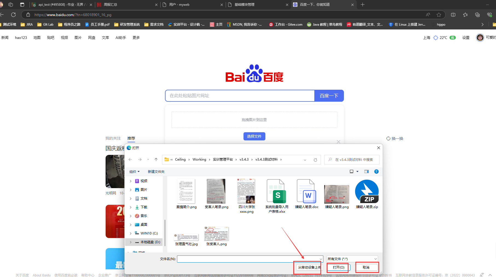

谷歌打开是这样的：

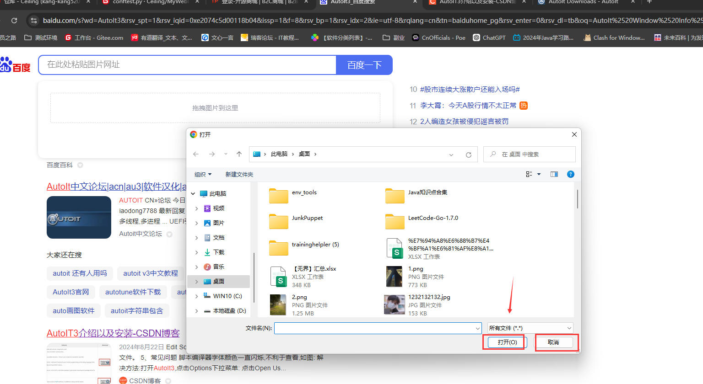

上述两者打开窗口按钮不同，因此，元素也不同 

一个是 Button1（谷歌） 一个是Button2（Edge）

如下：

~~~~python
def upload_file_by_pywinauto(file_path):
    """
    :param file_path: 需上传的文件路径
    :return:
    """
    # 使用pywinauto创建一个操作桌面窗口的对象
    app = pywinauto.Desktop()
    # 选择文件上传的窗口 窗口句柄默认为‘打开’
    dialog = app["打开"]
    # 文件上传的时间
    dialog["Edit1"].type_keys(file_path)
    time.sleep(1)
    dialog["Button1"].click()  #  如果是谷歌则是button1  如果是edge则是button2
~~~~

百度文件上传

使用 pywinauto 

~~~~python
"""
@Project ：TpShopVerifyCodeOCR 
@File    ：TestBaidu.py
@IDE     ：PyCharm 
@Author  ：张成龙
@Date    ：2024/10/8 15:20 
@explain ：
"""
import os
import time


import pywinauto
from selenium import webdriver
from selenium.webdriver import ActionChains
from selenium.webdriver.common.by import By
from webdriver_manager.microsoft import EdgeChromiumDriverManager

driver = webdriver.Edge(EdgeChromiumDriverManager().install())

driver.get("https://www.baidu.com")
driver.implicitly_wait(10)
driver.maximize_window()

driver.find_element(By.CSS_SELECTOR, ".soutu-btn").click()

element = driver.find_element(By.XPATH, "//input[@class='upload-pic']")
# 鼠标单击事件，因为元素classname一样，所以用鼠标事件点击
action = ActionChains(driver)
action.click(element)
action.perform()
time.sleep(3)

# 使用pywinauto创建一个操作桌面窗口的对象
app = pywinauto.Desktop()
# 选择文件上传的窗口 窗口句柄默认为‘打开’
dialog = app["打开"]
# 文件上传的时间
BASE_DIR = os.path.dirname(__file__) # 获取项目根路径

file_path = BASE_DIR + os.sep + "1.png"
dialog["Edit1"].type_keys(file_path)
time.sleep(1)
dialog["Button2"].click()  # 如果是谷歌则是button1  如果是edge则是button2

time.sleep(10)
~~~~


input标签可以直接上传文件图片

因为百度标签是元素是 input，因此可以直接send_keys上传文件路径

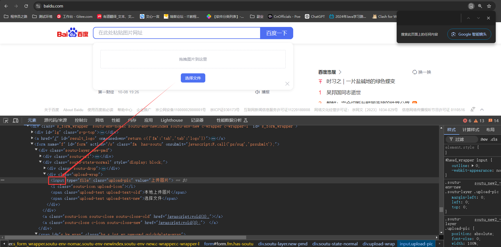

~~~~python
"""
@Project ：TpShopVerifyCodeOCR 
@File    ：TestBaidu.py
@IDE     ：PyCharm 
@Author  ：张成龙
@Date    ：2024/10/8 15:20 
@explain ：
"""
import os
import time


import pywinauto
from selenium import webdriver
from selenium.webdriver import ActionChains
from selenium.webdriver.common.by import By
from webdriver_manager.microsoft import EdgeChromiumDriverManager


BASE_DIR = os.path.dirname(__file__)
file_path = BASE_DIR + os.sep + "1.png"

driver = webdriver.Edge(EdgeChromiumDriverManager().install())

driver.get("https://www.baidu.com")
driver.implicitly_wait(10)
driver.maximize_window()

driver.find_element(By.CSS_SELECTOR, ".soutu-btn").click()

element = driver.find_element(By.XPATH, "//input[@class='upload-pic']").send_keys(file_path)

time.sleep(10)
~~~~


在实际开发中，只需要传入文件的上传路径，即可操作本地窗口从而实现上传

注意：为了项目的可移植性，建议将上传的本地文件放在项目目录中，这样操作是为了避免在路径中写死，利用相对路径找到项目路径下需上传的文件地址，提高代码的健壮性。

## APP自动化

### 接口自动化

#### 1，你的接口环境是怎么搭建的？（针对python代码来说）

项目目录结构

```
api：存放于系统 url 地址
data：存放构造数据文件
log：存放系统日志
report：测试报告(在运行脚本的时候会自动生成次目录)
scripts：测试脚本
utils： 工具类
.env：环境、密码存放位置
conftest：系统配置文件
pytest.ini：pytest配置文件
```


1. 首先我的技术栈式 python + pytest + requests + allure 这样的接口自动化测试框架， requests用于发送常用的请求，get啊或者post啊等等，pytest呢是去书写并执行测试用例，然后 生成allure测试报告 
2. 在真实项目中，我会首先创建api项目目录，用于放置我们接口请求的api，然后会书写发送请 求的函数，将入参进行封装，以便于后续数据驱动，达到解耦合的目的 
3. 在此之后我会创建一个用于真正执行的testcase包，利用pytest 的 fixture 去实例化api文件， 调用api中封装好的函数，进行真正的发送请求 
4. 测试框架我选用的是pytest，也是现在比较流行的第三方测试框架，通过配置pytest配置文 件，扫描测试脚本的位置，从从而执行脚本，并生成测试报告 
5. 为了降低数据与代码的耦合度，我单独创建一个data的文件夹，专门用来存放数据文件，我一 般选择json/ymal/excel文件，然后通过编写读取文件的工具类，在测试类那里通过pytest提供的 注解@pytest.mark.parameter()这个方式，将读取的文件数据以元组或者列表的形式传入，从而 实现参数化 
6. 为了方便后期排查问题，我封装了日志文件，同时创立一个log的文件夹，用于存放log文件 
7. 然后我会单独的创建存放allure测试报告的目录，当我们运行完测试类的时候，会生成很多的 json数据文件，此时，我们需要通过 allure generate 选择我们的数据json文件 - c -o 自定义我们测试报告存放的位置；这个命令来生成我们的测试报告，然后我们可以选择在本地打开allure或者通过allure open + 本地allure报告的命令形式进行线上查看 
8. 为了持续部署，我选用Jenkins来管理我的代码，从而实现了持续集成


仓库地址：https://github.com/zhangchenglo/PythonInterFaceFrame

#### 2，你们做接口自动化测试的流程是什么？

1. 首先呢我们会根据需求文档和开发接口文档制定接口测试的计划以及方案，敲定哪些功能模块 接口需要做，以及选择什么方式去做，是工具还是代码 
2. 然后会和开发要接口文档，根据接口文档，书写测试计划以及测试用例 
3. 根据书写好的接口测试用例，去执行接口测试，关注请求与响应是否符合接口文档的描述 
4. 发现接口跑不通的时候，会将发现的问题提交给开发，开发进行修复，然后再进行复测，直到 验证通过 
5. 最后进行缺陷的总结，记录并书写测试报告

#### 3，你是如何做断言的？

1，pytest提供了自带的关键字assert，利用assert去断言接口返回的数据，例如相应状态码，响 应头，响应体等等；断言包括等于不等于包含等等 如:

```python
assert result == 3  # 等于
assert result != 3 # 不等于
assert result is None # 为空
assert result is not None # 不为空
assert "r" in  "assert" # 包含
assert "r" not in  "assert" # 不包含
assert result # 判断为TRUE 还是FALSE
```

2，当然在实际开发过程中不可能将所有的返回值进行一一断言，这会大大增加维护成本，我所做 到是，抽取不变的返回值数据，进行断言，而实时的变化的返回值，这种做断言，也没有什么意义

#### 4，你是在测试过程中如何做关联的？

我们在接口自动化的过程中，会遇到如下情形：上游的接口返回值，会在下一个接口发送的时候进行调用，这就是接口的关联

针对关联的接口情形，有如下几种方式进行关联

##### 类的全局属性

~~~~python
import pytest

class TestScope:

    token = None

    def test_a(self):
        TestScope.token = "123456"

    def test_b(self):
        print(TestScope.token)  # 会输出 123456

        
if __name__ == '__main__':
    pytest.main()
~~~~


##### pytest的fixture

在 `pytest` 中，**fixture** 是一种用于提供测试函数所需的准备工作或依赖项的机制。它是一种功能强大的工具，可以帮助你在测试中复用代码、管理资源以及简化测试流程。

核心特性：

1. **定义和复用**
   使用装饰器 `@pytest.fixture` 定义，任何测试函数可以通过传入参数的方式使用它。
2. **自动调用**
   测试函数只需声明需要的 fixture，`pytest` 会自动调用并提供 fixture 的返回值。
3. **作用域控制**
   你可以指定 fixture 的作用范围（scope），如每次测试、每个模块、每个类或整个会话。
4. **资源管理**
   使用 `yield` 可以轻松实现资源的初始化和清理。

~~~~python
import pytest


@pytest.fixture(scope="session")
def value():
    return {
        "verify_code": ""
    }


class TestConnectInterface:

    def test_verify_code1(self, value):
        value["verify_code"] = "123456"  # 给全局变量赋值

    def test_login_success(self, value):
        print("login_success:", value["verify_code"])  # 输出 123456


if __name__ == '__main__':
    pytest.main()

~~~~

##### pytest-dependency 第三方库

`pytest-dependency` 是一个 `pytest` 插件，用于在测试中定义**依赖关系**，即测试用例可以依赖于其他测试用例的结果。它允许你按照特定的顺序执行测试，并根据依赖测试的通过或失败来决定是否继续运行某些测试。

核心功能

1. **定义依赖关系**：测试用例可以依赖其他测试用例。
2. **条件跳过**：如果依赖的测试失败，依赖它的测试会被标记为跳过（`skipped`）。
3. **跨模块依赖**：可以在不同的测试模块之间建立依赖关系。

~~~~python
import pytest


class TestDependency:

    """
       安装： pip install pytest-dependency
    """
    @pytest.mark.dependency()
    def test_a(self):
        # 假设从接口或其他地方获取到验证码
        verify_code = "123456"
        pytest.verify_code = verify_code  # 将验证码存储到 pytest 的全局变量中
        print("test_a executed successfully")  # 确认 test_a 是否执行

    @pytest.mark.dependency(depends=["TestDependency::test_a"])
    def test_b(self):
        # 获取 test_a 存储的验证码
        code = pytest.verify_code  # 直接通过 pytest 获取验证码
        print("test_b:", code)  # 打印验证码 输出 123456


if __name__ == '__main__':
    pytest.main()
~~~~


注：以上接口需要前一接口返回的值，因此需要同时运行，而不是单独运行

通过上述的几种方式，可以实现接口的关联，答上述的关联实现的几种方式即可

#### 5，post请求的四种参数形式是什么？

1. application/x-www-form-urlencoded 普通的form表单数据 
2. multipart/form-data 多form表单的数据 通常有上传文件的操作 涉及到接口上传文件操作 
3. application/json json的数据格式 
4. text/xml 文本格式

#### 6，requests 库响应消息体四种格式

1. r.text：文本响应内容  
2. r.content：字节响应内容 
3. r.json()：Json解码响应内容 
4. r.raw：原始响应内容

#### 7，不可逆的操作，如何处理，比如删除xxx这种接口如何测试

1. 如果直接发delete请求，会可能有数据不存在的这种情况，那么直接调用删除接口会跑不通
2. 为了数据的一致性，我会首先调用新增的接口，确保数据库中有数据，然后我再调用删除的接 口，这样的顺序保证了接口不会出错，并且也避免了新增过多所导致的数据冗余问题。 
3. 在pytest中，提供了一个第三方控制执行顺序的插件，pytest-ordering，然后我们可以通过 @pytest.mark.run(order=数字)这样的方式来控制用例的执行顺序，在正数的情况下，数字 越小，优先级越高，越先执行，因此，我会将新增的测试类的优先级放在删除测试类的前面， 保证接口能顺利的执行。

#### 8，遇到接口操作频繁的问题你是怎么处理的？

在实际的工作项目中，为了安全性和系统的稳定性等问题，会限制接口在每秒调用的次数，不同的 项目限制次数不同，我的公司限制的接口为：1秒只能调用3次，此时可能会出现接口调用频繁的 问题，该怎么处理呢？

 答： 

1. 接口调用次数过于频繁的问题，一般可以开发修改后端代码，放开接口限制，或者我们可以在 python代码中线程等待时间 
2. 在代码中我们可以在该接口查询之后，通过调用time.sleep(等待的秒数)，进行强制的等待 
3. 一般在我做接口的项目过程中，查询的接口容易出现调用频繁的提示，比如我修改指定的产 品，那么我们项目中存储的是产品的id，我需要调用查询接口，然后取到指定产品的id作为编辑接 口的入参标识，这样我可以实现指定产品的修改，这么做是为了数据分离，不能直接将产品id写 死，因为万一产品被删除，那么这个id就没有意义了。 
4. 除此之外，我一般和pytest的另一个第三方库，也就是pytest-rerunfailures 失败重跑，可以 在pytest的初始化文件中进行配置，指定失败重跑的次数，当调用过于频繁的时候，添加强制等待 时间，然后为了避免因为网络或者是服务器响应的问题所造成的接口延迟问题，进行失败重跑，然 后重新的执行测试用例

#### 9，做接口的过程中，遇到文件上传的接口你是怎么操作的？

1，针对文件上传的功能，request底层提供了文件上传的功能，我们只需要在发送请求的时候， 传入参数携带files，然后指定我们的文件路径就好了 类似于，request.post(url,data,herder,files)

2，files格式是一个列表的格式，我们可以传递多个值，在列表中，我们可以指定我们的参数名 字，和要上传的文件，例如图片或者文本

```python
files = [
	('logo', logo),
 	('image[]', image)
 ]
```

 3，后面的具体值，我们调用了open命令进行打开我们的文件所在位置；

```python
open("C:/1.jpg", 'rb')
```

因此全部因该这样写： 

```python
files = [ ('logo', open("C:/1.jpg", 'rb')), ('image[]', open("C:/1.jpg", 'rb')) ]
```

作为参数传递过去就好了

备注：postman 和 jmeter 操作文件上传

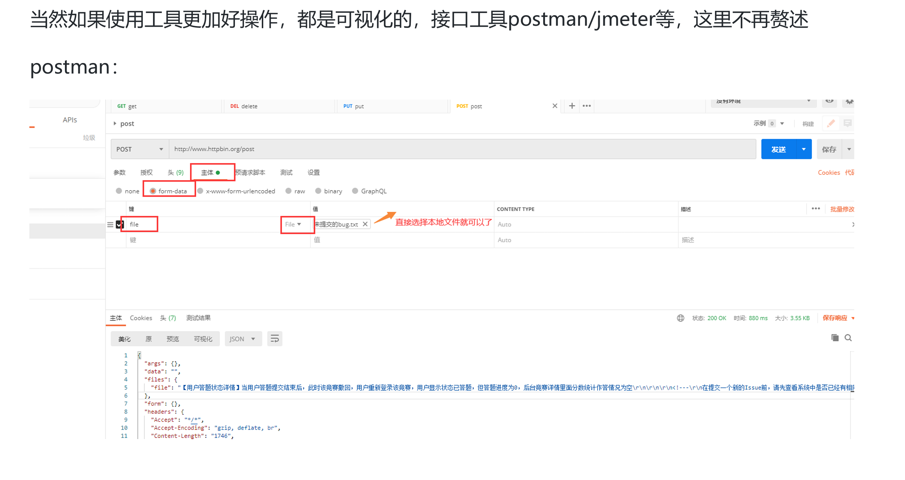

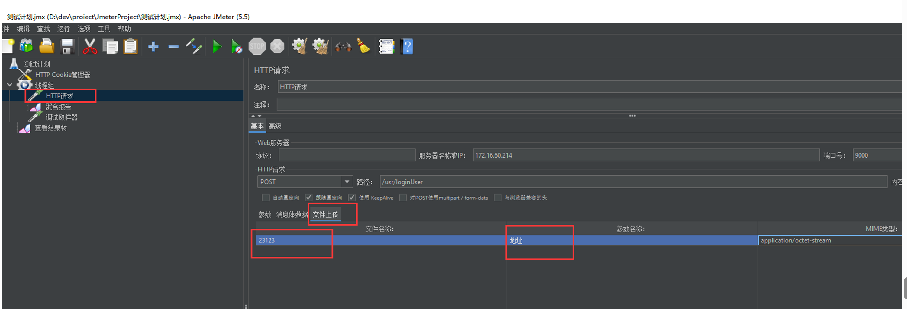


#### 10，接口不通可能是什么原因？

请求不通，可能的原因是：

1. ip或者端口号或者url写错了
2. 客户端和服务端网络不通 
3. 服务端项目根本没有部署起来 
4. 服务器的防火墙拦截了
5. 服务端程序内部发生了错误 
6. 没有访问权限（比如缺乏token、cookie之类）
7. 客户端设置了网络代理
8. 如果是浏览器访问，是不是绑定了错误的hosts

#### 11，你有没有遇到印象深刻的接口Bug

在我们系统中有关于权限的接口，是一个新增xxx的功能，那么在关闭权限之后，正常逻辑用户a应该不能再访问没有权限的功能接口，但是使用用户a的身份去跑接口却仍然可以发送，并且成功的跑通；这是不对的逻辑；因此提出了bug，最后结果是开发虽然进行了页面显示处理，但是没有进行接口的校验判断以及拦截，造成没有权限的用户仍然可以跑通接口，这是我印象中比较深刻的 bug

12，除了python 中的 request 库，你还知道哪些发送请求的方法？

| **特性**         | **Java**                                                     | **Python**                                 | **前端**                                       |
| ---------------- | ------------------------------------------------------------ | ------------------------------------------ | ---------------------------------------------- |
| **性能**         | 高性能，支持多线程，高效处理大规模并发                       | 性能较好，但不是主流高性能语言             | 依赖浏览器环境，受限于网络和浏览器性能         |
| **易用性**       | 标准库繁琐，第三方库如 `OkHttp` 和 `Apache HttpClient` 较友好 | 高度易用，`requests` 和 `httpx` 等封装良好 | 极其易用，`Fetch` 和 `Axios` 简单直观          |
| **异步支持**     | `CompletableFuture`、`OkHttp`（异步 API 简单）               | 使用 `httpx` 和 `aiohttp`，异步操作更便捷  | 天生支持异步（`Promise` 和 `async/await`）     |
| **生态支持**     | 强大，适合企业级开发，丰富的第三方库                         | 丰富但偏向脚本开发，企业级支持稍弱         | 丰富，庞大的前端社区和工具支持                 |
| **复杂场景支持** | 强，适合复杂认证、并发等企业级场景                           | 较好，适合中小型项目，支持 OAuth 等        | 强，支持各种 Web API 和服务交互                |
| **常用库**       | **`OkHttp`**, **`Apache HttpClient`**, **`Spring WebClient`** | **`requests`**, **`httpx`**, **`aiohttp`** | **`Axios`**, **`Fetch`**, **`XMLHttpRequest`** |
| **适用场景**     | 后端开发、大规模并发任务                                     | 数据分析、快速开发脚本、工具开发           | 前端开发，Web 服务交互                         |

## 性能测试部分

### 1，性能测试中，TPS 比较低，可能是哪些方面的问题？

1. 压力机本身性能瓶颈

2. 网络 IO 瓶颈

3. 中间件（tomcat/nginx/mysql）连接数限制

4. Java 线程的阻塞、等待

5. 本系统资源的瓶颈（cpu、内存、磁盘、网络等）

6. 其他外部系统响应时间过长，造成本系统的 time-wait

### 2，性能测试过程中如何对瓶颈进行分析？

性能瓶颈分析参考准则：排除法，从上至下、从局部到整体！

针对不同的瓶颈采用不同的分析方法，一般分为： 内存分析方法、处理器分析法、磁盘 I/O分析方法、进程分析方法、网络分析方法等等。

内存分析方法：内存分析用于判断系统有无内存瓶颈，是否需要通过增加内存等手段提高系统性能表现。

处理器分析法：通过处理器性能计数器的值体现服务器整体处理器利用率，判断是否存在处理器瓶颈。

磁盘 I/O 分析方法：通过磁盘 I/O 性能计数器的值体现服务器整体磁盘 I/O 使用情况，判断是否存在处理器瓶颈。

进程分析方法：通过进程性能指标数据，判断是否存在进程瓶颈。

网络分析方法：通过网络性能指标数据，判断是否存在网络瓶颈。

### 3，性能测试中，一般都关注哪些指标？

TPS：每秒事务数，代表了性能的好坏，TPS 越高，性能越好

平均响应时间：请求的平均耗时，响应时间越短，性能越好

并发数：同时向服务端发起请求的虚拟用户数，在不同的工具里可以用多个进程/线程来实现

错误率：失败的请求比例

吞吐量：网络上行和下行流量的总和，吞吐量是网络瓶颈定位的重要指标

### 4，应用服务器 cpu 高和数据库服务器 cpu 高的分析思路是什么？

1）应用服务器的 cpu 高，先要看 tps 和响应时间，如果 tps 比较高，我们认为是正常的 cpu消耗；如果 tps 比较低，那么往往某些代码过于消耗 cpu，可以考虑使用代码剖析工具分析下

2) 数据库服务器 cpu 高，往往是因为 sql 语句执行效率比较低，可以通过对数据库慢查询是监控，结合执行计划进行分析，是否是相关表没有索引或索引未生效

### 5，JMeter 参数化在性能测试中有哪些适用场景

1. 造数据  
2. 用户差异性随机行为模拟  
3. 禁止重复数据情况 
4. sign 签名校验字段  
5. 身份校验（后面讲 cookie、session、token）

### 6，如何使用 Jmeter 做HTTP性能测试 

（1）压测脚本准备：基本信息、参数化、关联、断言、聚合报告  

（2）压测执行：依据需求确定压测场景，单交易并发测试、混合交易负载测试、稳定 性测试，线程组下设置并发数、压测时长或者迭代次数  

（3）压测结果查看对比：聚合报告中查看响应时间、错误率、吞吐量等指标来分析性能 

可以扩展延伸的地方（如果会的话）：

（4）但是由于Jmeter本身自带的性能测试报告过于单一，因此我还在服务器中搭建了 Jmeter + Influxdb + Grafana 的性能监控大屏

（5）由于Jmeter本身自带的函数助手对话框函数不能满足我多个用户注册、登录等数据的统计，而使用CSV这样的格式仍然需要人工去维护，因此，我二次开发了Jmeter函数助手对话框，包括常用的用户身份信息，比如手机号、密码、身份证号码、姓名、性别、年龄、家庭住址、血型等等，然后就可以在接口请求的时候通过调用函数去动态的添加或者满足多用户这个需求

#### 知识点延伸：

如何搭建 Jmeter + Influxdb + Grafana：https://blog.csdn.net/qq_45594960/article/details/144159247?spm=1001.2014.3001.5502

如何二次开发Jmeter 函数助手对话框函数：

githup：https://github.com/zhangchenglo/JmeterSecondDEVFunctions

视频教学：https://www.bilibili.com/video/BV1ibGkeTE6d/?spm_id_from=333.999.0.0&vd_source=041bc3fc775a34d6d411f01365cecd96

### 7，你是如何做性能测试的？（python locust 版本）

1，我使用的是python第三方库 locust 做性能测试，Jmeter 使用Java语言开发，运行在JVM虚拟机上，对cpu资源消耗比较高，因此，占据内存比较大，在压测并发量过大的时候，对本机配置要求过高；Locust 采用 Python脚本语言，从性能上看没有Java语言表现得那么优秀，但是采用微线程（协程）机制，单机并发能力较强，对于单独接口压力测试而言，比较优越
2，由于仍是对接口进行压测，因此，我仍然使用接口框架封装，将带压测的接口封装到api当中，与接口性能一样，不同的是，locust有个任务集合的概念，也就是 TaskSet，我会将不同的功能接口创建不同的任务，进行分层展示，这样做的目的就是为了后续方便进行维护

3，我核心用到了locust的负载均衡模式，首先我会在性能测试之前，进行分析系统在哪些时刻用户活跃度比较高，然后哪些接口被频繁调用，比如，我们系统是一个在线考试系统；一场竞赛一般是一个专业大概300人左右进行答题；平时一般在线人数是100人左右进行学习；如果是发布竞赛进行考试，一般是在早上9点到11点之间，用户使用频率比较高，然后在这个时间段内，比如系统当中的登录、参加竞赛的接口被频繁的调用，因此，我会首先根据实际情况制定流量模型，然后根据流量模型再来测试这些接口；

4，针对刚刚讲的这种情况，我大致制定了如下的流量模型，先平稳运行1分钟，用户数量是100人；然后在9点那一刻，用户数用10s左右时间，每秒增加50人，达到300人，然后运行1分钟，然后在10s左右时间进行递减，每秒递减30人，人数递减到100人，此时再运行1分钟，结束针对登录、参加竞赛接口的压测

5，针对上述的流量模型，编写流量模型类，通过继承locust中的 LoadTestShape 类，实现 tick()方法，然后调用get_run_time()方法，针对上述流量模型中的运行时间，人数进行数学模拟

6，最后创建用户行为方法，继承 httpuser类，将需要压测的任务集放置在 tasks=[]列表当作进行标记，然后通过locust -f 方法进行运行，访问本地 8089端口进入locust主页面，进行目标地址压测，查看 locust charts 运行图表变化，关注 请求数、平均相应时间、RPS指标的变化

#### 知识点延伸

性能测试框架：https://github.com/zhangchenglo/PythonPerformanceFrame

### 8，当性能测试中，遇到像request 一样 接口关联一样的接口进行压测，你该如何使用locust进行压测？

1，首先locust实现了全局数据共享，也就是说，你可以直接在同一个类中，通过self的形式，直接调用上一个接口请求方法中获取的值，然后在本方法中进行引用即可，locust自己的self.client调用get/post的这个方法，低层本质上是实现了 request.session()

2，关联的本质就是一个顺序的逻辑执行关系，首先你需要先执行被关联的方法，获取返回值，然后才能在下一个接口中进行参数引用。在locust当中提供了SequentialTaskSet，顺序任务集，继承SequentialTaskSet类，它会按照你任务结合中的子任务从上而下顺序的执行，这就很好满足的接口的关联需求，有顺序的执行

3，其余方法仍是一样，指定负载均衡模式，制定流量模型，然后进行接口压测

#### 知识点延伸

一文搞懂性能测试 locust：https://blog.csdn.net/qq_45594960/article/details/143094851?spm=1001.2014.3001.5502

## 项目

### 1，简单介绍下最近做过的项目

根据自己的项目整理完成，要点： 

1）项目背景、业务、需求、核心业务的流程 

2）项目架构，B/S还是C/5，数据库用的什么? 中间件用的什么？后台什么语言开发的？ 是否有做App端，是否有H5是否开发小程序等等。 

3）项目前端有哪些功能模块，后台有哪些功能模块？

### 2，拿一个你所负责的模块，讲下具体怎么测的?

根据自己的项目整理完成，核心要点： 

1）拿一个你负责过的模块，核心业务模块讲解 

2）业务流程是怎样的，需求怎么样，有什么规则没，规则简单介绍 

3）你是如何分析的，讲明分析思路，测试点，主要怎么考虑测试的，主要核心测试重点在哪里， 用了什么测试方法等等。

### 3，你在这个项目里面主要做了些什么工作？

1）在这个项目中，主要是以功能测试跟后台接口测试为主，主要参加了需求评审会议，用例的编写， 参与用例的评审，执行测试。 

2）协助开发定位问题解决发现的bug，编写测试报告，协助上线。 

3）另外就是做了APP的一些相关项测试，像兼容性测试、稳定性测试、安装卸载版本覆盖测试和app 性能都是有做过的，例外后期有做过接口自动化等。主要就是做了这些工作。

### 4，你们项目组有多少人、开发多少个、测试多少个?

根据实际情况来说：

例如：产品1、项目1个、架构师1个、前端3个、后端5个、ios1个、Android 1个、 测试3个(测试主管，核心测试人员)、运维1个、UI一个

### 5，测试人员怎么分工的?

我们测试组3人，1个测试组长，2个测试，一般都是根据需求的复杂程度大小来， 尽量是自己熟悉哪个版块的就继续做那个版块。 

比如：我这边主要是负责前端大部分的功能模块，还有接口测试跟ui自动化测试，另一个同事主 华测教育专属 要是功能测试这边，组长这边也负责一些功能测试，包括一些性能跟安全测试。 

其实测试工作也划分的没有那么细，后期我们也会做交叉测试，相互测试功能，性能跟安全测试 我也会参与一下。

### 6，项目的送代周期? 多久一选代? 一个版本你们发现多少bug？

拿我公司举例子，我们公司是一个月迭代一次，一般来说会在月底进行新版本的发布，发现bug数量与这个迭代的需求以及功能的难易度有关系，由于我测试的是较为稳定的项目，上线很多年了，迭代改动不是太大，一般来讲，bug数量在20-30个左右。

### 7，你们整个项目写了多少用例，你负责的模块大概写了多少用例?

这个得根据项目的复杂程度，我们最近做的这个也还好，整个项目写了大概800百多条，我负责的模块就写了280多条(你要思考，你负责了哪些模块，大概评估下，不要乱喊)。 

总结注意点：没有标准答案，先说你的前置条件，再说数据，只要你前置条件和数据匹配即可。

### 8，最近的版本写了多少用例?

特别注意：你如果是半个月的版本，一般给你两天写用例，你自己评估下写多少。

 半个月的版本：1-2天需求分析，1-2天写用例，1天评审用例，其余的时间就是执行回归bug，编写测试报告

最近的版本因为没有特别的用户活动，产品那边也没有给特别大的改动需求，我负责的有5个模块吧，大概有180多条用例。

### 9，你的需求分析一般几天，用例大概写了多长时间?执行了多长时间?

如果按照2周一个版本来算的话，我们需求分析一般是由产品SE先组织我们开会，讲清新版本需求，然后我们再花1天到1天半时间去详细分析需求，另外有2天左右时间来写用例，写完用例会进行用例评审，后面的时间基本就是在执行用例，提bug，并跟进bug修复问题。

### 10，在uat测试的时候，突然客户临时要大量的数据

看他需要的数据能不能从上个版本，或者生产环境导入数据进来测试，如果没有，我们看能不能批量修改数据去测试，如果不行，我们只能通过数据库存储过程造数据了。

#### 知识延伸

UAT 是 **User Acceptance Testing**（用户验收测试）的缩写，是软件开发生命周期中的一个重要阶段。UAT环境指的是一个专门为用户验收测试准备的环境。

在UAT环境中，实际用户会使用应用程序，验证它是否满足业务需求并符合规范。这通常是上线之前的最后一步，确保没有关键性问题存在。

### 11，发现哪些映像比较深刻bug/经典bug?

根据自己的项目来准备，核心要点： 

1）有哪些经典或者说影响比较深刻的Bug，最好是与业务相关的Bug，不要举例说前端的Bug 

2）具体怎么分析，讲明你的分析过程。如何定位的......

比如:业务逻辑漏洞；

支付功能:

1. 商品选择支付的时候，实际已扣款成功，但是用户后台显示该商品没有付款， 导致不能使用该商品提供的服务。 
2. 商品所显示的价格是x元，但是实际支付的时候显示和扣款的价格是y元(x≠y) 

找密码流程： 

- 按照常规操作，会直接跳跃了某个必须的流程(流程缺失)，但是通过url修改参数又可以访问到 该流程，存在安全和逻辑漏洞。

安全漏洞：

1. 登录账户：退出or注销之后，浏览器返回键回退之后又可以回到已登录的页面继续操作，识 别用户身份的信息并没有失效，用登录后才能访问的url直接访问也可以登录，安全漏洞。 

2. 搜索功能：前端页面的搜索输入框中输入特殊敏感符号 

   ```js
   <script> alert(document.cookie)</script>
   ```

3. 新增功能：一开始没有限制字符的类型和数量，当输入特殊符号、超长的字符， 提交后直接抛出包含有 INSERT INTO的完整SQL语句。 

4. 前端搜索：以敏感字符直接搜索后，客户端和服务端都没有任何字符过滤or转义处理， 华测教育专属 直接把数据库和网站服务器的名称、版本暴露。

数据调用/加载异常:

1. 翻页功能：有时候会出现前面几页翻页和数据显示都是正常的，往后再翻页就会 出现翻页不了or加载的数据异常。 
2. 前端页面有几级菜单的情况下，程序都已经调用过，第一级是正常展示的，但是第二级、 三级有可能被折叠而没有显示在浏览器显示。 
3. 定位到某个导航主题，调用的数据并不是该主题分类的数据，而是调用成了其他分类的数据。 不可逆操作，导致流程受阻：
   1. APP 测试，orH5页面测试，触发某个操作，比如手机触屏下滑刷新页面，不能恢复到操作前 的正常页面。
   2. 输入某个异常值提交之后，程序没有相关的处理机制，导致页面保存，没法继续进行其他操 作。
   3. 登录方式切换：登录时有几种不同的方式，如：密码登录&短信验证码登录，但同一时刻默认 只能显示一种登录方式，当从密码登录界面点击短信登录切换到短信验证码登录界面之后， 没有切换返回密码登录界面的功能。
   4. 删除异常：正常情况下可以从列表中删除记录，但是若先对列表记录执行了搜索功能之后， 再次删除的时候可能出现删除无响应而删除不了数据。
   5. 弹框阻止：当触发某个操作，如“保存”、提交”or某个开关按钮，界面中弹单出一个提示框， 此提示框不管怎么操作都无法关闭，直接阻碍了页面上其他功能的操作。

附件上传时，未控制格式尺寸和容量大小，系统处理出现异常：

1. 文件上传功能：没有限制上传的文件格式、尺寸和大小，当上传非常规文件(如js文件)、大 容量文件(如：图片大小>20M)，较大分辨率(如：1600×1200)，服务器没有相应的异常处理 机制，导致网站出现持续长时间的卡顿，影响后续操作。
2.  上传的是非常规的文件，如js格式文件，程序无相关控制，直接将js文件上传到数据库， 前端页面访问时若不能解析则出现异常页面。

缺少非空判断，服务器报500错误：

1. 编辑包含多个字段的页面时，有一些字段在程序中控制是必填的(事先未知)，但是没有任何 说明提示，当不填写这些字段，直接保存时会出现服务器异常页面，报500状态错误。(特别 是在管理后台容易出现此场景) 
2. 在形如以下结构的if函数中，关系表达式的条件没有对某个变量(该变量因代码疏漏未作初 始化赋值)进行非空判断，就直接执行语句体，程序已空值null进行参与运算而出现异常， 如500错误if(关系表达式)样式导致异常。  
3. 某个功能(如：金额输入和统计)在A页面程序限制只能输入正整数，而在B页面却没有相应 控制，若不小心在B页面输入了非正整数，比方小数，A和B的数据分别传递到到同一个C 页面时数据处理会出现异常。 
4. 文章上传/图片上传：超长字符的文章内容or较大尺寸的图片上传，程序没有进行相关的压 缩和截取，直接完全调取到前端页面，导致浏览样式异常.

经典bug：

bug复述：前端申请借款中，用户没有信用额度或者借款金额超过了用户信用额度但是却能成功提交审核

发现途径：我是在模拟借款人，借款金额提示我的可用额度为0，但是我输入5000的借款金额点击 提交审核提示我提交成功，等待审核

解决：首先我去数据库查找到对应的表，比对我的信用额度跟界面显示的数据是否一样，一样我就 把数据库的记录，填写的借款信息和我借款成功的界面显示截图都保存好。之后提交这个bug，开发 人员通过修改代码，我再复测，有没有重现bug

还有一个就是在借款流程中，我们通过修改数据库中的数据，把借款时间修改了，制造出一个逾期 未还款的数据，结果显示还款的金额比借款金额还少，而且管理要收得特别高，存在不合理性。

还有一个是在产品上线后，运维人员在统计数据时发现少了一条数据，我们去数据库检查发现0分0 秒的数据没有统计，后来开发人员修改了代码之后就解决了

1）服务费计算错误，计算公式开发这边写错，本来是利息0.3，写成003，开发修复bug。 

2）退出用户，后退还可以进入到原来的登录完成操作后的界面，原始，退出用户，没有删除用户对应的 session，导致后退完成后，用户用户cookie可以进行操作。 

3）重新选择下拉框，输入信息全部清空，原因，修改类型，重新刷新界面，输入数据，并没有保存缓存里面，导致一刷新，原来信息没有。解决办法，开发选择不同借款类型，不再进行刷新。 

4）借款标题，输入xss攻击代码，导致接口所有的数据不存在显示，因为xss脚本，当然代码处理，开发这边进行转义字符串。 

5）谷歌浏览器登录不成功，显示验证码。

### 12，每个阶段测试开发在干嘛（比如你写用例的时候开发在干嘛？）

1. 需求阶段，大家都在了解需求
2. 前期准备阶段， 你在准备测试计划，开发在做概要设计，详细设计
3. 具体实施阶段；你在编写测试用例；开始是在编写代码，编写接口文档，设计文档。 
4. 执行阶段， 测试人员执行用例，发现bug、提交bug、开发修复bug(开发还有可能在开发未完成的功能)

### 13，你这个项目做了多久? 你这个项目现在的用户里有多少? 活跃量多少?

时间根据简历来 比如：一年时间，金融项目：100W用户2W活跃用户

### 14，你们公司是否敏捷开发？

可以说是，也可以说不是。[具体看你了不了解敏捷开发模式]

#### 知识延伸

##### 什么是敏捷开发？

敏捷开发以用户的需求进化为核心，采用达代、循序渐进的方法进行软件开发。

在敏捷开发中，软件项目在构建初期被切分成多个子项目，各个子项目的成果都经过测试， 具语可视、可集成和可运行使用的特征，换言之，就是把一个大项目分为多个相互联系， 但也可独立运行的小项目，并分别完成，在此过程中软件一直处于可使用状态。

##### 敏捷开发优缺点：

特点： 

1、能适应快速的客户需求变化，快速的交付，注重与客户的沟通。最优先要做的是通过尽早的、 持续的交付有价值的软件，把项目拆分成各个小的子项目，快速开发快速交付，有问题及时调整， 适合高风睑项目。 

2、交付周期短，交付的时间间隔越短越好，一周一个迭送代，甚至有时候一周多个选代， 不过每个选代版本的需求不会太多，注重项目持续选代开发交付。 

3、整个项目开发期间，业务人员和开发人员必须天天都在一起工作，团队规模不能太大， 团队间强调面对面的交谈。 

4、更关注可交付可以使用的软件，而非文档。 

5、对团队技术要求高，能快速适应客户对需求的变化。 

6、敏捷团队只专注于开发项目中当前最需要的、最具价值的部分。这样能很快地投入开发，另外， 较短的迭代周期使团队成员能迅速进入开发状态。

优点： 

1、敏捷开发的高适应性，以人为本的特性，适应客户的更快需求变化，更快的交付成果。

2.更加的灵活并且更加充分的利用了每个开发者的优势，调动了每个人的工作热情。

缺点： 

1、由于其项目周期很长，所以很难保证开发的人员不更换，而没有文档就会造成在交 接的过程中出现很大的困难。 

2.特别项目存在新手比较多时，老员工比较累.(对开发团队人员的技木要求高) 

3、敏捷开发流程图：

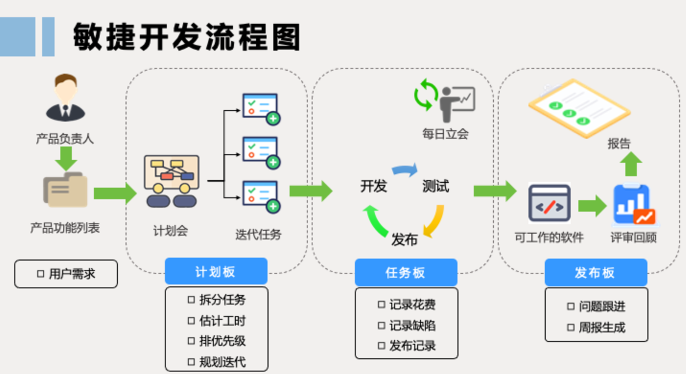


## 测试场景题

一般而言，我们回答此类问题，只需要按照 **功能、性能、安全、兼容、易用性**等这几个方面来回答就基本覆盖差不多范围了。

### 1，打电话功能怎么去测？

我们会从几个方面去测试：界面、功能、兼容性、易用性、安全、性能、异常。

1）界面我们会测试下是否跟界面原型图一致，考虑浏览器不同显示比例，屏幕分辨率。 

2）功能：给不同人员打电话，不同号码打电话，不同运营商，测试每个按钮是否正常使用，拨打号 码，是输入还是，复制过程，还是其他地方跳转过来，多次拨打电话，双卡选择不同电话卡。 

3）兼容性：不同手机型号，厂商，不同系统版本，屏幕大小，分辨率，内存大小 

4）易用性：操作是否说的越多越好

### 2，给你一个杯子怎么测？

**功能测试**： 主要关注水杯基本功能 

1. 水杯是否可以正常装水
2. 水杯是否可以正常喝水 
3. 水杯是否有盖子，盖子是否可以正常盖住 
4. 水杯是否有保温功能，保温功能是否正常保温 
5. 水杯是否会漏水，盖住盖子拧紧后是否会漏水

**界面测试**： 主要关注水杯外观、颜色、设计等方面 

1. 外观是否完整 
2. 外观是否舒适 
3. 颜色搭配及使用是否让人感到舒适 
4. 杯子外观大小是否适中 
5. 杯子是否有图案，图案是否易磨损 

**易用性测试**： 主要关注水杯使用是否方便 

1. 水杯喝水时否方便 
2. 水杯拿起放下是否方便，这里会行注到水杯形状的测试 
3. 水杯装水是否方便 
4. 水杯携带是否方方便 
5. 水杯是否有防清功能 
6. 水杯装有低温或者高温水时，是否会让手感到不适 

**性能测试**： 

1. 水杯装满水时，是否会露出来 
2. 水杯最大使用次数 
3. 水杯的保温性是否达到要求 
4. 水杯的耐寒性是否达到要求 
5. 水杯的耐热性是否达到要求 
6. 水杯掉落时时，是否可以正常使用 
7. 水杯长时间放置时，是否会发生泄露

**兼容性测试**： 主要关注水杯是否可以装其他液体，如果汁、汽油、酒精等

**可移植性测试**：主要关注水杯放置环境等 

1. 将水杯放在常温环境中，使用是否正常 
2. 将水杯放在零下的环境中，使用是否正常 
3. 将水杯放在高于正常温度的环境中，使用是否正常

**安全性测试**： 主要关注水杯外观和各种异常条件下是否释放有毒物质等 

1. 当水杯装满热水时，水杯是否会烫手 
2. 当水杯装上水后，是否会产生有毒物质 
3. 把水杯放在零下环境时，是否会产生有毒物质 
4. 把水杯放在高温环境时，是否会产生有毒物质

### 3，图像上传功能的测试点

1. 检查图片上传路径 
2. 检查图像上传和修改功能 
3. 检查各种扩展图像文件的上传（例如JPEG、PNG、BMP等）
4. 检查文件名中含有空格或其他可用特殊字符的图片的上传 
5. 检查重复名称图片上传
6. 图片尺寸大于最大允许值，上传时应该显示适当的错误消息
7. 检查上传的图片文件类型外的其它文件时(例如txt、doc、pdf、exe等等)， 应该显示适当的错误消息。 
8. 检查如果上传的图片满足指定的高度和宽度(如果有定义的话)则可以成功上传，否则不能上传。
9. 上传大尺寸图片时应显示上传进度条
10. 检查上传过程中的取消按钮是否有效 
11. 检查文件选择对话框中的文件列表是否只显示支持文件类型 
12. 检查上传多个图像的功能 
13. 上传后检查图像质量，图像质量不应该改变 
14. 检查用户是否能够使用/查看上传的图像

### 4，搜索框的测试

#### **1. 功能测试**

- 基本功能
  - 输入搜索关键字后，点击“搜索”按钮或按下回车键，搜索结果是否正确显示。
  - 不输入内容直接搜索，是否有提示或合理的结果返回。
  - 输入部分关键字，是否支持自动补全或智能提示。
  - 搜索结果分页功能是否正常（如果有）。
  - 支持模糊搜索或精确匹配的配置是否生效。
- 边界值
  - 输入超长字符串，搜索框是否能够正常处理，且无页面异常。
  - 输入特殊字符（如 `@ # $ % ^ & *`），是否能够正确处理或提示非法输入。
  - 输入空格或连续多个空格，是否能够正确处理。
  - 输入SQL注入关键字（如 `'; DROP TABLE users; --`），系统是否能够识别并拦截。
  - 支持的多语言搜索（如中文、英文、法文等），是否正常工作。
- 高级功能
  - 支持多条件筛选搜索的功能是否正常。
  - 是否支持排序功能（如按时间、相关性排序）。
  - 搜索历史记录功能是否准确（如果有）。
  - 高级搜索选项（如按日期、分类）是否生效。

------

#### **2. 性能测试**

- 响应时间
  - 搜索框的响应时间是否在用户可接受的范围内（通常 <2秒）。
- 并发测试
  - 在高并发用户同时搜索时，系统是否能正常返回结果。
- 大数据测试
  - 搜索一个存在海量结果的数据集，是否能快速显示部分结果（如前10条）。
- 缓存机制
  - 搜索结果是否有缓存机制（如相同的搜索短时间内是否复用上次结果）。

------

#### **3. 安全测试**

- 输入验证
  - 是否对用户输入进行严格校验，防止XSS攻击（如 `<script>alert('XSS')</script>`）。
  - 是否防止SQL注入攻击。
- 权限控制
  - 搜索结果是否基于用户权限返回，不会泄露无权限查看的数据。
- 隐私保护
  - 用户输入的搜索关键字是否加密传输。
  - 是否记录用户搜索历史，若记录，是否有明确的用户隐私声明。

------

#### **4. 兼容性测试**

- 浏览器兼容
  - 主流浏览器（如 Chrome, Firefox, Edge, Safari）是否正常工作。
  - 移动端浏览器是否支持。
- 设备兼容
  - 在不同分辨率的设备（如PC、平板、手机）上显示是否正常。
- 操作系统兼容
  - 在不同操作系统（如 Windows、MacOS、Android、iOS）上是否正常。

------

#### **5. 用户体验测试**

- UI交互
  - 输入时的视觉提示（如输入框高亮、占位文字消失）是否清晰。
  - 搜索按钮位置是否易于点击。
  - 搜索结果的加载动画（如果有）是否流畅。
- 可用性
  - 支持键盘操作（如Tab键切换焦点、回车提交搜索）。
  - 错误提示信息是否友好（如网络问题、结果为空）。

------

#### **6. 异常处理测试**

- 网络问题
  - 搜索时断网是否有友好提示。
  - 搜索请求超时是否有重试机制。
- 服务异常
  - 搜索服务不可用时，前端是否能处理并给出合理提示。

### 5，微信发朋友圈如何测试？

#### **1. 功能测试**

##### **基础功能**

- 是否可以成功发布带有文字的朋友圈。
- 是否支持图片上传，图片数量是否符合限制（如最多9张）。
- 视频上传是否正常，视频长度和大小是否符合限制。
- 支持的附件类型（如文字、图片、视频）是否可以正确上传和显示。
- 文字、图片、视频混合发布是否正常。
- 是否支持添加位置信息。
- 是否支持添加表情包、Emoji表情。
- 是否可以选择可见范围（如公开、部分可见、不可见）。
- 是否可以设置同步到微信状态或其他关联平台。

##### **边界测试**

- 输入超长文字，是否能截断或提示字数限制。
- 上传超大文件（图片、视频），是否正确提示。
- 上传不支持的文件类型，是否有正确提示。
- 位置信息超长或特殊字符，是否能正常显示。
- 使用复杂表情（如合成表情包）是否正常显示。

##### **异常场景**

- 网络中断时，是否提示“发布失败”或提供重试功能。
- 服务器异常（如上传图片超时）是否有友好提示。

##### **操作后功能**

- 是否可以查看刚发布的内容。
- 删除朋友圈是否正常，且是否立即生效。
- 评论、点赞功能是否正常。
- 他人可见的内容范围是否符合设定。

------

#### **2. 性能测试**

- 发布性能
  - 发布朋友圈的响应速度是否符合用户期望。
  - 发布大文件或高分辨率图片时，系统响应是否流畅。
- 并发测试
  - 在高并发情况下（如热门事件时），发布朋友圈是否稳定。
- 加载性能
  - 加载带图片或视频的朋友圈是否流畅，是否会卡顿。

------

#### **3. 安全测试**

- 权限管理
  - 仅设置的可见范围用户是否能查看内容。
  - 屏蔽的用户是否完全看不到内容。
- 数据保护
  - 发布内容是否通过加密传输。
  - 是否会泄露位置信息或其他敏感信息。
- 恶意内容防护
  - 输入含有恶意代码的内容（如`<script>`），是否能拦截。
  - 上传违规或非法内容是否有防护机制（如色情图片、敏感词过滤）。

------

#### **4. 兼容性测试**

- 设备兼容
  - 不同分辨率的设备（如低端手机、平板）上发布是否正常。
  - 不同屏幕方向（竖屏、横屏）是否适配。
- 操作系统兼容
  - 在主流操作系统（如iOS、Android）是否表现一致。
  - 是否支持微信旧版本和最新版本的交互。
- 网络兼容
  - 在弱网（如3G）环境下，是否能够成功发布。
  - 在切换网络（如WiFi切换到4G）时，发布是否受影响。

------

#### **5. 用户体验测试**

- 界面交互
  - 输入框、上传按钮是否清晰易操作。
  - 上传进度条（如发布视频时）是否准确。
  - 位置信息选择是否方便，界面是否友好。
- 容错性
  - 是否支持草稿保存功能（如发布失败后保留输入的内容）。
  - 操作是否有撤销选项（如不小心删除图片时可恢复）。

------

#### **6. 异常处理测试**

- 网络中断
  - 网络断开后发布是否能自动保存为草稿。
- 系统资源不足
  - 手机存储不足时，是否有提示。
  - 手机内存占用高时，是否能正常发布。

##  HR人事部分

### 1，你对于加班是怎么看的？

1. 首先，加班不是目的而是手段，我会尽量在正常的上班时间完成我今天所有的工作  
2. 重复性工作找到提效方法  
3. 如果确定需要测试加班情况（例如：临时发版），我这边保证积极配合，保质保 量完成测试工作任务  
4. 如果其他情况需要加班情况，比如业务、技术培训、盘点会议等等，我这边也 非常乐意和大家通过这种形式，进一步提示自己实力、以及同步信息

### 2，你有面试过其他公司吗？

1. 建议大家答第一家，尽量不要回答超过3家。  
2. 如果说面试过其它的，它就会继续问有没有拿到 offer ，说没拿到 offer 好像能 力显得挺 low；  
3. 如果说拿到offer，人家会考虑你那边有 offer 了，说不定我的 offer 没人家的好， 那你就不来了，干脆就不给你发了  
4. 或者继续询问你拿到offer那家公司的相关信息。

### 3，为什么离职？

1. 不要 diss（吐槽） 上家公司领导和同事。  
2. 不要说在上家公司学不到东西。  
3. 尽量不要归咎于个人原因，比如不想再继续异地恋了。  
4. 尽量陈述正面的客观情况，比如谋求更好的发展空间、公司倒闭大裁员、停发工资。

### 4，你期待什么样的公司？

1. 经济--待遇，福利  
2.  发展前途--手工/自动化 
3. 平台大小--公司规模 
4. 项目业务--如互联网金融、电商、智能家居、人工智能、支付、财会  
5.  离家远近--建议陈述交通是否便利，建议陈述能够就近租房  
6. 工作量大小--任务量，加班量
7.  公司环境--公司文化，同事相处 

### 5，你离招聘公司有多远 

1. 离公司不远  
2. 租房马上到期可以搬

### 6，期望薪资？ 

1. 期待薪资范围（按照JD说）但可谈  
2. 按照不同城市工资基数说  
3. 反问 HR 贵公司薪资结构  
4. 拿到多个offer情况下，薪资每次提500到1000元不等。

### 5，你有什么想问的？ 

1. 问公司的流程（测试、非测试方向都行）  
2. 问自己入职后的工作内容和范围 
3. 什么时间可以得到面试答复  
4. 问应聘公司的核心业务  
5. 问应聘部门团队人员构成情况 
6. 问应聘团队规划计划  
7. 平时一般公司加班到几点

### 6，和其他应聘者相比，你觉得你有什么优势？

1. 业务经验和贵公司高度匹配  
2. 专业技能、综合技能  
3. 快速融入团队  
4. 特长额外加分项：比如钢琴、体育这些  

参考答案：  

第一，我对咱们公司的业务有了解，我上家公司的业务和你们公司的业务相同（重合度 很高），我在这块有业务经验，我对这块业务非常感兴趣。  

第二，我的测试技术技能优势，对测试的技能非常熟练，对（比如银行、CRM、电商、 物流、ERP）业务熟悉，除此之外还擅长接口、性能测试。  

第三，我这个人能特别快地融入工作环境，我真的来公司上班，我可以很快地上手工作。

### 7，你未来的发展规划？

1. 业务扩展，针对面试公司和自己以往工作差异性业务的补充。  
2. 技能提升，自动化、性能、安全、测开方向。


